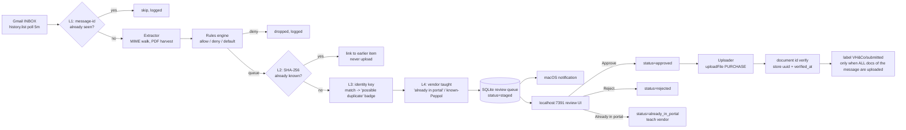

## SPECIFICATION: Postbode — Gmail → ClearFacts/QPS Invoice Agent

**Version:** 1.6
**Status:** Draft — **P0 spike COMPLETE**: all six legs pass live (ClearFacts 2026-08-03, Gmail 2026-08-04). Phase 4 queue implemented.
**Changelog:**
- **v1.6 — Gmail leg executed live.** Three findings:
  1. **The label is `VH&Co/submitted`, not `vh&co/submitted`.** The PRD's lowercase spelling does not exist in the mailbox. **F-15 worked exactly as designed** — it refused rather than creating a lookalike, which would have produced a second near-identical label and silently orphaned every processed message under it. Corrected throughout; resolution now also falls back to a case-insensitive match (Gmail forbids two user labels differing only in case, so this cannot resolve ambiguously and never creates anything).
  2. **OQ-1 closed by sidestep.** The developer is on Google Workspace with the watched mailbox (`michiel@vhco.pro`) inside the org, so the OAuth app is registered **User type: Internal**. Google's 7-day refresh-token expiry is scoped to *"an external user type and a publishing status of Testing"* — Internal is neither. **Re-auth is no longer a weekly event.** F-16 stays P0 (revocation and password changes still happen); F-17 stops predicting a "+7 days" expiry it can no longer compute.
  3. Token cache confirmed at `0600`, and a second run refreshed without re-consent.
- **v1.5** — Added the `item_transition` table to §5.2. F-41 mandates that every lifecycle transition be logged with timestamp and actor, but the five entities in §5.2 gave it nowhere to live (`decision_log` belongs to `rules` and records message-level queue/deny decisions, not item-level transitions). Additive only. Surfaced by the Phase 4 implementation.
- **v1.4 — first revision driven by evidence from the live API rather than documentation.** Three findings, all from the Phase 3 spike:
  1. **`tags` is broken server-side.** The published schema documents `tags: [String]` as a writable `uploadFile` argument, but *any* upload carrying it returns `{"errors":[{"message":"Internal server error"}]}` with `data.uploadFile = null`. Isolated by single-variable testing: `comment`-only succeeds, `tags`-only fails, `comment`+`tags` fails. **F-56 provenance now uses `comment` alone.** `tags` remains *readable* (returns `[]`).
  2. **OQ-8 closed negative.** All eight candidate `type` strings for `companyStatistics` were rejected with *"Invalid type for getCompanyStatistics query"*. **F-57 and AC-30 are struck; Phase 14 is dropped.** No aggregate reconciliation is possible.
  3. **`companyNumber` is the bare enterprise number** (`1031077138`), not the `BE`-prefixed form the schema's example implies. The `administrations` query returns it bare and `uploadFile` accepts it bare.
- **v1.3** — Ratified 8 defects found by the planner against v1.2. Real contradictions fixed: the `sha256` partial unique index vs. F-31/AC-11 (new terminal status `duplicate_linked`, OQ-P1); F-13's resync query unbounded and not inbox-scoped, contradicting F-11 (OQ-P6); F-15's hard label-refusal indistinguishable from F-16's routine re-auth (OQ-P7). Gaps closed: `gopkg.in/yaml.v3` added to NF-13, which mandated YAML config with no parser (OQ-P2); F-46 session-token handoff mechanism defined (OQ-P8); `statistics` added to NF-02's PAT scopes since scopes are fixed at creation (OQ-P11); AC-22 given an enforcement mechanism (OQ-P9); AC-21's LAN assertion made environment-conditional (OQ-P13). Added AC-27…AC-29 for silent-failure P0s and conditional AC-30 for F-57 (OQ-P3, OQ-P10).
- **v1.3** — Ratified 8 defects found by the planner against v1.2. Real contradictions fixed: the `sha256` partial unique index vs. F-31/AC-11 (new terminal status `duplicate_linked`, OQ-P1); F-13's resync query unbounded and not inbox-scoped, contradicting F-11 (OQ-P6); F-15's hard label-refusal indistinguishable from F-16's routine re-auth (OQ-P7). Gaps closed: `gopkg.in/yaml.v3` added to NF-13, which mandated YAML config with no parser (OQ-P2); F-46 session-token handoff mechanism defined (OQ-P8); `statistics` added to NF-02's PAT scopes since scopes are fixed at creation (OQ-P11); AC-22 given an enforcement mechanism (OQ-P9); AC-21's LAN assertion made environment-conditional (OQ-P13). Added AC-27…AC-29 for silent-failure P0s and conditional AC-30 for F-57 (OQ-P3, OQ-P10).
- **v1.2** — Located the **full published GraphQL schema** at `assets-prod.cdn.clearfacts.be/doc/` and rewrote §6.1 from it. Closed OQ-3 (`{PURCHASE, SALE, VARIOUS}`), OQ-4 (no list query — confirmed against the complete 10-query root) and OQ-7 (no duplicate field exists — negative). Corrected the upload signature: **`vatnumber` is deprecated, use `companyNumber`** (A-12). Added F-56 provenance stamping via the newly-found writable `comment`/`tags` (A-13), F-57 conditional aggregate reconciliation via `companyStatistics` (A-14, OQ-8). Dropped F-37b and the F-09 field-probe as answered. OQ-2 (limits) reframed as empirical-only.
- **v1.1** — Recorded ClearFacts' server-side "possible duplicate" flagging as a backstop, not a mechanism (A-11).
**Date:** 2026-08-03
**Type:** feature
**Slug:** postbode-gmail-invoice-agent
**Scope:** PRD phases **P0 (spike)** and **P1 (MVP)** only. P2/P3/P4 are follow-on (see §9).
**Source of truth:** `prd-postbode.md` (repo root, Draft v1.2, 2026-08-03). Every requirement below carries a `PRD §x` trace.
**Constitution:** none. This repo intentionally has no `vega.yaml`. No platform archetype, no cluster/registry/GitOps bindings, no inherited Tier-3 specs. This spec stands alone.

---

### 1. Overview

Postbode is a **single-user macOS background daemon written in Go**, distributed as a local static binary run under a launchd `LaunchAgent`. It polls one Gmail account, extracts purchase-invoice attachments, applies a config-driven rules engine, stages candidates in a SQLite **review queue** surfaced through a localhost-only web UI plus a macOS notification, and — **only after explicit human approval** — uploads each document to the ClearFacts GraphQL API (`uploadFile`, `invoicetype: PURCHASE`) into the QPS administration's digital inbox, then labels the source email `VH&Co/submitted`. (PRD §1, §5, §6.)

It serves exactly one user (Michiel), one Gmail account, one administration ("VH & Co", one VAT/company number). The target corpus is deliberately narrow: foreign vendors, SaaS subscriptions, webshops and consumer-style suppliers that do **not** deliver via Peppol, since the Belgian B2B e-invoicing mandate already routes most Belgian suppliers straight into the portal (PRD §2.2). Postbode must never compete with, duplicate, or replace the Peppol channel.

The defining constraint of the whole design: **the developer's recurring pain is not "did it get sent" but "was it already sent".** A verified API limitation makes this harder than it looks — see §3 (F-30…F-39) and §10 Assumption A-1.

There is no cloud component, no telemetry, no hosted service, no container, no Kubernetes. Secrets live in the macOS Keychain. Everything else is a local SQLite file and a local spool directory. (PRD §8.)

**Repo identity (supersedes PRD §13.2):** Go module path is `github.com/vhco-pro/postbode`. The PRD's `github.com/michielvh/postbode` is **superseded** and must not be used. Repo is `git init`-ed on `main`, commit identity `michielvha <michielvh@outlook.com>`, no remote configured, no push.

---

### 2. Goals & Success Metrics

| # | Goal (PRD §3) | Metric |
|---|---|---|
| G-1 | Nothing matching the rules gets missed | Over a 2-week live run, 0 purchase invoices present in Gmail-with-attachment and matched by rules that failed to reach the review queue. Measured by manual audit of `postbode log` against the mailbox. |
| G-2 | Nothing gets uploaded twice | 0 duplicate documents in the portal's "In verwerking" list attributable to Postbode over the 2-week run. Every suppressed/flagged duplicate has a recorded reason and layer (L1–L4, §5.3). |
| G-3 | Nothing is uploaded without human approval | 0 uploads with `approved_at IS NULL`. Enforced structurally: the uploader's item selector is `WHERE status='approved'`, and there is no auto-approve path in P1. |
| G-4 | Zero manual file handling | 0 occurrences of "save attachment to disk then drag into portal" over the 2-week run. |
| G-5 | The developer can always answer "is this already uploaded?" | For any invoice, a single `postbode status <query>` or review-UI search returns one of: `uploaded (uuid, verified-at)`, `staged`, `rejected`, `already-in-portal (marked <date>)`, or `unknown`. p95 answer time < 10 s, no portal login required. |
| G-6 | Runs unattended, recovers cleanly | Survives laptop sleep, restart and a 14-day offline period with no lost invoices and no crash-loop; `KeepAlive` restart count over 2 weeks ≤ 2. |
| G-7 | Beats "just add more Gmail filters" | Missed-invoice rate strictly lower than the filter-only baseline, and marketing noise reaching the portal = 0. (PRD §12 benchmark.) |

---

### 3. Functional Requirements

Priority scale: **P0** = launch blocker for the phase named in Notes · **P1** = important · **P2** = nice-to-have.
"Phase" column maps to PRD §10 milestones. Everything here is in-scope; P2/P3/P4 PRD phases are in §9.

#### 3.1 P0 — Spike (`cmd/spike`)

| ID | Priority | Requirement | Notes |
|---|---|---|---|
| F-01 | P0 | `go run ./cmd/spike` performs round-trip (a): query ClearFacts `administrations` and print each administration with its **`companyNumber`** field, then write the chosen one to config. | PRD §10 P0(a). **Verified**: the field is `companyNumber`, NOT `vatnumber` as the PRD implies. [Source: https://developer.clearfacts.be/] |
| F-02 | P0 | Spike round-trip (b): upload one file named exactly `TEST-postbode-ignore.pdf` as `invoicetype: PURCHASE` to the real administration and print the returned `uuid` and `amountOfPages`. | PRD §10 P0(b), §13.5. Live upload into a real accountant queue is **explicitly authorized** by the developer, who deletes it from the portal afterwards. |
| F-03 | P0 | Spike round-trip (c): list the 5 newest Gmail messages and resolve the label ID for the exact full name `VH&Co/submitted`. If the label does not exist, **fail loudly and exit non-zero** — never create it or a lookalike. | PRD §6.1, §10 P0(c), §13.3. |
| F-04 | P0 | Every live upload performed by any command is announced in session output as a single line containing `uuid`, `filename` and destination administration, so the developer can spot-check "In verwerking". | PRD §13.5 live-verification etiquette, applies **in full**. |
| F-05 | P0 | Immediately after F-02, the spike calls `document(id: "<uuid>") { date }` and prints whether the uuid resolves, proving the upload landed. | Verified: `document(id:)` is the **only** read path, and the only way to obtain an ID is from your own upload response. [Source: https://developer.clearfacts.be/] |
| F-06 | P1 | The spike asserts the upload uses `companyNumber` (not the deprecated `vatnumber`) and prints the `File` payload it got back (`uuid`, `name`, `amountOfPages`, `comment`, `tags`), confirming the v1.2 signature against the live endpoint. | Introspection is disabled, but the **full schema is published** at `assets-prod.cdn.clearfacts.be/doc/`, so no discovery is needed — only confirmation that the documented signature is what production accepts. [Source: https://assets-prod.cdn.clearfacts.be/doc/mutation.doc.html] |
| F-08 | P1 | Spike round-trip (d): call `companyStatistics` for the current month with `invoicetype: PURCHASE` and print the returned `{period, value}` items, trying the plausible `type` argument values. Record which `type` string works, or that none does. | Settles OQ-8 empirically — the `type` argument's permitted strings are the one thing the schema does not document. Decides whether F-57 reconciliation is buildable. Read-only, no side effects. |
| F-07 | P1 | `cmd/spike` is a documented throwaway; a `// DELETE AFTER P1` header and a Makefile note record that it is removed once P1 ships. | PRD §13.2. |

#### 3.2 P1 — Gmail watcher

| ID | Priority | Requirement | Notes |
|---|---|---|---|
| F-10 | P0 | Authenticate to Gmail with an OAuth **desktop** client using scopes `gmail.readonly` + `gmail.modify` (modify solely for label application). Refresh token cached locally; access token never written to the config file. | PRD §6.1, §13.1. |
| F-11 | P0 | **Watch scope is the whole `INBOX`.** Not a dedicated label, not the full archived mailbox. Precision is delivered by the rules engine (§3.4) and the review queue (§3.5). Configurable via `gmail.watch: inbox`. | **Resolves PRD §11 open question 1.** Developer decision, this session. Reversible via config. |
| F-12 | P0 | Poll every `gmail.poll_interval` (default `5m`) using incremental `history.list` from a stored `historyId`. | PRD §6.1. |
| F-13 | P0 | On first run, or on any history gap / `404 historyId not found`, fall back to `messages.list` with query `in:inbox newer_than:{query_window_days}d (has:attachment OR invoice OR factuur)`, bounded by `gmail.query_window_days` (default 30). | PRD §6.1, §9. Covers the 14-day-offline case. **Ratified v1.3 (planner finding OQ-P6):** the original query was neither inbox-scoped nor date-bounded, so a resync would have swept the entire archived mailbox — contradicting F-11's INBOX watch scope and potentially staging years of old invoices on the first history gap. `in:inbox` and `newer_than:` are load-bearing, not cosmetic. |
| F-14 | P0 | After **all** documents extracted from a message are successfully uploaded, apply the resolved `VH&Co/submitted` label and remove `INBOX` via `messages.modify`. Never modify a message whose documents are not all terminal-uploaded. | PRD §6.1, §6.5. |
| F-15 | P0 | **[v1.6: the name is `VH&Co/submitted` — verified against the live mailbox. The PRD's `vh&co/submitted` does not exist. Resolution tries the exact name first, then a case-insensitive match, which is safe because Gmail forbids two user labels differing only in case and because matching never creates anything.]** The label is resolved **by exact full name at startup**. Only an **authenticated `users.labels.list` that returns successfully without the name present** counts as "absent" → fail loudly, notify, and refuse to start the uploader (the watcher may still poll and stage). Never auto-create. An auth failure, network error or pending re-auth is **explicitly not** "absent": it defers resolution and is handled by F-16. | PRD §6.1, §13.3. Hard rule. **Ratified v1.3 (planner finding OQ-P7):** label resolution requires a live token, so as originally worded "label absent" and "cannot check because the weekly re-auth is pending" were indistinguishable — F-15's hard refusal would have fired spuriously on exactly the routine event F-16 says must never crash the daemon. The two states must be distinguished before refusing. |
| F-16 | P0 | **Re-auth is handled gracefully, never as a crash.** On refresh-token expiry or `invalid_grant`: emit a macOS notification containing a one-click re-auth URL, keep the queue and all state intact, keep the process alive, retry the auth check on every poll tick, and never silently stop polling. | PRD §9. **Amended v1.6 — no longer expected weekly.** The app is registered **Internal** on a Google Workspace org with the watched mailbox (`michiel@vhco.pro`) inside it, and Google's 7-day expiry is scoped to *"an external user type and a publishing status of Testing"* — Internal is neither (OQ-1, closed). Re-auth now fires only on genuine revocation, password change or scope change. **The requirement is unchanged and still P0:** it is rarer, not gone, and a daemon that dies on it is still broken. [Source: https://developers.google.com/identity/protocols/oauth2] |
| F-17 | P0 | `postbode status` reports Gmail token age, last successful refresh, and a `re-auth needed` flag. | Derived from F-16. **Amended v1.6:** no longer computes a "+7 days" expiry, since Internal-user-type tokens carry no such fixed lifetime (OQ-1). Report observed state — age and last refresh — rather than a predicted expiry date that would now be fiction. |
| F-18 | P2 | IMAP + app-password fallback is **documented in `docs/` as an escape hatch only**; no code is written for it in P1. | PRD §6.1 fallback. Documented, not built. |
| F-19 | P1 | No Gmail state other than the `VH&Co/submitted` label is ever written. All `seen`/`staged`/`rejected` state lives in SQLite. | PRD §6.1. |

#### 3.3 P1 — Extractor

| ID | Priority | Requirement | Notes |
|---|---|---|---|
| F-20 | P0 | Walk the full MIME tree of each candidate message and collect `application/pdf` parts, including parts nested inside `multipart/mixed`/`multipart/related` and parts declared `application/octet-stream` whose filename ends `.pdf`. | PRD §6.2 "PDF attachments (MVP)". |
| F-21 | P0 | Each extracted document becomes exactly one queue item. A message yielding N PDFs yields N items, all linked to the one `gmail_message_id`. | PRD §6.2, §6.5. |
| F-22 | P0 | Password-protected / undecryptable PDFs are **staged with a `needs_manual_handling` flag**, never dropped and never uploaded. | PRD §6.2. |
| F-23 | P0 | Proposed filename is `{vendor}-{date}-{orig}.pdf`, where `vendor` derives from the sender domain and `date` from the message date (ISO `YYYY-MM-DD`), sanitized to `[A-Za-z0-9._-]`, truncated to 120 chars. | PRD §6.4. |
| F-24 | P1 | Extracted bytes are written to `~/Library/Application Support/Postbode/spool/` with mode `0600`, referenced by the queue item, and pruned `retention_days` (default 30) after successful upload. | PRD §8. |
| F-25 | P1 | The extractor validates that the file is one of the ClearFacts-accepted MIME types before staging: `application/pdf`, `image/jpeg`, `application/xml`. Anything else is staged as `unsupported_type`, not uploaded. | **Verified** accepted-type list. [Source: https://developer.clearfacts.be/] In P1 only `application/pdf` actually reaches upload (images are P2, §9). |

#### 3.4 P1 — Rules engine

| ID | Priority | Requirement | Notes |
|---|---|---|---|
| F-26 | P0 | Rules are read from `~/.config/postbode/config.yaml` and evaluated **per extracted document, first match wins**, with `allow`(→queue) and `deny`(→never queue) forms, matching on `from` (glob), `subject` (substring, case-insensitive), `has`/`has_no` (`pdf`, `image`), and `list_unsubscribe` (bool). | PRD §6.3. Config shape as printed in PRD §6.3 is normative. |
| F-27 | P0 | Default when no rule matches: `queue_if(pdf_attachment || image_attachment || invoice_keywords)` where `invoice_keywords` matches subject or body against at least: `factuur, invoice, receipt, creditnota, rekening`. Recall is favoured over precision. | PRD §6.3. |
| F-28 | P0 | Every decision — `queued`, `denied`, `no-match-dropped` — is written to the local log with message id, matched rule index and reason, so rules can be tuned from evidence. | PRD §6.3, §9. |
| F-29 | P1 | Config is validated at startup; an invalid rule (unknown key, bad glob) fails loudly with the offending line number and the daemon refuses to start rather than running with a partially-applied ruleset. | Derived from G-1: silently dropping a rule causes missed invoices. |

#### 3.5 P1 — Duplicate prevention (four layers) — **the "already uploaded?" requirement**

> **Hard constraint, stated plainly:** ClearFacts exposes **no bulk document-list, inbox-list or archive-list query**. The only document read path is `document(id: "<uuid>")`, and the documentation states the only way to obtain a document ID is from your own upload response. **Postbode therefore cannot ask the portal what it already holds.** Every guarantee below is a *local* guarantee, plus one human-teachable layer for documents that reached the portal through channels Postbode cannot see (Peppol, the portal's Auto-forward intake, the QPS mobile app, manual drag-and-drop). [Source: https://developer.clearfacts.be/] · Extends PRD §7 from three layers to four.
>
> **ClearFacts' own duplicate detection is a backstop, and it is confirmed API-invisible.** The developer observed first-hand (2026-08-03) that the ClearFacts UI flags documents as **"possible duplicate"**, so server-side detection demonstrably exists. Three findings fix its role:
> 1. **It flags, it does not block.** Third-party integration documentation reports ClearFacts does not prevent duplicate delivery — a repeated export simply produces a second document in the portal. [Source: https://www.wefact.nl/help/boekhoudpakketten/administratie-exporteren-naar-clearfacts/] A Postbode double-upload still creates a real document someone must clean up.
> 2. **It is not readable via the API — settled, not assumed.** The full published schema gives `InvoiceDocument` exactly five fields (`type`, `paymentState`, `file`, `date`, `comment`) and `File` exactly five (`uuid`, `name`, `amountOfPages`, `comment`, `tags`). There is no duplicate, status or state field anywhere. The UI flag is internal. [Sources: [invoicedocument](https://assets-prod.cdn.clearfacts.be/doc/invoicedocument.doc.html), [file](https://assets-prod.cdn.clearfacts.be/doc/file.doc.html)]
> 3. **But `comment` and `tags` are writable on upload**, so Postbode can make its own documents self-identifying in the portal (F-56) even though it cannot read the portal's verdict.
>
> Net effect on design: this **lowers the blast radius** of an L1–L4 false negative (worst case is a flagged duplicate, not a silent double-booking), which is a further argument for badging rather than auto-suppressing — a false *positive* that silently drops a real invoice remains the more expensive error (G-1). It reduces **no** requirement below.

| ID | Priority | Requirement | Notes |
|---|---|---|---|
| F-30 | P0 | **Layer 1 — Gmail message-id ledger.** Every processed `gmail_message_id` is recorded in SQLite before staging. A message id already present is never re-extracted, regardless of history replays, restarts or full-resync fallbacks. | PRD §7 layer 1. |
| F-31 | P0 | **Layer 2 — SHA-256 content hash.** The hash of every extracted file is stored. If a hash matches an item already `staged`, `approved`, `uploaded` or `already_in_portal`, the new item is **linked to the earlier item and never uploaded**; the link and reason are visible in the UI and log. | PRD §7 layer 2. Byte-identical only. |
| F-32 | P0 | **Layer 3 — invoice identity key (content-independent).** Derive a key from `(vendor_domain, invoice_number, invoice_date, total_amount)` parsed from the filename, the email subject, and the PDF text layer where one exists. Fallback lower-confidence key: `(vendor_domain, year_month, total_amount)`. Store `identity_key`, `identity_confidence` (`high`/`low`) and the parse source per item. | **NEW vs PRD §7.** Catches what hashing misses: the same invoice re-sent as a regenerated PDF (different bytes), or arriving via two different emails. |
| F-33 | P0 | An identity-key match **never auto-suppresses**. The item is staged with a `possible duplicate of <item ref>` badge showing the matched item's status, uuid (if uploaded) and date. The human decides. | The parse is heuristic; silent suppression would violate G-1. |
| F-34 | P0 | **Layer 4 — teach-once channel suppression.** The review UI offers a third terminal action alongside Approve and Reject: **"Already in portal"**. Marking an item that way sets status `already_in_portal`, records `(vendor_domain, identity_key, marked_at, note)`, and does **not** upload. | **NEW vs PRD §7.** This is the developer's answer to "it arrived via Peppol / Auto-forward / the mobile app and I can't see that from here". |
| F-35 | P0 | Future items whose `vendor_domain` matches a vendor previously marked `already_in_portal` are staged pre-flagged `probably already handled` **with the reason and the date of the teaching event shown**. They are still staged, still human-decidable, never auto-rejected. | Derived from F-34. |
| F-36 | P1 | Config supports `vendors.known_peppol: ["*@acerta.be", ...]`. Documents from a known-Peppol vendor are staged with status `suppressed_peppol` and are **not uploadable** without an explicit UI override. | PRD §2.2, §7 layer 3 — "should never touch what Peppol already handles". |
| F-37 | P0 | **Proof of delivery.** After every successful upload, store the returned `uuid`, then call `document(id: "<uuid>")` and store `verified_at` on a resolving response. An upload with a `uuid` but no `verified_at` is displayed as `uploaded (unverified)`. | The single read the API allows; upgrades "we got a 200" to real confirmation. [Source: https://developer.clearfacts.be/] |
| F-56 | P0 | **Provenance stamping — `comment` only.** Every upload sets `comment: "postbode <item-id> · <gmail-message-id> · <sha256-prefix>"` and **must not send `tags`**. Verified readable back via `document(id:)` on both `comment` and `file { comment }`. | Makes every Postbode-uploaded document self-identifying *inside the portal*, so "did Postbode send this, or did it arrive via Peppol/Auto-forward?" is answerable from the document itself — closing the channel-attribution gap L4 exists to paper over. **Amended v1.4 from live evidence:** `tags` is documented as writable but the server 500s on it (see §6.1). Sending it fails the entire upload, so provenance rests on `comment` alone. |
| ~~F-57~~ | ~~P2~~ | ~~**Aggregate reconciliation.**~~ **STRUCK v1.4.** The F-08 probe found no working `type` argument — all eight candidates returned *"Invalid type for getCompanyStatistics query."* `companyStatistics` is unusable, so aggregate reconciliation is impossible. Phase 14 is dropped and AC-30 is struck. | The condition this requirement was gated on resolved negative, exactly as the conditional framing anticipated. Nothing was built speculatively. **Consequence to carry forward: there is no portal-side check at any granularity.** L1–L4 and the F-56 `comment` stamp are the complete duplicate story. |
| F-38 | P0 | `postbode status` and the review UI expose, per item: status, `uuid`, `verified_at`, dedup layer that fired (L1–L4), and the linked sibling item if any — so "did this get uploaded?" is answerable entirely from the local record. | Goal G-5. |
| F-39 | P1 | `postbode status --find <term>` searches items by vendor, filename, subject, invoice number and amount, and prints the one-line verdict defined in G-5. | Goal G-5. |

#### 3.6 P1 — Review queue, UI and notifications

| ID | Priority | Requirement | Notes |
|---|---|---|---|
| F-40 | P0 | Items live in SQLite (`modernc.org/sqlite`, pure Go, **no cgo**) with source email metadata, spool path, SHA-256, identity key, proposed filename and status. | PRD §6, §6.4. |
| F-41 | P0 | Item lifecycle: `staged → approved → uploaded`, with terminal alternatives `rejected`, `already_in_portal`, `failed`, `suppressed_peppol`, **`duplicate_linked`**. Transitions are logged with timestamp and actor (`human`/`daemon`). | PRD §6.4 extended by F-34/F-36. **`duplicate_linked` ratified v1.3** — see the §5.2 constraints note (planner finding OQ-P1); it is the status that lets an L2 byte-identical duplicate be recorded and linked without violating the partial unique index on `sha256`. |
| F-42 | P0 | Review UI is a single embedded local web page (Go `html/template` + `embed.FS`, no JS build step, no framework), bound to **`127.0.0.1:7391` only**. | PRD §6.4, §8. |
| F-43 | P0 | UI provides: list view, inline PDF preview, per-item **Approve** / **Reject** / **Already in portal**, and one **Approve all & upload** button. | PRD §6.4 + F-34. |
| F-44 | P0 | Rejected items are remembered and never resurface for the same `gmail_message_id` + hash. | PRD §5. |
| F-45 | P0 | macOS notification via `osascript` when new items are staged ("Postbode: N invoices waiting for review.") and when a batch of uploads completes. | PRD §5, §6.4. |
| F-46 | P0 | The UI is protected by a **random per-daemon-start session token** required on every mutating request, so other local processes cannot approve uploads. The daemon writes it to `~/Library/Application Support/Postbode/session.token` with mode **`0600`**, rewriting it on every start; `postbode review` reads that file and opens the browser at the tokenized URL. The path is gitignored (F-63). | PRD §8. **Ratified v1.3 (planner finding OQ-P8):** the spec required a per-start token but never said how `postbode review` — a *separate process* — learns it. Without a defined handoff the requirement is unimplementable. A `0600` file is the minimum mechanism consistent with "other local processes can't approve uploads", since it restricts to the same UID. |
| F-47 | P1 | Ambiguous items (no rule matched, keyword-only match, unparsed identity key) are staged with a `low confidence` badge — never dropped silently. | PRD §9. |

#### 3.7 P1 — Uploader

| ID | Priority | Requirement | Notes |
|---|---|---|---|
| F-50 | P0 | For each `approved` item, POST the `uploadFile` mutation as `multipart/form-data` to `https://api.clearfacts.be/graphql` with `Authorization: Bearer <PAT>`, **`companyNumber`** (never the deprecated `vatnumber`), `invoicetype: PURCHASE`, and the binary under form field `file`. | Signature taken from the **published schema**, which supersedes the PRD §2.1 curl (see §6.1). [Source: https://assets-prod.cdn.clearfacts.be/doc/mutation.doc.html] |
| F-51 | P0 | Retry network errors and 5xx with exponential backoff `1m → 2h`, giving up after 24h into status `failed` with the last error recorded. 4xx (except 429) is terminal-`failed` immediately, no retry. | PRD §6.5. |
| F-52 | P0 | Approval is **durable**: a partial-batch failure leaves the remaining items in `approved` and they retry automatically without re-approval. Upload is at-least-once; layers 1–3 make it effectively exactly-once. | PRD §6.5. |
| F-53 | P0 | Before issuing any upload, re-check layers 1–3 inside the same transaction that claims the item, so a concurrent/restarted uploader cannot double-send. | G-2. |
| F-54 | P1 | The uploader honours a configurable `max_concurrent_uploads` (default **1**) and a minimum inter-request delay (default 2 s), since ClearFacts rate limits are undocumented. | Conservative default; see OQ-2. |
| F-55 | P1 | The PAT is read from the macOS Keychain in production and from `CF_TOKEN` in dev; it is never written to the config file, the log, or any error message (redact to `cf_***` on print). | PRD §8, §13.1. |

#### 3.8 P1 — Packaging, ops, CLI

| ID | Priority | Requirement | Notes |
|---|---|---|---|
| F-60 | P0 | Single static Go binary with subcommands: `postboded` (daemon), `postbode review`, `postbode status`, `postbode log`. | PRD §6. |
| F-61 | P0 | launchd `LaunchAgent` plist at `launchd/be.vhco.postbode.plist` with `KeepAlive`, installed by `make install-launchagent`. | PRD §6, §13.2. |
| F-62 | P0 | Secrets (Gmail OAuth refresh token, ClearFacts PAT) stored via `github.com/zalando/go-keyring` in the macOS Keychain, with an env-var fallback for dev only. | PRD §6, §8, §13.2. |
| F-63 | P0 | `.gitignore` excludes `credentials.json`, any token cache, `spool/`, `*.db` and `.env` **before the first commit that could contain them**. | PRD §13.3. |
| F-64 | P0 | `postbode status` prints: last poll time, queue counts by status, last upload uuid, Gmail token age/expiry, and any items stuck > 48h. | PRD §9, F-17. |
| F-65 | P1 | Logs are local, rotated, and **never contain message bodies or attachment contents**. Subjects are logged; bodies are not. | PRD §8. |
| F-66 | P1 | Repo layout follows PRD §13.2 (`cmd/`, `internal/{gmailwatch,extract,rules,queue,clearfacts,webui,keychain}`, `testdata/`, `Makefile`, `launchd/`) with module path `github.com/vhco-pro/postbode`. | PRD §13.2, **module path superseded** by repo context. |
| F-67 | P1 | `CLAUDE.md` is created at repo root from the PRD §13.3 starter, amended with: the vhco-pro module path, the four-layer dedup rule, and the "no test touches live APIs" rule. | PRD §13.3. |

---

### 4. Non-Functional Requirements

| ID | Category | Requirement |
|---|---|---|
| NF-01 | Platform | macOS only. Single static Go binary, **no cgo** (hence `modernc.org/sqlite`), no container image, no cloud runtime, no JS build step, no web framework. Distributed as a local binary under launchd. (PRD §6, §13.2.) |
| NF-02 | Security | Gmail scope limited to `gmail.readonly` + `gmail.modify`; the ClearFacts PAT is minted with `upload_document`, `read_administrations` **and `statistics`**. **Verified**: those are the real scope identifiers; the PRD quotes the Dutch QPS UI labels *"Een document uploaden in jouw naam"* / *"De lijst met KMO's opvragen waar je toegang tot hebt"*, which map to the first two. [Source: https://developer.clearfacts.be/] **Ratified v1.3 (planner finding OQ-P11):** `statistics` is added because F-08's probe and F-57 need it and **PAT scopes are fixed at creation time** — omitting it would force minting a replacement token mid-build. Granting it costs one read-only permission; the alternative costs a credential rotation. |
| NF-03 | Security | Both secrets live only in the macOS Keychain (env-var fallback in dev). Nothing sensitive in `config.yaml`, logs, or the SQLite file. |
| NF-04 | Security | The web UI binds to `127.0.0.1` exclusively and requires a random per-start session token on all mutating requests. No external listener, ever. (PRD §8.) |
| NF-05 | Privacy | No telemetry, no cloud component, no third-party analytics. Spool files pruned `retention_days` after successful upload. Logs never contain message bodies. (PRD §8.) |
| NF-06 | Reliability | The daemon must not crash on any expected failure (token expiry, API down, malformed MIME, corrupt PDF, offline). Every such condition degrades to a queued/flagged state plus a notification. (PRD §9.) |
| NF-07 | Reliability | Survives sleep/restart: all state is in SQLite and durable across process death. A 14-day offline period is fully recovered via the 30-day query window. (PRD §9.) |
| NF-08 | Performance | A 5-minute poll cycle over an inbox with ≤ 200 new messages completes in < 30 s. Review UI first paint < 500 ms for a 100-item queue. Uploads are single-digit per day, so throughput is not a design driver. |
| NF-09 | Testability | **No test may contact `api.clearfacts.be` or `gmail.googleapis.com`.** Unit tests over a `testdata/*.eml` fixture corpus; `clearfacts/` and `gmailwatch/` integration-tested against `httptest` fakes mimicking the GraphQL multipart contract and Gmail pagination/history semantics; rules engine as table tests; dedup against replayed histories. The **only** commands permitted to touch live APIs are `cmd/spike` and (later) `postbode doctor`. (PRD §13.4, §13.3.) |
| NF-10 | Testability | `make e2e-dry` runs the full pipeline against a fixture mailbox fake with uploads pointed at a local fake server — nothing real is touched. (PRD §13.4.) |
| NF-11 | Operational etiquette | Every live upload is announced in session output with uuid + filename. Test uploads always use the `TEST-postbode-ignore` filename prefix. Label moves occur only on messages the pipeline actually processed. "It appeared in the portal" is treated as human-confirmed, never assumed. (PRD §13.5.) |
| NF-12 | Quality gate | `make test && go vet ./...` passes before any task is declared done. (PRD §13.3.) |
| NF-13 | Maintainability | Dependencies restricted to: `google.golang.org/api/gmail/v1`, `golang.org/x/oauth2`, `modernc.org/sqlite`, `github.com/zalando/go-keyring`, **`gopkg.in/yaml.v3`**, plus stdlib. Any further addition requires a note in the plan. (PRD §13.2.) **Ratified v1.3 (planner finding OQ-P2):** the YAML parser was an omission, not a discretionary extra — F-26 mandates a YAML config file, and the original list contained no way to read one. A PDF **text-extraction** dependency is deliberately still excluded: F-32's "PDF text layer where one exists" is therefore a P2 refinement, and L3 ships parsing filename + subject only (see F-32 note), so no dependency decision blocks it. F-22's password-protected-PDF check needs no library — it is a stdlib scan for `/Encrypt`. |

---

### 5. Data Model & Flows

#### 5.1 Pipeline



#### 5.2 Entities

| Entity | Owner | Key fields |
|---|---|---|
| `message` | gmailwatch | `gmail_message_id` (PK), `thread_id`, `from`, `subject`, `internal_date`, `first_seen_at`, `all_docs_uploaded_at`, `labeled_at` |
| `item` | queue | `id` (PK), `gmail_message_id` (FK), `spool_path`, `orig_filename`, `proposed_filename`, `mime_type`, `size_bytes`, `sha256`, `identity_key`, `identity_confidence`, `identity_source`, `status`, `flags` (`needs_manual_handling`, `low_confidence`, `possible_duplicate`, `probably_already_handled`, `unsupported_type`), `linked_item_id`, `dedup_layer`, `staged_at`, `approved_at`, `uploaded_at`, `uuid`, `amount_of_pages`, `verified_at`, `failed_at`, `last_error`, `retry_count`, `next_retry_at` |
| `vendor_teaching` | queue | `vendor_domain` (PK), `identity_key`, `reason` (`already_in_portal` / `known_peppol`), `marked_at`, `note` |
| `sync_state` | gmailwatch | `history_id`, `last_poll_at`, `label_id_submitted`, `token_issued_at` |
| `decision_log` | rules | `id`, `gmail_message_id`, `decision`, `matched_rule_index`, `reason`, `at` |
| `item_transition` | queue | `id`, `item_id` (FK), `from_status`, `to_status`, `actor` (`human`/`daemon`), `at`, `reason` — **added v1.5 (Phase 4 implementation finding).** F-41 requires *"every transition logged with timestamp and actor"* but §5.2 as written gave it no home: `decision_log` is owned by `rules` and records queue/deny/no-match decisions about *messages*, not lifecycle transitions of *items*. Purely additive — no column on the other five entities changes. |

Constraints: unique index on `item.sha256` where `status IN ('staged','approved','uploaded','already_in_portal')`; unique index on `message.gmail_message_id`; `item.uuid` unique when non-null.

> **Ratified v1.3 (planner finding OQ-P1) — the partial index needs a terminal status to sit outside.** As originally written this index contradicted F-31/AC-11: those require the byte-identical *second* item to be **stored and linked**, which the index forbids because the first item already occupies the hash. Resolution: add terminal status **`duplicate_linked`**, which is **not** in the index predicate. A byte-identical arrival is inserted with `status='duplicate_linked'`, `linked_item_id` pointing at the original and `dedup_layer='L2'`, so it is durably recorded and visible in the UI and `--find` output without ever becoming uploadable. The index continues to guarantee at most one *live* item per hash. F-41's lifecycle is extended accordingly.

#### 5.3 Dedup layer semantics (authoritative)

| Layer | Catches | Action | Silent? |
|---|---|---|---|
| **L1** message-id | Reprocessing the same email (restart, history replay, full resync) | Skip extraction entirely | Yes (logged) |
| **L2** SHA-256 | Byte-identical file already staged/uploaded/marked | Link to earlier item, never upload | Yes (logged + shown in UI) |
| **L3** identity key | Same invoice, different bytes (regenerated PDF, two emails) | Stage with `possible duplicate of <ref>` badge | **No — human decides** |
| **L4** vendor teaching | Invoice already in the portal via a channel Postbode cannot see (Peppol, Auto-forward, mobile app, manual) | Stage pre-flagged `probably already handled`, or `suppressed_peppol` for configured Peppol vendors | **No — human decides** (except configured Peppol vendors, which need an explicit override) |

---

### 6. API / Interface Contracts

#### 6.1 ClearFacts GraphQL — `https://api.clearfacts.be/graphql`

Single endpoint, `Authorization: Bearer <PAT>`. [Source: https://developer.clearfacts.be/]

> **The full GraphQL schema is published** at `https://assets-prod.cdn.clearfacts.be/doc/index.html`, one HTML page per type (`query.doc.html`, `mutation.doc.html`, `invoicetypeargument.doc.html`, `invoicedocument.doc.html`, `file.doc.html`, …). Introspection is disabled on the endpoint, but this schema reference is authoritative and made every API open question answerable without contacting support. **Everything in this section is taken from it, not from the prose intro page** — where the two disagree, the schema pages win.

**Upload — authoritative signature (supersedes both the PRD §2.1 curl and the docs' intro snippet):**

```graphql
uploadFile(
  companyNumber: String    # REQUIRED in practice, e.g. "BE0123456789"
  vatnumber: String        # DEPRECATED — do not use
  filename: String!
  comment: String
  tags: [String]
  invoicetype: InvoiceTypeArgument
  journal: String
): File
```

[Source: https://assets-prod.cdn.clearfacts.be/doc/mutation.doc.html]

Four corrections that matter for implementation:
1. **`vatnumber` is deprecated — pass `companyNumber`.** The PRD's reference curl and the docs intro page both still use `vatnumber`. Postbode must not.
2. **`invoicetype` is nullable** in the schema (not `InvoiceTypeArgument!`). Postbode always sends `PURCHASE` explicitly regardless.
3. **The return type is `File`**, whose fields are exactly `uuid`, `name`, `amountOfPages`, `comment`, `tags`. [Source: https://assets-prod.cdn.clearfacts.be/doc/file.doc.html]
4. **`comment` is writable on upload and `tags` is NOT — despite the schema documenting both.**

> **Live finding, 2026-08-03 (spec v1.4).** Any `uploadFile` carrying a `tags` argument returns HTTP 200 with `{"errors":[{"message":"Internal server error"}]}` and `data.uploadFile = null`. Isolated by single-variable testing against the real endpoint:
>
> | Variables sent | Result |
> |---|---|
> | `comment` only | **200 OK**, `comment` reads back verbatim |
> | `tags` only | **Internal server error**, upload lost |
> | `comment` + `tags` | **Internal server error**, upload lost |
>
> The file content is irrelevant — a 345-byte generated PDF and a 15 KB real PDF behave identically. `tags` remains *readable* (`document(id:)` returns `tags: []`), so it stays in response selections. **Do not restore `tags` on the strength of the schema docs; the schema is right and the server is broken.** The client carries a regression test asserting the key is absent.
>
> Also confirmed live: **`companyNumber` is the bare enterprise number** (e.g. `1031077138`), not the `BE`-prefixed form the schema's `BE0123456789` example implies. `administrations` returns it bare and `uploadFile` accepts it bare; the `BE`-prefixed form was tested and is not required.

Transport: `multipart/form-data` with parts `query`, `variables` and the binary under field name `file`.
Accepted MIME: `application/pdf`, `image/jpeg`, `application/xml` (Billing3 / UBL.BE / legacy E-FFF).
Errors handled: 401/403 → terminal `failed` + notify (PAT problem); 4xx other than 429 → terminal `failed`; 429/5xx/network → backoff per F-51.

**`InvoiceTypeArgument` — closed, authoritative:** `enum InvoiceTypeArgument { PURCHASE SALE VARIOUS }`. The PRD's `SALE` was correct; the `SALES` variant seen in a third-party summary is **wrong**. v1 sends `PURCHASE` only. [Source: https://assets-prod.cdn.clearfacts.be/doc/invoicetypeargument.doc.html]

**Administrations (authoritative):**

```graphql
query { administrations(offset: Int, first: Int) { companyNumber } }
```

The identifier is `companyNumber` (the PRD's `vatnumber` is superseded), and it is what gets passed as the mutation's `companyNumber` argument. `administration(companyNumber: String!)` fetches one. [Source: https://assets-prod.cdn.clearfacts.be/doc/query.doc.html]

**Document read (the only document read path):**

```graphql
query { document(id: "<uuid>") { date comment ... on InvoiceDocument { type paymentState file { uuid name amountOfPages } } } }
```

`Document` (interface) = `file`, `date`, `comment`. `InvoiceDocument` adds exactly `type` and `paymentState` — **and nothing else**. Used solely by F-37 for post-upload verification. [Sources: [document](https://assets-prod.cdn.clearfacts.be/doc/document.doc.html), [invoicedocument](https://assets-prod.cdn.clearfacts.be/doc/invoicedocument.doc.html)]

**The complete Query root is 10 queries** — `administrations`, `administration`, `accountant`, `archiveCategories`, `associates`, `associateGroups`, `companyStatistics`, `document`, `customers`, `journals`. **None of them lists or searches documents.** `document(id:)` is the only document read, and the only source of an ID is your own upload response. This is now a *closed* finding from the full schema, not an inference from silence — see OQ-4. [Source: https://assets-prod.cdn.clearfacts.be/doc/query.doc.html]

**No duplicate-detection or processing-status field exists anywhere in the public schema.** `InvoiceDocument` = `{type, paymentState, file, date, comment}`; `File` = `{uuid, name, amountOfPages, comment, tags}`. The "possible duplicate" flag visible in the ClearFacts UI is **not exposed via the API** — see OQ-7, closed negative.

**Reconciliation surface (the one portal-side signal that does exist):**

```graphql
query { companyStatistics(type: String!, startPeriod: Date!, endPeriod: Date!,
                          companyNumber: String, invoicetype: InvoiceType,
                          worklist: Boolean, offset: Int) { companyNumber items { period value } } }
```

`StatisticItem` is `{period: [String], value: [Int]}` — a period label and a count. Filterable by `invoicetype`, so it plausibly yields "how many PURCHASE documents this administration received in July". The permitted `type` argument strings are **not documented**. This is the only way Postbode can compare its own record against the portal in aggregate; it needs the `statistics` scope. See F-57 and OQ-8. [Sources: [query](https://assets-prod.cdn.clearfacts.be/doc/query.doc.html), [companystatistic](https://assets-prod.cdn.clearfacts.be/doc/companystatistic.doc.html), [statisticitem](https://assets-prod.cdn.clearfacts.be/doc/statisticitem.doc.html)]

**Token scopes required:** `upload_document`, `read_administrations`. Full documented scope list: `openid, email, profile, accountant, statistics, read_administrations, associate_read, associate_actions, journal_read, contact_read, upload_document, archive_read, archive_actions, archive`. [Source: https://developer.clearfacts.be/]

#### 6.2 Gmail API

| Call | Use |
|---|---|
| `users.labels.list` | Resolve `VH&Co/submitted` by exact full name at startup (F-15) |
| `users.history.list` | Incremental poll from stored `historyId` (F-12) |
| `users.messages.list` | Fallback / first-run window query (F-13) |
| `users.messages.get` (format `raw` or `full`) | Fetch MIME for extraction (F-20) |
| `users.messages.modify` | `addLabelIds: [submitted]`, `removeLabelIds: ["INBOX"]` (F-14) |

Scopes: `https://www.googleapis.com/auth/gmail.readonly`, `https://www.googleapis.com/auth/gmail.modify`.

#### 6.3 Local review UI — `http://127.0.0.1:7391`

| Method + path | Input | Output | Errors |
|---|---|---|---|
| `GET /` | `?t=<session-token>` | HTML list of queue items with badges, previews, actions | 401 without valid token |
| `GET /preview/{id}` | token | `application/pdf` bytes streamed from spool | 401, 404 |
| `POST /items/{id}/approve` | token (form field) | 303 → `/` | 401, 404, 409 if not `staged` |
| `POST /items/{id}/reject` | token | 303 → `/` | 401, 404, 409 |
| `POST /items/{id}/already-in-portal` | token, optional `note` | 303 → `/`, records vendor teaching | 401, 404, 409 |
| `POST /approve-all` | token | 303 → `/` | 401 |
| `GET /healthz` | — | `200 ok` | — |

#### 6.4 CLI

```
postboded                       # daemon, launched by launchd
postbode review                 # open the tokenized UI in the default browser
postbode status                 # last poll, queue counts, last uuid, token age/expiry, items stuck >48h
postbode status --find <term>   # "is this already uploaded?" one-line verdict (G-5, F-39)
postbode log [--since 24h]      # decision + upload log
```

#### 6.5 Config — `~/.config/postbode/config.yaml`

Normative shape is PRD §6.3, plus these P1 additions: `gmail.watch: inbox` (F-11), `vendors.known_peppol: []` (F-36), `retention_days: 30` (F-24), `upload.max_concurrent: 1`, `upload.min_interval: 2s` (F-54), `ui.port: 7391`.

---

### 7. Acceptance Criteria

**P0 — spike**

- [ ] **AC-1:** `go run ./cmd/spike` prints at least one administration with a non-empty `companyNumber`, and writes that value into `~/.config/postbode/config.yaml` under **`administration.company_number`** (the PRD §6.3 sample's `administration.vatnumber` key is superseded along with the argument name). *(F-01, A-12)*
- [ ] **AC-2:** The spike uploads `TEST-postbode-ignore.pdf` with `invoicetype: PURCHASE` and prints a non-empty `uuid` plus `amountOfPages`; the same line names the file and administration. *(F-02, F-04)*
- [ ] **AC-3:** Immediately after AC-2 the spike calls `document(id: <uuid>)` and prints `verified: true` on a resolving response. *(F-05, F-37)*
- [ ] **AC-4:** The spike prints the 5 newest Gmail message ids and the resolved label ID for `VH&Co/submitted`. With that label renamed/absent, the spike exits non-zero with an explicit "label not found, refusing to create" message and creates no label. *(F-03, F-15)*
- [ ] **AC-5:** The developer confirms in the portal that exactly one `TEST-postbode-ignore.pdf` appeared in "In verwerking" and deletes it. Human-confirmed, not assumed. *(NF-11)*
- [ ] **AC-5b:** The spike calls `companyStatistics` for the current month with `invoicetype: PURCHASE`, trying each candidate `type` string, and prints either the returned `{period, value}` items with the `type` that worked, or an explicit "no working `type` found". Either outcome is a pass; the result is written into OQ-8 and decides whether F-57 survives. *(F-08)*
- [ ] **AC-5c:** The spike's upload passes **`companyNumber`** (never the deprecated `vatnumber`) and sets `tags: ["postbode"]` plus a provenance `comment`; the follow-up `document(id: <uuid>)` reads both back unchanged. *(F-06, F-56)*

**P1 — pipeline**

- [ ] **AC-6:** Given a `testdata/*.eml` fixture with two PDFs nested in `multipart/mixed` plus one `application/octet-stream` named `*.pdf`, the extractor produces exactly 3 queue items linked to one `gmail_message_id`. *(F-20, F-21)*
- [ ] **AC-7:** Given a password-protected PDF fixture, the item is staged with `needs_manual_handling=true`, is not uploadable from the UI, and is never sent to the fake upload server. *(F-22)*
- [ ] **AC-8:** Rules table test: for the exact `config.yaml` in PRD §6.3, an email from `news@newsletter.example.com` with a PDF yields decision `denied` (rule index 2), and an email from `billing@ovh.com` with a PDF yields `queued` (rule index 0). Both appear in `decision_log`. *(F-26, F-28)*
- [ ] **AC-9:** With no rule matching, an email carrying a PDF and the subject "Uw factuur juli" is queued with `low_confidence=true`. *(F-27, F-47)*
- [ ] **AC-10:** Replaying the same Gmail history response twice produces exactly one set of items; the second pass writes a `skip (L1)` log line and creates zero rows. *(F-30)*
- [ ] **AC-11:** Two different emails carrying byte-identical PDFs produce one uploadable item; the second is `linked_item_id`-bound with `dedup_layer='L2'` and is never POSTed to the fake upload server. *(F-31)*
- [ ] **AC-12:** Two emails carrying **different bytes** but the same `(vendor_domain, invoice_number, invoice_date, total_amount)` both stage, and the second shows a `possible duplicate of #<id>` badge with the first item's status and uuid. Neither is auto-suppressed. *(F-32, F-33)*
- [ ] **AC-13:** `POST /items/{id}/already-in-portal` sets status `already_in_portal`, writes a `vendor_teaching` row, and performs zero upload calls. A subsequent item from the same `vendor_domain` stages with `probably_already_handled=true` and the UI shows the reason and the teaching date. *(F-34, F-35)*
- [ ] **AC-14:** With `vendors.known_peppol: ["*@acerta.be"]`, a PDF from `facturatie@acerta.be` stages as `suppressed_peppol` and the Approve button is disabled without an explicit override action. *(F-36)*
- [ ] **AC-15:** Approving one item POSTs exactly one multipart request to the fake server containing parts `query`, `variables` and `file`, with `variables.invoicetype == "PURCHASE"`, `variables.companyNumber` equal to the configured company number, **no `vatnumber` key present**, and `variables.tags == ["postbode"]`. *(F-50, F-56)*
- [ ] **AC-16:** After a successful fake upload, the item has non-null `uuid` and `verified_at`, and `postbode status --find <vendor>` prints `uploaded (uuid=<uuid>, verified <ts>)`. *(F-37, F-38, F-39)*
- [ ] **AC-17:** A fake server returning 503 three times then 200 results in exactly one stored `uuid`, `retry_count == 3`, and no duplicate upload. A fake server returning 400 marks the item `failed` immediately with `retry_count == 0`. *(F-51)*
- [ ] **AC-18:** Killing the process between `approved` and upload, then restarting, results in the item uploading exactly once with no second approval required. *(F-52, F-53)*
- [ ] **AC-19:** A message with 2 PDFs where only 1 uploads successfully results in **no** `messages.modify` call; once the second succeeds, exactly one `modify` call is issued adding the submitted label and removing `INBOX`. *(F-14)*
- [ ] **AC-20:** With the fake OAuth server returning `invalid_grant`, the daemon stays alive, emits a notification containing a re-auth URL, leaves all queue rows untouched, and `postbode status` reports `re-auth needed` with token age. Polling resumes without restart once auth succeeds. *(F-16, F-17)*
- [ ] **AC-21:** `GET /` and every `POST` without a valid session token returns 401. The listener's bind address is asserted to be `127.0.0.1` directly; the LAN-IP-refused check runs **only when a non-loopback interface exists**, since it is otherwise environment-dependent and would fail on an offline machine. `session.token` is mode `0600`. *(F-42, F-46, NF-04)* — *LAN caveat and token file ratified v1.3, planner findings OQ-P13 / OQ-P8.*
- [ ] **AC-22:** `make test && go vet ./...` passes, and the suite passes 100% with outbound network blocked. **Mechanism (ratified v1.3, planner finding OQ-P9):** "blocked" is enforced in-process by a test-only dialer guard that panics on any non-loopback dial, rather than assumed from the environment — otherwise the criterion states an outcome `go test` provides no way to produce, and NF-09 would be unenforceable in CI. *(NF-09, NF-12)*
- [ ] **AC-23:** `make e2e-dry` runs the full pipeline against the fixture mailbox and fake upload server, ending with items in `uploaded` state and zero real network calls. *(NF-10)*
- [ ] **AC-24:** `git status` shows no `credentials.json`, token cache, `spool/` content or `*.db` as tracked or untracked-unignored; grep of the log output for the PAT value returns zero matches. *(F-55, F-63, NF-03)*
- [ ] **AC-25:** After `make install-launchagent`, `launchctl list` shows the agent, and `kill -9` of the daemon results in an automatic restart with the queue intact. *(F-61, NF-07)*
- [ ] **AC-26:** Two consecutive weeks of real invoices flow review → portal with zero manual file handling and zero duplicates in "In verwerking". *(PRD §10 P1 definition of done; G-1, G-2, G-4)*

**Added in v1.3 — planner finding OQ-P3.** Twelve P0 requirements had no acceptance criterion at all. The three below are promoted because each **fails silently**: nothing surfaces when they break, so only an explicit test catches them. The remaining nine are covered by the plan's supplementary `F-nn`-keyed test table rather than inflating this list.

- [ ] **AC-27:** An item rejected in the UI does not reappear after a full re-poll of the same message, nor after a `historyId`-gap resync that re-fetches it. The re-poll writes a `skip (rejected)` log line and creates zero rows. *(F-44)*
- [ ] **AC-28:** Staging new items invokes the notifier exactly once per batch with a message containing the item count; a completed upload batch invokes it exactly once more. Asserted against a fake notifier — `osascript` is behind an interface and is never executed in tests. *(F-45)*
- [ ] **AC-29:** Given a `config.yaml` with an unknown rule key and given one with a malformed glob, the daemon exits non-zero **before** opening the queue, naming the offending line number in both cases, and the previous run's queue is left untouched. *(F-29)*
- [x] ~~**AC-30 — conditional on OQ-8.**~~ **STRUCK v1.4** — the F-08 probe resolved OQ-8 negative (no working `companyStatistics` `type` argument), so F-57 and this criterion are both withdrawn. Recorded as satisfied-by-withdrawal rather than deleted, so the trail from "conditional requirement" to "condition failed, nothing built" stays auditable. *(F-57, struck)*

---

### 8. Edge Cases & Error Handling

| Scenario | Expected behaviour | Trace |
|---|---|---|
| Laptop asleep at poll time | Next poll catches up via history sync; the 30-day window covers a two-week absence | PRD §9, F-13 |
| `historyId` too old / 404 from `history.list` | Fall back to windowed `messages.list`, then L1 suppresses everything already processed | F-13, F-30 |
| Gmail refresh token expired (expected ~weekly in Testing mode) | Notification with one-click re-auth URL; queue intact; process alive; polling resumes automatically | F-16 |
| ClearFacts API down / 5xx | Backoff 1m→2h, max 24h; queue intact; items stay `approved` | F-51, F-52 |
| ClearFacts 401/403 | Terminal `failed` + notification "PAT invalid or scope missing"; no retry storm | F-51, NF-02 |
| `VH&Co/submitted` label missing or renamed | Fail loudly at startup, notify, refuse to upload; never create a lookalike label | F-15 |
| Password-protected PDF | Staged `needs_manual_handling`, never uploaded, never dropped | F-22 |
| Corrupt / zero-byte / non-PDF-with-.pdf-extension | Staged `unsupported_type` with the sniffed MIME shown; not uploaded | F-25 |
| Attachment MIME not in the accepted list | Staged `unsupported_type`; in P1 that includes images (P2 scope) | F-25, §9 |
| Same invoice as regenerated PDF (different bytes) | L3 identity-key badge, human decides | F-32, F-33 |
| Invoice already delivered via Peppol / Auto-forward / mobile app | L4: human marks "Already in portal" once; the vendor is remembered and future items pre-flagged | F-34, F-35 |
| Vendor configured `known_peppol` | `suppressed_peppol`, requires explicit override to upload | F-36 |
| Upload returns 200 but `document(id:)` does not resolve | Item shown as `uploaded (unverified)`; surfaced in `postbode status`; **not** retried (would risk a real duplicate) | F-37 |
| Two Postbode processes started accidentally | Item claim happens in a transaction; the loser sees zero claimable rows; no double upload | F-53 |
| Multiple administrations returned by `administrations` | Spike prints all and requires explicit config confirmation rather than guessing | F-01, PRD §11 resolved-2 |
| Email with 20 attachments (statement bundles) | 20 items staged; UI must remain usable; `Approve all` applies to the visible filtered set only | F-21, NF-08 |
| Very large PDF | No documented ClearFacts max file size exists; upload is attempted and any 413 is surfaced verbatim to the developer | OQ-2 |
| Item stuck > 48 h | Reported by `postbode status` and included in the notification summary | F-64, PRD §9 |
| Disk full while spooling | Extraction fails safe: no queue row is committed, message-id is **not** marked seen, error logged, retried next poll | F-24, F-30 |
| Rules config invalid after an edit | Daemon refuses to start with the offending line number; previous run's queue untouched | F-29 |

---

### 9. Out of Scope

Explicitly **not** covered by this spec:

- **PRD P2 — Image attachments.** HEIC/PNG/TIFF → JPEG conversion via `sips`, tiny-image (< 30 KB) filtering, one-item-per-image. **Discrepancy flagged:** PRD **§6.2 labels image attachments "(MVP)"** while **PRD §10 places them in phase P2**. This spec **resolves in favour of §10** — images are P2 and out of scope here. The extractor stages non-PDF accepted types as `unsupported_type` (F-25) so the P2 work is additive, not a rewrite.
- **PRD P3 — Link-based invoices.** Tier-1 direct-PDF link fetching, per-vendor YAML recipes, the "vendors worth a recipe" digest. No HTTP link-following of any kind in P1.
- **PRD P4 — Comfort.** Per-rule auto-upload (`--yolo`), weekly digest notification, `postbode doctor`. In P1 **every** upload requires human approval (G-3); there is no auto-upload path at all.
- **Sales and "various" invoices.** `invoicetype: SALE` and `VARIOUS` are never sent in v1, nor is the `uploadArchiveFile` mutation used; PURCHASE only. (PRD §4.)
- **The archive-upload mutation** for "Divers" documents.
- **Bookkeeping logic** — coding, VAT treatment, approval-for-payment stay with QPS/ClearFacts. (PRD §4.)
- **Replacing or interacting with the Peppol channel.** Postbode only avoids it. (PRD §4.)
- **iPhone capture flow** — the QPS mobile app already covers photographed receipts. (PRD §4.)
- **IMAP + app-password fallback** — documented as an escape hatch (F-18), not implemented.
- **Headless-browser / portal-login invoice retrieval** — permanently out of scope. (PRD §6.2 tier 3.)
- **Scraping the QPS web UI** for upload or for listing existing documents. (PRD §12.)
- **Multi-user, multi-administration, hosted or cloud operation.** One user, one mailbox, one administration, one Mac. (PRD §4, §12.)
- **Any Engie platform artifact** — no `vega.yaml`, no Kubernetes, no Argo CD, no GitOps repo, no container image, no cloud secret manager, no registry. This is a personal local binary; secrets are macOS Keychain.
- **A remote git remote / push.** The repo is local-only for now.

---

### 10. Open Questions

| ID | Question | Owner | Deadline | Blocking? |
|---|---|---|---|---|
| ~~**OQ-1**~~ | **CLOSED 2026-08-04 — resolved by sidestepping it entirely.** The question (does *unverified Production* escape the 7-day expiry?) is now moot: the developer has Google Workspace and the watched mailbox is `michiel@vhco.pro`, inside that org, so the OAuth app is registered with **User type: Internal**. Google's rule is scoped in their own wording to *"an external user type and a publishing status of Testing"* — Internal is neither, so the 7-day refresh-token expiry does not apply, and no verification review or unverified-app warning is involved. [Source: https://developers.google.com/identity/protocols/oauth2] **F-16 remains implemented in full** (see its amended note): re-auth still happens on genuine revocation, password change or scope change — it is simply no longer a weekly event. | — | Done | No |
| **OQ-2** | ~~ClearFacts **rate limits and maximum file size**.~~ **Still open — but no longer answerable by research.** Confirmed absent from the published schema, the mutation page, the docs intro and every third-party source searched; no MB cap or requests-per-minute figure is published anywhere. A status page exists at `status.clearfacts.be`. **Resolution path is now empirical, not correspondence:** treat `413` as the file-size ceiling and `429`/`Retry-After` as the throttle signal, both already handled by F-51, and keep the conservative defaults (`max_concurrent: 1`, `min_interval: 2s`, F-54). At single-digit daily volume this is very unlikely to bind. | — | Non-blocking, no action needed | No |
| ~~**OQ-3**~~ | **CLOSED 2026-08-03.** `enum InvoiceTypeArgument { PURCHASE SALE VARIOUS }` — authoritative. The PRD's `SALE` was **correct**; the `SALES` variant was a third-party summary error. v1 sends `PURCHASE`. [Source: https://assets-prod.cdn.clearfacts.be/doc/invoicetypeargument.doc.html] | — | Done | No |
| ~~**OQ-4**~~ | **CLOSED 2026-08-03 — definitively no.** The complete Query root is 10 queries (`administrations`, `administration`, `accountant`, `archiveCategories`, `associates`, `associateGroups`, `companyStatistics`, `document`, `customers`, `journals`) and none lists or searches documents. This is now read off the full published schema rather than inferred from documentation silence, so **layer 4 (F-34/F-35) is load-bearing and permanent**, not a stopgap. [Source: https://assets-prod.cdn.clearfacts.be/doc/query.doc.html] | — | Done | No |
| ~~**OQ-7**~~ | **CLOSED 2026-08-03 — negative.** ClearFacts' "possible duplicate" flag is **not** exposed via the API: `InvoiceDocument` has exactly `{type, paymentState, file, date, comment}` and `File` exactly `{uuid, name, amountOfPages, comment, tags}`. No duplicate/status/state field exists. F-37b is **dropped**; the F-08 field-probe is replaced by the F-08 statistics probe. Partial consolation: `comment`/`tags` are writable on upload, which yielded F-56. | — | Done | No |
| ~~**OQ-8**~~ | **CLOSED 2026-08-03 — negative, settled by the live F-08 probe.** All eight candidate `type` strings (`DOCUMENTS`, `INVOICES`, `PURCHASE`, `documents`, `invoices`, `UPLOADS`, `INBOX`, `COUNT`) were rejected with the identical error *"Invalid type for getCompanyStatistics query."* **F-57 and AC-30 are struck and Phase 14 is dropped.** Consequence: there is **no portal-side reconciliation of any kind** — not per-document (OQ-4) and not in aggregate. L1–L4 plus the F-56 `comment` stamp are the entire duplicate story, permanently. | — | Done | No |
| **OQ-5** | Where do the portal's **"Auto-forward"** rows originate? Confirmed there are **no Gmail-side forwarding filters** on this account, so the channel lives outside this mailbox (likely a QPS-configured forward elsewhere). Purely so we know which channel owns which vendors. Ask QPS. | Michiel | Non-blocking | No |
| **OQ-6** | What accuracy does the L3 identity-key parser actually achieve on the real corpus? Unknown until `testdata/` has real (sanitized) invoices. If `high`-confidence parse rate is < 50 %, revisit whether the `(vendor, month, amount)` fallback carries too many false positives. | Michiel | Review after 2 weeks of P1 | No |

**Assumptions** *(mode: assisted — these were decided this session and are recorded for audit at the PR merge gate)*

- **A-1 — Duplicate prevention is a local guarantee, not a portal query.** Because ClearFacts exposes no document-list query and the only way to get a document ID is from your own upload response, Postbode **cannot** ask the portal what it already holds. The spec therefore states the constraint explicitly (§3.5 preamble) and builds the guarantee in **four local layers** (F-30…F-36), extending PRD §7's three with the identity key (L3) and teach-once channel suppression (L4). Heuristic layers surface for human confirmation rather than acting silently. *[Risk: medium — heuristic by construction; mitigated by never auto-suppressing on L3/L4]*
- **A-2 — Proof of delivery via `document(id:)`.** Each upload's `uuid` is verified with the one read the API allows, upgrading "we got a 200" to real confirmation, and both `uuid` and `verified_at` are exposed by `postbode status` and the UI. *[Risk: low]*
- **A-11 — ClearFacts' server-side duplicate flag is a backstop, never the mechanism.** It exists (observed in the UI), but it **flags rather than blocks** [Source: https://www.wefact.nl/help/boekhoudpakketten/administratie-exporteren-naar-clearfacts/], and it is **confirmed not readable via the API** (full schema inspected). It lowers the *cost* of an L1–L4 false negative without reducing any requirement, and reinforces badge-don't-suppress: a silently dropped real invoice (G-1) stays the more expensive failure than a flagged duplicate. *[Risk: low — no requirement depends on it]*
- **A-12 — `companyNumber`, not the deprecated `vatnumber`, is the upload argument.** The PRD §2.1 reference curl and the ClearFacts docs intro page both still show `vatnumber`; the published schema marks it deprecated. Postbode uses `companyNumber` throughout. *[Risk: low — but this is the single most likely thing an implementer copies wrong from the PRD]*
- **A-13 — Provenance is stamped into the portal via `comment` alone (F-56).** *Amended v1.4:* the original plan was `comment` + `tags`, but `tags` makes the live API 500 (§6.1). `comment` alone still delivers the goal — Postbode-uploaded documents are self-identifying inside ClearFacts, which is the closest thing to channel attribution available and reduces how often L4 teaching is needed. Verified round-tripping live. *[Risk: low]*
- **A-14 — ~~Aggregate reconciliation~~ WITHDRAWN v1.4.** The OQ-8 probe resolved negative, so F-57 was never built. The conditional framing did its job: no speculative work, and the negative result is recorded rather than silently forgotten. **The standing consequence is that Postbode has no portal-side duplicate check at any granularity** — per-document is impossible (OQ-4) and aggregate is impossible (OQ-8). This raises the stakes on L1–L4 being right and is the strongest argument for keeping L3/L4 badging rather than auto-suppressing. *[Risk: accepted — it is a hard API limit, not a choice]*
- **A-15 — `companyNumber` is the bare enterprise number** (`1031077138`), not the `BE`-prefixed form the schema example (`BE0123456789`) implies. Confirmed live: `administrations` returns it bare, `uploadFile` accepts it bare. *[Risk: low — verified against production]*
- **A-3 — Gmail re-auth is routine, not exceptional.** Driven by the **verified** 7-day refresh-token expiry for Testing-status apps with restricted scopes, and by the **unverified** Production behaviour (OQ-1). The daemon notifies with a re-auth URL, keeps the queue intact, never crashes and never silently stops polling. *[Risk: medium]*
- **A-4 — Watch scope is the whole INBOX** (developer decision, resolving PRD §11 open question 1), with rules + review queue providing precision. *[Risk: medium — reversible via `gmail.watch` config]*
- **A-5 — Full live P0 spike is authorized**, including one real `TEST-postbode-ignore.pdf` upload as PURCHASE into the real accountant's "In verwerking" queue, which the developer deletes afterwards. PRD §13.5 etiquette applies in full: every live upload announced with uuid and filename. *[Risk: high — explicitly authorized by the developer]*
- **A-6 — Repo identity:** module path `github.com/vhco-pro/postbode` (**supersedes** the PRD's `github.com/michielvh/postbode`), commit identity `michielvha`, no remote, no push. *[Risk: low]*
- **A-7 — No Vega constitution.** Intentionally absent; the spec stands alone with no archetype, bindings or Tier-3 inheritance. No Engie platform artifacts are to be created. *[Risk: low]*
- **A-8 — Scope is P0 + P1 only.** P2/P3/P4 are follow-on (§9). The PRD's internal §6.2-vs-§10 contradiction about images is resolved in favour of §10 (P2, out of scope). *[Risk: low]*
- **A-9 — Testing never touches live APIs.** `httptest` fakes plus a `testdata/*.eml` corpus; only `cmd/spike` and the future `postbode doctor` may touch live systems. *[Risk: low]*
- **A-10 — `companyNumber`** is the field returned by the `administrations` query, and its value is passed as the mutation's **`companyNumber`** argument (see A-12). The config key is `administration.company_number`. *[Risk: low — verified against the published schema]*

---

### 11. Planner Handoff Notes

**Dependencies to resolve first**

1. Human prerequisites (PRD §13.1, cannot be agent-created): the ClearFacts PAT with `upload_document` + `read_administrations` — **and `statistics` too if you want F-57 reconciliation, since scopes are fixed at token-creation time and adding one later means minting a new token** — exported as `CF_TOKEN`; and the Google OAuth **Desktop app** client saved as `credentials.json` in the repo root (gitignored). Nothing else can proceed without these.
2. `.gitignore` **before the first commit** (F-63) — this is a one-way door if a secret lands in history on a repo with no remote to force-push over.
3. `go mod init github.com/vhco-pro/postbode` with the pinned dependency set (NF-13).
4. `CLAUDE.md` from the PRD §13.3 starter, amended per F-67, so subsequent agent sessions inherit the hard rules.

**Suggested implementation order**

| Step | Work | Rationale |
|---|---|---|
| 1 | Repo skeleton, `.gitignore`, `CLAUDE.md`, Makefile, module init | Safety rails before any credential touches the tree |
| 2 | `internal/clearfacts` client + `httptest` fake (AC-15, AC-17) | The riskiest external contract; build it testable first |
| 3 | `cmd/spike` all three round-trips + `document(id:)` verify + provenance readback + the F-08 statistics probe (AC-1…AC-5c) | Proves both integrations end-to-end before any architecture is committed to. The statistics probe runs here because its answer decides whether F-57 exists at all — cheap now, a rework later. |
| 4 | `internal/queue` schema + lifecycle + L1/L2 dedup (AC-10, AC-11) | Everything downstream writes to this |
| 5 | `internal/extract` MIME walk against `testdata/*.eml` (AC-6, AC-7) | Pure, highly testable; grow the fixture corpus here |
| 6 | `internal/rules` table-driven engine (AC-8, AC-9) | Pure |
| 7 | `internal/gmailwatch` poll + history + label resolve, against a Gmail fake (AC-19, AC-20) | Second-riskiest contract |
| 8 | `internal/webui` review UI + session token + notifications (AC-13, AC-21) | Needs the queue to exist |
| 9 | Uploader loop + backoff + durable approval (AC-16, AC-18) | Needs queue + clearfacts + webui approval states |
| 10 | L3 identity key + L4 vendor teaching (AC-12, AC-13, AC-14) | Layer onto a working pipeline; heuristics benefit from a real corpus |
| 11 | `postbode status --find`, launchd plist, Keychain migration (AC-22…AC-25) | Ops polish |
| 12 | 2-week live run (AC-26), then delete `cmd/spike` | PRD §10 P1 definition of done |

**Risk areas to flag**

- **Highest — L3 identity-key parsing (F-32).** Invoice-number/amount extraction from heterogeneous PDF text layers is inherently unreliable. Mitigation is architectural: it *never* auto-suppresses (F-33). Do not let an implementation "improve" this into silent suppression. Track accuracy via OQ-6.
- **High — the live spike (F-02).** A real upload into a real accountant's queue. Announce uuid + filename (F-04, NF-11), use the `TEST-postbode-ignore` prefix, treat portal appearance as human-confirmed only.
- **High — the label rule (F-15).** Auto-creating a lookalike `VH&Co/submitted` would silently orphan processed mail. Fail loudly, always.
- **Medium — Gmail history semantics.** `historyId` expiry and pagination are easy to get subtly wrong; the fallback path (F-13) plus L1 (F-30) is the safety net, and AC-10 is the test that proves it.
- **Medium — the uploaded-but-unverified state (F-37).** Deliberately **not** retried: a retry risks a real portal duplicate, which violates G-2 harder than an unverified row does. Surface it, don't fix it automatically.
- **Medium — approval durability across crash (F-52, F-53).** Claim-in-transaction is the crux; AC-18 is the proof.
- **Low but sharp — secret leakage.** PAT redaction in every error path (F-55), `.gitignore` first (F-63), AC-24 as the gate.

**Estimated complexity**

| Area | Requirements | Size |
|---|---|---|
| Repo skeleton, gitignore, CLAUDE.md, Makefile | F-63, F-66, F-67 | S |
| `internal/clearfacts` + fake | F-50, F-51, F-54, F-55 | M |
| `cmd/spike` incl. statistics probe | F-01…F-08 | S |
| `internal/queue` + L1/L2 | F-30, F-31, F-40, F-41 | M |
| `internal/extract` | F-20…F-25 | M |
| `internal/rules` | F-26…F-29 | S |
| `internal/gmailwatch` | F-10…F-19 | **L** |
| `internal/webui` + notifications | F-42…F-47 | M |
| Uploader loop | F-52, F-53 | M |
| L3 identity key | F-32, F-33 | **L** |
| L4 teaching + known-Peppol | F-34, F-35, F-36 | M |
| Status / find / proof-of-delivery / provenance | F-37, F-38, F-39, F-56, F-64 | M |
| Aggregate reconciliation *(conditional on OQ-8)* | F-57 | S |
| launchd + Keychain | F-61, F-62 | S |
| Test corpus + `e2e-dry` | NF-09, NF-10 | **L** |

**Traceability note for the planner:** every Test Plan row must cite an `AC-n`, and every `AC-n` must cite an `F-nn`/`NF-nn`. Requirements F-30 through F-39 collectively answer the developer's stated need ("I don't know if something already has been uploaded"); none of them may be descoped without an explicit spec revision.
