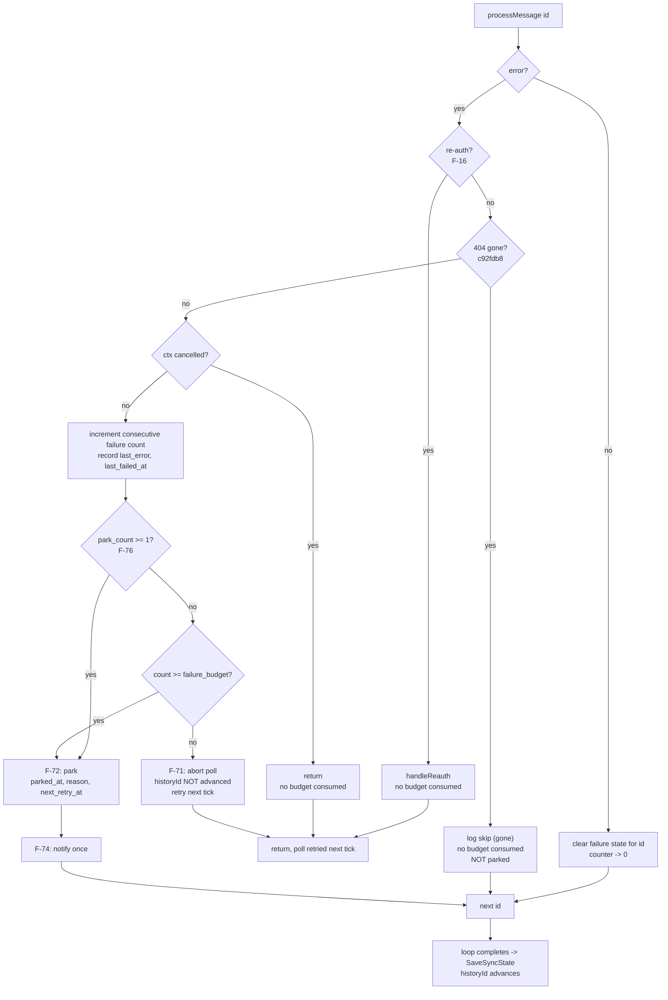
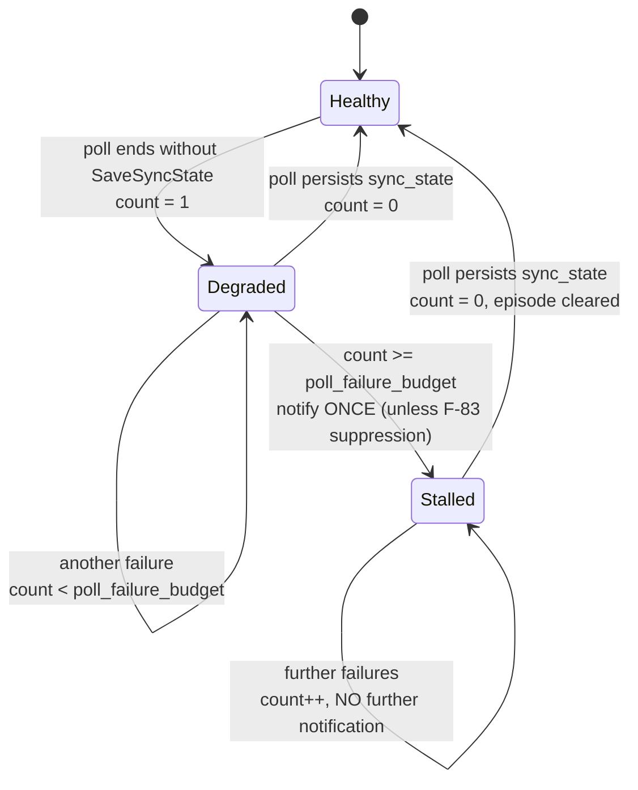

## SPECIFICATION: Resilient poll — per-message failure budget and stall escalation

**Version:** 1.0
**Status:** Draft
**Date:** 2026-08-25
**Type:** feature
**Slug:** resilient-poll-failure-budget
**References:** GitHub issues [vhco-pro/postbode#1](https://github.com/vhco-pro/postbode/issues/1) *(Poll wedges indefinitely on any non-404 per-message error)* and [vhco-pro/postbode#2](https://github.com/vhco-pro/postbode/issues/2) *(A stalled poll is silent: no notification, no alert, only a repeating log line)*. Both filed after the same production outage, 2026-08-22 → 2026-08-25. Follow-up to commit `c92fdb8` (`fix(gmailwatch): skip deleted messages instead of wedging the poll`).
**Relationship to the main spec:** this is a **separate, additive** spec. `docs/specs/postbode-gmail-invoice-agent.spec.md` (v1.10/v1.11, the P0+P1 build) is **not modified by this document**. New requirement ids start at **F-70** and new criteria at **AC-34**, both above that spec's maxima (F-67, AC-33), so the two id spaces never collide. Where this spec cites `F-nn` below 70, `NF-nn` below 14, `AC-nn` below 34, `G-n` or `L1…L4`, it means the main spec's requirement of that number and does not restate it.
**Constitution:** `vega.yaml` — archetype `go-daemon`, language `go`, `artifact.kind: binary`, `deploy_unit: launchd-launchagent`, `distribution: homebrew-tap`, `workflow.spec_mode: assisted`. Bindings `secret_manager`, `k8s_resources`, `apps`, `container_registry`, `image_name` are **n/a** and must not be asked for. Inherited Tier-3: `vega.spec.md`, `constitution.spec.md`, `lang-go.spec.md`. `gitops-layout.spec.md` and `runtime-containers.spec.md` are inherited but **do not apply** — no container image, no cluster, no overlays.

---

### 1. Overview

Postbode's Gmail poll loop currently treats **any** per-message processing failure that is neither a re-auth condition nor a `404` as fatal to the whole poll cycle. `Watcher.Poll` returns out of its `for _, id := range msgIDs` loop on that first error, and the return happens **before** `SaveSyncState`, so `historyId` never advances, the next tick re-lists the same message, and it fails identically — forever. A single bad message therefore converts into an unbounded outage that takes the entire mailbox down with it. (`internal/gmailwatch/poll.go`, the `return PollResult{StagedCount: staged}, fmt.Errorf("gmailwatch: poll: process message %s: %w", id, perr)` line.)

`c92fdb8` fixed exactly one error shape — Gmail's `404` on `messages.get` for a message that was listed and then deleted — because for a 404 the reasoning is airtight: the message no longer exists in the mailbox, so skipping it provably cannot be a **G-1** silent miss. Every other shape (a 5xx, a 429, a spool write failure, a permanently malformed MIME part, a `decision_log` write failure) still has the original failure mode. A 404 was simply the shape that happened first.

The same incident exposed a second, independent gap: nothing escalates. `Daemon.RunIteration` logs a poll error and waits for the next tick, with no notion of "this has now failed N times in a row" (`internal/daemon/daemon.go`). `brew services list` said `started` — true and useless. The log grew by the same line every five minutes for three days, and the only human-visible signal, `sync_state.last_poll_at` going stale, is only reachable by someone who already suspects a problem and thinks to run `postbode status`.

This spec adds a **bounded, loud, recoverable** treatment for both. Per message: a persisted consecutive-failure count; under budget, keep today's fail-the-poll-and-retry-next-tick so genuinely transient errors self-heal; over budget, **park** the message with its reason and let the poll continue past it so `historyId` advances and the rest of the mailbox drains. Per poll: a consecutive whole-poll failure count that escalates to a notification once — not every tick — and makes `postbode status` state in words that the daemon is not making progress.

This is the **inbound-side counterpart to F-51** (`item.first_failed_at` / `retry_count` / `next_retry_at`, the uploader's bounded retry budget with a give-up window) and it deliberately reuses F-51's vocabulary rather than inventing new terms. Its escalation shape is **F-16's** (a routine failure that must not stop polling, is persisted into `sync_state`, and notifies exactly once). Nothing here adds an auto-approve path: every upload still requires human approval (**G-3**).

**Parking is not dropping.** Under **G-1** — *silently dropping a real invoice is worse than letting a duplicate through* — a parked message must stay loud, bounded and recoverable. It is surfaced by notification and by `postbode status`, it is retried automatically after a cooldown, it can be retried on demand, and it is **never** aged out, garbage-collected or forgotten.

---

### 2. Goals & Success Metrics

| # | Goal | Metric |
|---|---|---|
| G-70 | No single message can stall the mailbox | For any message and any error shape, the number of consecutive poll cycles in which that message prevents `sync_state.history_id` from advancing is **≤ `gmail.failure_budget`** (default 3, ≈ 15 min at the 5-minute default poll interval). Proven by AC-34, not by observation. |
| G-71 | Nothing parked is ever silently lost | 0 parked messages that stop being reported. Every park raises exactly one notification and remains listed by `postbode status` until it is processed successfully or explicitly resolved by a human. Measured by AC-39, AC-40, AC-44. |
| G-72 | Transient errors still self-heal without human involvement | A message that fails fewer than `gmail.failure_budget` consecutive times and then succeeds is never parked, never notified, and leaves no residual state. AC-35. |
| G-73 | A stalled daemon announces itself | Time from "the daemon stops making progress" to "a human is notified" ≤ `gmail.poll_failure_budget × gmail.poll_interval` (default 3 × 5m = 15 min), versus the 3 days observed in the 2026-08-22 outage. Exactly one notification per stall episode. AC-43. |
| G-74 | "Is it working?" is answerable in words, not arithmetic | `postbode status` states poll health and parked messages explicitly; no reader has to subtract two timestamps to discover a stall. AC-40, AC-43. |
| G-75 | The 404 fix does not regress | `c92fdb8`'s behaviour is preserved bit-for-bit: a 404 is skipped immediately, consumes no budget, and is never conflated with parking. AC-36. |

---

### 3. Functional Requirements

Priority scale: **P0** = blocker for this feature shipping · **P1** = important · **P2** = nice-to-have.

#### 3.1 Per-message failure budget (issue #1)

| ID | Priority | Requirement | Notes |
|---|---|---|---|
| F-70 | P0 | Postbode persists a **consecutive processing-failure count per `gmail_message_id`**, incremented once per poll cycle in which `processMessage` returns a budget-consuming error for that id, and **reset to zero on any successful processing of that message**. The state is stored in SQLite and survives a daemon restart. | A restart that reset the counters would reintroduce exactly the re-wedge-on-reboot failure mode. Vocabulary mirrors F-51 (`first_failed_at`, `last_error`, `retry_count`, `next_retry_at`) rather than inventing new terms — see §5.2 for the mapping. |
| F-71 | P0 | **Under budget the current behaviour is unchanged.** While a message's consecutive-failure count is **strictly below** `gmail.failure_budget`, a failure aborts the poll cycle exactly as today: the error is returned, `sync_state` is not persisted, and the next tick retries from the same `historyId`. | Deliberate. This is what makes a genuinely transient error (one 503, one transient disk-full) self-heal with no state change, no notification and no human involvement (G-72). Issue #1: *"Under the budget: keep today's behaviour so genuinely transient errors self-heal."* |
| F-72 | P0 | **At or over budget the message is parked.** When the count reaches `gmail.failure_budget`, the message is recorded as **parked** with `parked_at`, its failure count, the last error text and the last attempt time; the poll loop **continues to the next message id**; and the cycle completes normally through `SaveSyncState`, so `history_id` advances and every message behind the parked one is processed. | The whole point. Today the `return` on line ~88 of `internal/gmailwatch/poll.go` happens before `SaveSyncState`, which is what turns one bad message into a permanent outage. |
| F-73 | P0 | **Errors that must not consume budget**, and must keep their existing handling untouched: (a) a **re-auth condition** (`isReauthError`, F-16) — still short-circuits to `handleReauth`; (b) a **404 / message gone** (`isMessageGone`, `c92fdb8`) — still skipped immediately, logged `skip (gone)`, never parked; (c) **context cancellation** (`context.Canceled` / `context.DeadlineExceeded` originating from daemon shutdown). Any other error shape consumes budget. | Burning budget because the user quit the daemon would park perfectly healthy messages. A 404 is **not** "parked": there is nothing left to retry, nothing to surface and nothing a human could do — conflating the two mechanisms would put dead ids in the parked list forever, which is noise, and noise is how G-71 dies. `isMessageGone`'s existing doc comment already draws exactly this line and stays authoritative. |
| F-74 | P0 | **Parking raises exactly one notification per newly parked message**, never on subsequent polls that re-encounter the same parked message. Wording names the message id, the failure count, the truncated last error, and states that the message is **not** in the review queue and how to see it. | Mirrors F-16's notify-once shape and `internal/notify/messages.go`'s convention of appending the command that actually resolves the situation (the v1.8 F-45 amendment: an `osascript` notification is not clickable, so a notification without a command is a dead end). |
| F-75 | P0 | **A parked message is retried automatically after a cooldown, and the automatic retry is itself bounded.** The first automatic retry becomes due `gmail.park_retry_cooldown` after `parked_at` (default **6h**), doubling on each subsequent automatic attempt and capped at 24h, for at most `gmail.park_retry_attempts` automatic attempts (default **3** → due at ≈ 6h, 18h, 42h after parking). Once the automatic attempts are exhausted the message stays parked and stays reported, and only `postbode retry` (F-77) can schedule another attempt. | The developer asked for both automatic and manual recovery, and explicitly that the automatic path must not re-wedge the poll on a schedule forever. Bounded-then-quiet-but-still-visible satisfies both: a day-long upstream outage heals itself; a permanently broken message stops generating work and waits for a human, without ever falling off the report (G-71). Backoff shape and the "give up into a terminal, reported state" idea are F-51's, at a coarser timescale because the failure has already proven itself non-transient. |
| F-76 | P0 | **A retry attempt can never re-wedge the poll.** Any message that has been parked at least once (`park_count ≥ 1`) is processed with an effective budget of **1**: a single failure re-parks it immediately, re-arms the cooldown per F-75, and the poll continues — a re-park never aborts the poll cycle and never blocks `SaveSyncState`. | Without this, each retry of a permanently broken message would cost another `failure_budget × poll_interval` stall, on a schedule. F-71's fail-the-poll path is a concession to transience, and a message that has already been parked has forfeited the presumption of transience. |
| F-77 | P0 | **CLI: `postbode retry`.** Exactly two forms: `postbode retry <gmail_message_id>` clears the park for one message and makes it due on the next poll; `postbode retry --all` does so for every parked message. Both print what they changed. `postbode retry` with **neither** an id nor `--all` is a usage error, exit code **2**, and changes nothing. An id that is unknown or not parked exits non-zero naming the id. | No accidental "retry everything". The daemon is a separate process, so `retry` communicates through SQLite and takes effect on the next poll tick rather than reaching into the running daemon; the command says so in its output rather than implying instant action. |
| F-78 | P0 | **A retried message is actually re-processed, not L1-skipped.** A message can be parked *after* `extract.ExtractMessage` has already recorded it via `RecordMessageIfNew` (the failure window between recording and staging), which would make the L1 check (F-30) skip it on every future attempt — a permanent silent miss. A retry (automatic or manual) of a parked message must therefore bypass the **L1** message-id skip for that attempt. **L2 (SHA-256), L3, L4 and F-44 rejection memory are unaffected and still apply**, so re-extraction cannot produce a second uploadable copy: a byte-identical document links as `duplicate_linked` exactly as AC-11 requires. | This is the sharpest correctness hazard in the feature and it is invisible from the outside: everything would *look* fine — no error, no park churn — while the message was never re-extracted. G-1 forbids it. `internal/extract/extract.go`'s spool-before-record ordering already narrows this window but does not close it, because staging happens after the record. |
| F-79 | P0 | **Parked state never ages out.** No prune, retention or garbage-collection path may delete or hide a parked message. It leaves the parked set only by being processed successfully, or by an explicit human action. This is deliberately different from `internal/queue`'s spool prune policy (F-24, `retention_days`). | Under G-1, forgetting a parked message **is** the silent miss this whole design exists to prevent. A 90-day-old park is not stale, it is unresolved. |
| F-80 | P1 | Every park, re-park, automatic retry, manual retry and un-park is written to the local log with the message id, the failure count and the reason, so the sequence is reconstructible without reading SQLite. Log lines carry no message body and no attachment content (F-65) and the error text is redacted per F-55. | Parity with the existing `skip (gone)` / `skip (L1)` / `dropped:` log vocabulary in `poll.go`. |

#### 3.2 Whole-poll stall escalation (issue #2)

| ID | Priority | Requirement | Notes |
|---|---|---|---|
| F-81 | P0 | Postbode persists a **consecutive whole-poll failure count** in `sync_state`, incremented once for every poll cycle that ends **without persisting `sync_state`** — which covers `history.list` failing, the F-13 fallback query failing, `SaveSyncState` itself failing and F-71's under-budget per-message abort — and reset to zero by any poll that completes and persists. Alongside it: the time of the first failure in the current episode and the last poll error text. | Issue #2 is explicit that a stall can come from causes #1 does not touch. The counting/reset/notify-once **logic** is the same as F-70/F-74's and should be implemented once and reused; the **state** is genuinely different (one singleton row versus one row per message) and must not be force-fitted into one table. |
| F-82 | P0 | When the count reaches `gmail.poll_failure_budget` (default **3**), Postbode raises **exactly one** notification for that stall episode — not one per tick — stating that the daemon is alive but not making progress, how many consecutive polls have failed, since when, the last error, and the command to run. A subsequent successful poll clears the episode; a later stall is a new episode and may notify again. | The 2026-08-22 outage repeated one log line every five minutes for three days and notified nothing. F-16's persisted `last_auth_error` is the precedent for how "notified already" survives a restart. |
| F-83 | P0 | The stall notification is **suppressed for a poll cycle that already emitted a park notification** (F-74). | Both budgets default to 3, so a purely per-message stall crosses both thresholds on the same tick and would otherwise double-notify about one condition. The park notification is strictly more informative and the poll is unwedged by the very act of parking, so the next cycle resets the poll counter to zero anyway. |
| F-84 | P0 | **`postbode status` states poll health in words.** It prints either an explicit healthy line (last successful poll and its age) or a `NOT MAKING PROGRESS` line naming the consecutive failure count, the start of the episode and the last error — never leaving the reader to infer a stall by subtracting timestamps from `last poll:`. | Issue #2: *"Make `postbode status` say so in words."* The existing `last poll: <t> (<age> ago)` line stays; this is added, not substituted. |
| F-85 | P0 | **`postbode status` reports parked messages** in their own section: count, and per message the `gmail_message_id`, consecutive failure count, truncated last error, last attempt time, and either the next automatic retry time or `auto-retry exhausted` plus the exact `postbode retry <id>` command. An empty parked set prints an explicit zero line rather than nothing. | A section that disappears when empty trains the reader to not look for it. |
| F-86 | P1 | Parked messages are **not** rendered as rows in the review UI (`internal/webui`) and never enter the queue lifecycle in any status. | Developer decision, this session. A parked message has no extractable document to review — extraction is precisely what failed — so it does not belong in a queue whose only purpose is deciding on documents. Notification + `postbode status` is the whole visibility surface (F-74, F-85). |

#### 3.3 Configuration

| ID | Priority | Requirement | Notes |
|---|---|---|---|
| F-87 | P0 | Four new keys under `gmail:` in `~/.config/postbode/config.yaml`, all with defaults, all validated by the existing F-29 line-number-naming loader: `failure_budget` (int, default **3**), `park_retry_cooldown` (duration, default **6h**), `park_retry_attempts` (int, default **3**), `poll_failure_budget` (int, default **3**). | `internal/config` walks the parsed `yaml.Node` tree against an explicit per-level allow-list, so these keys must be added to that allow-list or a config containing them fails to load — a hard, easy-to-miss coupling. Values ≤ 0 are rejected at load with the offending line number (F-29): a `failure_budget: 0` would park every message on its first hiccup, which is a G-1 hazard dressed as a config typo. |

---

### 4. Non-Functional Requirements

| ID | Category | Requirement |
|---|---|---|
| NF-14 | Reliability | **Bounded stall, by construction.** No single message, and no single error shape, can prevent `sync_state.history_id` from advancing for more than `gmail.failure_budget` consecutive poll cycles (default ≈ 15 min). This must be a structural property of the loop, not a timeout — it is asserted directly by AC-34. Extends NF-06 ("the daemon must not crash on any expected failure") to its missing half: *nor may it stop making progress*. |
| NF-15 | Reliability | **Durability across restart.** Failure counts, parked state, retry schedules and the notified-once markers all live in SQLite and survive `launchctl` restarts, `kill -9` and laptop sleep. A fresh process re-reads them rather than restarting any clock from zero — the same property F-51's `first_failed_at` was added for in v1.7. Schema changes are **forward-only additive migrations** appended to `internal/queue/schema.go`'s `migrations` slice; no already-shipped migration entry may be edited (NF-07). |
| NF-16 | Testability | **No test may contact `gmail.googleapis.com` or `api.clearfacts.be`** (NF-09, CLAUDE.md). Every criterion in §7 is exercised against `internal/gmailwatch/fake` + `httptest` and a `testdata/*.eml` corpus, including the failure shapes themselves: 5xx, 429 and malformed-MIME failures are scripted through `fake.Server`'s `MessagesGetFunc` / `HistoryFunc` / `MessagesListFunc` and `fake.APIError`, never by pointing at a real endpoint. The AC-22 in-process non-loopback dialer guard (`internal/testsupport/nonet`) remains the enforcement mechanism. |
| NF-17 | Privacy | Park reasons, `last_error` values, notifications and log lines contain **no message body and no attachment content** (F-65), and the ClearFacts PAT and any OAuth token are redacted (F-55). Error text persisted into `last_error` is truncated (≤ 500 chars) so a pathological error string cannot bloat the database or a notification. |
| NF-18 | Performance | The additional per-poll work is one indexed read of due retries plus, only on failure, one small upsert. A healthy poll over ≤ 200 new messages must stay within NF-08's < 30 s budget with no measurable regression. |
| NF-19 | Compatibility | Existing behaviour that other criteria depend on is unchanged: F-16 / AC-20 (re-auth), `c92fdb8` / AC-10 / the `internal/gmailwatch/deleted_message_test.go` 404 tests, F-30's L1 skip for ordinary (non-parked) messages, and F-13's fallback semantics. This feature adds paths; it removes none. |

---

### 5. Data Model & Flows

#### 5.1 Per-message decision flow



#### 5.2 New and amended entities

| Entity | Owner | Key fields | Status |
|---|---|---|---|
| `message_failure` | gmailwatch (stored by queue) | `gmail_message_id` (PK), `failure_count`, `first_failed_at`, `last_failed_at`, `last_error`, `parked_at` (NULL = not parked), `park_count`, `retry_count`, `next_retry_at`, `notified_at` | **New.** |
| `sync_state` | gmailwatch | existing `history_id`, `last_poll_at`, `label_id_submitted`, `token_issued_at`, `last_auth_error`, **plus** `consecutive_poll_failures`, `first_poll_failure_at`, `last_poll_error`, `poll_stall_notified_at` | **Amended, additive only.** |

**Hard constraint on `message_failure`:** it must **not** carry a foreign key to `message(gmail_message_id)` and must not require a `message` row to exist. A message can fail at `users.messages.get` — before `extract` has recorded anything at all — and that is the single most likely failure to park. An FK here would make the feature fail exactly where it is needed most.

The concrete shape (a new table versus columns on `message`) is a plan decision, but the constraint above rules out hanging it off `message`, and the migration must be appended to `internal/queue/schema.go`'s `migrations` slice as a **new version entry** (the existing entries are versions 1–3; this is version 4 and, if `sync_state` is migrated separately, version 5).

**Vocabulary mapping to F-51** — deliberate reuse, not coincidence:

| F-51 (`item`, outbound uploads) | This spec (`message_failure`, inbound polls) | Meaning |
|---|---|---|
| `first_failed_at` | `first_failed_at` | Anchors the episode; set once, never overwritten while the episode lasts |
| `last_error` | `last_error` | Truncated reason, human-readable, redacted |
| `retry_count` | `retry_count` | Attempts spent against the **bounded retry budget** (here, post-park automatic retries) |
| `next_retry_at` | `next_retry_at` | When the next attempt becomes due |
| give up into terminal `failed` after 24h | park after `failure_budget`, then give up automatic retries after `park_retry_attempts` | Bounded budget with an explicit, reported give-up state |
| — | `failure_count` | Consecutive failures in the current episode; resets to 0 on success. No F-51 analogue: uploads count attempts, this counts consecutive failures. |
| — | `park_count`, `parked_at`, `notified_at` | Park state and the F-74 notify-once marker |

**Lifecycle of one `message_failure` row:** created on the first budget-consuming failure → `failure_count` increments per failing poll → at budget, `parked_at` set, `park_count`++, `next_retry_at` armed, `notified_at` set → automatic or manual retry clears `parked_at` and makes the message due → success **deletes the row** (that deletion *is* the F-70 reset) → failure re-parks per F-76. `retry_count` and `park_count` are never reset by a retry; they are the history that makes F-76 and F-75's bound work.

#### 5.3 Retry admission — parked messages must be reachable after `historyId` moves on

Parking advances `historyId` past the parked message by design (F-72), so the message will **never** be listed again by `history.list` or by the F-13 fallback window once that window rolls past its date. A retry therefore cannot depend on the message reappearing in a listing.

**Mechanism:** at the start of every poll cycle, before the ordinary listing, the watcher reads the set of message ids whose park is cleared or whose `next_retry_at` is due, and **prepends them to `msgIDs`** for that cycle. This is the single mechanism behind both automatic (F-75) and manual (F-77) retry, and it is the reason `postbode retry` can be a pure SQLite write from a separate process. Ids are de-duplicated against the listing result so a message that is both due and listed is processed once.

#### 5.4 Whole-poll stall state machine



---

### 6. API / Interface Contracts

#### 6.1 CLI

```
postbode retry <gmail_message_id>   # clear the park for one message; due on the next poll
postbode retry --all                # clear the park for every parked message
postbode retry                      # usage error, exit 2, changes nothing
postbode status                     # now also prints poll health (F-84) and parked messages (F-85)
```

| Invocation | Effect | Output | Exit |
|---|---|---|---|
| `postbode retry <id>` on a parked id | `parked_at` cleared, `next_retry_at` set to now | `retry: message <id> unparked (3 failures, last error: …) — will be reprocessed on the next poll (within <poll_interval>)` | 0 |
| `postbode retry <id>` on an unknown or non-parked id | none | `retry: message <id> is not parked` on stderr | non-zero |
| `postbode retry --all` with N ≥ 1 parked | all cleared | one line per message, then `retry: unparked N message(s)` | 0 |
| `postbode retry --all` with none parked | none | `retry: no parked messages` | 0 |
| `postbode retry` (no argument, no flag) | none | usage on stderr | 2 |
| `postbode retry <id> --all` | none | usage on stderr | 2 |

`postbode retry` opens the queue database with the existing `cli.OpenDB` path. It is the **first CLI verb that writes to the queue while the daemon may be running**; `queue.Open` already sets `PRAGMA journal_mode=WAL` and `PRAGMA busy_timeout=5000` (`internal/queue/db.go`), which is what makes that safe — verified in this session by reading the pragma list, and to be re-verified by AC-41.

#### 6.2 `postbode status` — added output

Added between the existing `re-auth needed:` line and the `queue:` block (poll health), and after the `stuck > 48h:` block (parked messages):

```
poll health:      ok (last successful poll 3m ago)
```
or
```
poll health:      NOT MAKING PROGRESS — 7 consecutive poll failures since 2026-08-25T06:00:00Z
                  last error: gmailwatch: poll: history.list: googleapi: Error 503: backend error
```
and
```
parked messages:  2 message(s) — these are NOT in the review queue
  [19881a2f3b4c5d6e] 3 failures, last attempt 2026-08-25T09:12:00Z, auto-retry 2026-08-25T15:12:00Z
                     last error: gmailwatch: extract message …: spool write failed: no space left on device
  [19881b30c1d2e3f4] 5 failures, last attempt 2026-08-24T22:40:00Z, auto-retry exhausted
                     last error: gmailwatch: messages.get(…): googleapi: Error 500: internal error
                     run: postbode retry 19881b30c1d2e3f4
```
```
parked messages:  0
```

Rendering lives in `cli.FormatStatus` and its report in `cli.BuildStatusReport`, whose `now` stays injected so tests control every age and due-time boundary exactly.

#### 6.3 Go-level surfaces (indicative; names are the plan's to finalise)

| Package | Surface | Contract |
|---|---|---|
| `internal/queue` | `RecordMessageFailure(ctx, id, errText string, budget int) (MessageFailure, parked bool, err error)` | Upserts the row, increments `failure_count`, returns whether this failure crossed into parked (true exactly once per park, so the caller can notify once). |
| `internal/queue` | `ClearMessageFailure(ctx, id) error` | Deletes the row. The F-70 reset. Idempotent, no error when absent. |
| `internal/queue` | `ListParkedMessages(ctx) ([]MessageFailure, error)` | For `postbode status` (F-85). Stable order: oldest `parked_at` first. |
| `internal/queue` | `DueRetries(ctx, now time.Time) ([]string, error)` | §5.3 admission set: park cleared, or `next_retry_at <= now` with automatic attempts remaining. |
| `internal/queue` | `Unpark(ctx, id) (bool, error)` / `UnparkAll(ctx) (int, error)` | F-77. Returns false / 0 when nothing was parked. |
| `internal/queue` | `RecordPollFailure(ctx, errText string, budget int) (SyncState, escalate bool, err error)` / `ClearPollFailure(ctx) error` | F-81/F-82. `escalate` is true exactly once per episode. |
| `internal/gmailwatch` | `consumesBudget(err error) bool` | F-73's classifier, sibling of `isReauthError` and `isMessageGone`, in its own file with its own doc comment explaining each exclusion. |
| `internal/gmailwatch` | `PollResult.Parked []string`, `PollResult.Retried []string` | Additive fields, so `Daemon.RunIteration` and tests can observe the outcome without reading the database. |
| `internal/extract` | `Message.ForceReextract bool` (or equivalent) | F-78's L1 bypass for one attempt. Must not weaken L2/L3/L4 or F-44. |
| `internal/notify` | `ParkedMessage(id string, failures int, reason string) string`, `PollStalled(count int, since time.Time, lastErr string) string` | Wording lives with the other F-45 messages, appending the command to run per the v1.8 convention. |

#### 6.4 Config — `~/.config/postbode/config.yaml`

```yaml
gmail:
  poll_interval: 5m          # existing
  failure_budget: 3          # F-70/F-72 — consecutive per-message failures before parking
  park_retry_cooldown: 6h    # F-75 — delay to the first automatic retry, doubling, capped 24h
  park_retry_attempts: 3     # F-75 — how many automatic retries before only `postbode retry` helps
  poll_failure_budget: 3     # F-81/F-82 — consecutive whole-poll failures before escalating
```

---

### 7. Acceptance Criteria

Every criterion below runs against `internal/gmailwatch/fake` + `httptest` and the `testdata` corpus. **None contacts a real Google or ClearFacts endpoint** (NF-16, NF-09, CLAUDE.md). New criteria are numbered from **AC-34**, above the main spec's AC-33.

- [ ] **AC-34:** Given a poll listing message ids `[A, B, C]` where `B`'s `messages.get` is scripted to return `500` on every call: polls 1 and 2 return an error and leave `sync_state.history_id` unchanged; poll 3 parks `B`, processes `C`, and persists `sync_state` with an advanced `history_id`. After poll 3, `A` and `C` have staged items and `B` is listed by `ListParkedMessages` with `failure_count == 3`. A fourth poll stages nothing new, parks nothing new and does not error. *(F-70, F-71, F-72, NF-14)*
- [ ] **AC-35:** A message whose `messages.get` fails twice and then succeeds is **never** parked: after the third poll it has staged items, `ListParkedMessages` is empty, no park notification was sent, and the `message_failure` row for that id no longer exists (`failure_count` reset to zero). *(F-70, G-72)*
- [ ] **AC-36 — regression guard on `c92fdb8`:** A message whose `messages.get` returns `404` is skipped on the **first** poll with the existing `skip (gone)` log line, consumes **no** budget (no `message_failure` row is created), is **not** parked, raises no notification, and the same poll persists `sync_state`. The existing `internal/gmailwatch/deleted_message_test.go` tests continue to pass unmodified. *(F-73b, G-75, NF-19)*
- [ ] **AC-37:** A poll cancelled mid-loop (context cancelled while `messages.get` is in flight) creates **no** `message_failure` row and increments no counter for the in-flight message; the next poll with a live context processes that message normally. *(F-73c)*
- [ ] **AC-38:** With the fake OAuth server returning `invalid_grant` mid-loop, behaviour is byte-for-byte AC-20's: `handleReauth` runs, exactly one re-auth notification is sent, no queue row changes, **no** `message_failure` row is created for the in-flight message, and no message is parked. *(F-73a, NF-19)*
- [ ] **AC-39:** Parking a message invokes the fake notifier **exactly once**, with a message containing the `gmail_message_id`, the failure count and the truncated reason. A second and third poll that re-encounter the same parked message (before its cooldown is due) invoke the notifier **zero** further times. `osascript` is never executed — the notifier is behind the existing interface. *(F-74)*
- [ ] **AC-40:** With one parked message, `postbode status` output contains a `parked messages:` section listing that `gmail_message_id`, its failure count, its last error and its last attempt time, plus either an auto-retry timestamp or `auto-retry exhausted` with the exact `postbode retry <id>` command. With none parked, the section prints `parked messages:  0` rather than being omitted. Asserted against `cli.FormatStatus` with an injected `now`. *(F-85, F-84, G-74)*
- [ ] **AC-41:** `postbode retry <id>` on a parked message exits 0, clears `parked_at`, and the **next poll reprocesses that message and stages its documents even though `history_id` has advanced past it and no listing returns it** (§5.3 admission path). `postbode retry --all` unparks every parked message and reports the count. `postbode retry` with no argument exits **2** and changes nothing; `postbode retry <unknown-id>` exits non-zero naming the id. The write succeeds while a second connection holds the same database open (WAL + `busy_timeout`). *(F-77, §5.3, §6.1)*
- [ ] **AC-42:** With `park_retry_cooldown: 1ms` and `park_retry_attempts: 2` (injected clock or tiny durations), a parked message whose failure persists is retried automatically twice and no more; each retry **re-parks on the first failure without aborting the poll** — every one of those poll cycles still persists `sync_state` and still processes the messages behind it — and after the second retry the message reports `auto-retry exhausted` while remaining in `ListParkedMessages`. A parked message whose underlying failure has healed is processed successfully on its first automatic retry, stages its documents, and its `message_failure` row disappears. *(F-75, F-76, F-79)*
- [ ] **AC-43:** With `history.list` scripted to fail with `503` on every call and `poll_failure_budget: 3`: polls 1–2 notify nothing; poll 3 invokes the notifier **exactly once** with a message naming the consecutive failure count and the last error; polls 4–10 invoke it **zero** further times; `postbode status` prints a `poll health: NOT MAKING PROGRESS` line naming the count and the episode start. Once `history.list` succeeds, the counter resets, `postbode status` prints `poll health: ok`, and a subsequent new stall episode notifies again exactly once. Separately: a purely per-message stall that ends in a park emits the **park** notification only — never both — for that cycle. *(F-81, F-82, F-83, F-84, G-73)*
- [ ] **AC-44:** Parked state, failure counts, retry schedules and the notify-once markers survive closing and reopening the database (a daemon restart): reopening does **not** re-notify, does **not** reset any counter, and does **not** restart the cooldown from zero. A `PruneSpool` / retention pass with `retention_days` set to prune-everything leaves every parked message present and reported. *(NF-15, F-79, G-71)*
- [ ] **AC-45 — the silent-miss guard:** A message that reaches `RecordMessageIfNew` and then fails during staging is parked; on retry it is **re-extracted rather than L1-skipped**, and its documents reach the queue. The retry produces **no** second uploadable item for a byte-identical document — the duplicate links as `duplicate_linked` via L2 exactly as AC-11 requires — and a document previously rejected stays rejected via F-44. *(F-78, G-1, G-2)*
- [ ] **AC-46:** `make test && go vet ./...` passes and the whole suite passes with the AC-22 in-process non-loopback dialer guard active: every failure shape in AC-34…AC-45 is produced by `fake.Server` / `fake.APIError` / `httptest`, and zero tests reference `gmail.googleapis.com` or `api.clearfacts.be`. *(NF-16, NF-09, NF-12)*
- [ ] **AC-47:** A `config.yaml` containing all four new `gmail:` keys loads with those values; one containing `failure_budget: 0` (and, separately, `park_retry_attempts: -1`) is rejected at startup with the offending **line number**, and the daemon does not start. Omitting all four yields the documented defaults 3 / 6h / 3 / 3. *(F-87, F-29)*

---

### 8. Edge Cases & Error Handling

| Scenario | Expected behaviour | Trace |
|---|---|---|
| Message returns `500`/`429` persistently | Fails the poll up to `failure_budget` times, then parks; poll continues, `historyId` advances | F-71, F-72 |
| Message returns `404` (deleted / purged from Trash) | Skipped on the first poll, no budget consumed, **not** parked, no notification | F-73b, `c92fdb8` |
| Spool write keeps failing (disk full) for one message | Parks after budget; the existing fail-safe still leaves the message unrecorded and no queue row committed, so the retry is clean | F-72, F-78, main spec §8 "disk full while spooling" |
| Disk full affecting **every** message | Every message parks in turn and the whole-poll counter also climbs; the human gets one park notification per message plus, on a cycle with no park, one stall notification | F-74, F-82, F-83 |
| Permanently malformed MIME part | Parks after budget, stays parked and reported after automatic retries are exhausted, waits for a human | F-72, F-75, F-79 |
| Re-auth condition mid-loop | Unchanged F-16 path; no budget consumed; nothing parks | F-73a, AC-38 |
| Daemon shut down (SIGTERM) mid-poll | Context cancellation consumes no budget; nothing parks; next start resumes | F-73c |
| Parked message is later deleted from Gmail | Its retry hits a 404, which per F-73b is skipped without consuming budget. **The park is cleared by that skip** and the message stops being reported — it provably cannot be a silent miss, since it no longer exists | F-73b, F-79 |
| `historyId` advanced past a parked message | The retry admission set re-injects it by id, so a retry never depends on it being listed again | §5.3 |
| Parked message retried manually while the daemon is mid-poll | The write lands under WAL + `busy_timeout=5000`; the change takes effect on the next cycle, which is what the command's output says | §6.1, AC-41 |
| `SaveSyncState` itself fails | Counts toward the whole-poll counter (the cycle made no progress), escalates at budget; no message is parked for it | F-81 |
| History gap / F-13 fallback triggered while messages are parked | Parked messages that the fallback window re-lists are still governed by F-76 (effective budget 1), so a resync cannot re-wedge on them | F-76, F-13 |
| Both budgets cross on the same tick | Park notification only; the stall notification is suppressed for that cycle | F-83 |
| Enormous error string from the API | Truncated to ≤ 500 chars before persisting or notifying | NF-17 |
| Clock jumps backwards (sleep/wake) | `next_retry_at` in the future simply delays the retry; a due-time in the past fires on the next tick. No unbounded catch-up loop, because at most one retry attempt per message per poll cycle is admitted | F-75, §5.3 |
| 100 messages parked | `postbode status` lists them oldest-first; the notification is per-park, so no digest is attempted in this version | F-85, §9 |

---

### 9. Out of Scope

Explicitly **not** covered:

- **A review-UI surface for parked messages.** Developer decision: notification + `postbode status` only (F-86). A parked message has no document to review.
- **Any auto-approve or auto-upload path.** Unchanged from the main spec: every upload requires human approval (G-3, CLAUDE.md).
- **Changing the 404 handling from `c92fdb8`.** Preserved exactly; this spec only forbids conflating it with parking (F-73b, AC-36).
- **Re-classifying which errors are *retryable* on the ClearFacts side.** F-51's outbound retry/give-up policy is untouched; this spec is inbound-only.
- **A digest or summary notification** when many messages park at once. One notification per park, per F-74's notify-once mirror of F-16. Revisit if a real incident produces notification spam.
- **Automatic root-cause classification of park reasons** (grouping "disk full" versus "malformed MIME" into distinct states). The reason is recorded and reported verbatim; interpreting it stays human work.
- **Aging out, archiving or garbage-collecting parked messages** — forbidden by F-79, not deferred.
- **Health-check endpoints, telemetry or remote alerting.** Notifications are local `osascript` only; no cloud component, no telemetry (NF-05).
- **Every Engie platform artifact** — no Kubernetes, no container image, no Argo CD, no cloud secret manager. Per `vega.yaml`, `artifact.kind: binary`, `deploy_unit: launchd-launchagent`; the inherited `gitops-layout` and `runtime-containers` Tier-3 specs do not apply.

---

### 10. Open Questions

| ID | Question | Owner | Deadline | Blocking? |
|---|---|---|---|---|
| **OQ-70** | Are the default cooldown numbers right in practice — first automatic retry at **6h**, then 12h/24h, 3 attempts total (F-75)? They are a judgement call, not a measurement: the only production data point is a single deleted message, whose class no longer reaches this path at all (it is a 404). Config-tunable, so wrong-but-tunable rather than wrong-and-stuck. | Michiel | Review after the first real park | No |
| **OQ-71** | Should `postbode status` exit non-zero when anything is parked or the poll is stalled, so `brew services`-style scripted checks can act on it? Attractive but out of band with today's status contract, which always exits 0. Not decided here, and nothing in this spec depends on it. | Michiel | Non-blocking | No |

**Assumptions** *(mode: assisted — the four decisions above the line were answered by the developer this session; the rest were self-resolved and are recorded for audit at the PR merge gate)*

**Developer-answered (not assumptions, recorded here for the trail):**

- **D-1 — Parked-message visibility is notification + `postbode status` only, not a review-UI row.** Rationale accepted by the developer: a parked message has no extractable document to review, since extraction is exactly what failed, so it does not belong in a queue whose purpose is deciding on documents. → F-86. *[Risk: low]*
- **D-2 — Recovery is both automatic and manual.** Automatic retry after a cooldown, plus `postbode retry` to force it sooner, with the automatic path itself bounded so it cannot re-wedge the poll on a schedule forever. → F-75, F-76, F-77. *[Risk: medium — the cooldown numbers are a judgement call, see OQ-70]*
- **D-3 — Issue #2 is in scope.** Consecutive whole-poll failure escalation ships with the per-message budget, reusing one counting/escalation shape where the logic is genuinely the same and keeping the state separate where it is not. → F-81…F-84. *[Risk: low]*
- **D-4 — The budget is 3 consecutive failures, exposed as a config key defaulting to 3.** At the 5-minute default poll interval that is ≈ 15 minutes of stall. → F-70, F-87. *[Risk: low]*

**Self-resolved (audit these):**

- **A-70 — Context cancellation and re-auth conditions must not consume budget.** Burning a message's budget because the user quit the daemon, or because a token expired, would park perfectly healthy messages — turning an ordinary event into a G-1 hazard. → F-73a, F-73c, AC-37, AC-38. *[Risk: low]*
- **A-71 — A 404 keeps `c92fdb8`'s behaviour exactly and is never "parked".** It is skipped immediately without consuming budget, because there is nothing left to retry and nothing a human could do. The two mechanisms are deliberately not conflated: parking a dead id would pollute the parked list forever, and a report full of noise is how G-71 dies in practice. → F-73b, AC-36. *[Risk: low]*
- **A-72 — Parked state never ages out or is garbage-collected.** Under G-1, forgetting a parked message **is** the silent miss the whole design exists to prevent, so it stays reportable until a human resolves it. Deliberately different from `internal/queue`'s spool prune policy (F-24). → F-79, AC-44. *[Risk: low]*
- **A-73 — Notification fires once per newly parked message, not on every subsequent poll**, mirroring F-16's notify-once shape. → F-74, AC-39. *[Risk: low]*
- **A-74 — The failure counter is per `gmail_message_id` and resets to zero on any successful processing of that message**, so a message that fails twice and then succeeds is never parked and starts clean next time. → F-70, AC-35. *[Risk: low]*
- **A-75 — Parked state is persisted in SQLite and survives a daemon restart**, since a restart resetting the counters would reintroduce exactly the re-wedge-on-reboot failure mode. Schema shape (a new table versus columns on `message`) is the plan's call, but the migration must follow the existing forward-only pattern in `internal/queue/schema.go`. → NF-15, §5.2. *[Risk: medium — the one place this feature touches the shared schema]*
- **A-76 — `message_failure` must not depend on a `message` row existing.** A failure at `users.messages.get` happens before `extract` records anything, and that is the most likely park cause of all, so a foreign key to `message` would break the feature exactly where it is needed most. This is stated as a hard constraint in §5.2 rather than left to the plan. *[Risk: medium — an FK here would look like good hygiene and would be a defect]*
- **A-77 — A retry of a parked message must bypass the L1 message-id skip for that attempt (F-78).** There is a real window in `extract.ExtractMessage` between `RecordMessageIfNew` succeeding and staging failing; without the bypass, every future retry would L1-skip and the invoice would be permanently, silently lost — with no error and no park churn to reveal it. L2/L3/L4 and F-44 stay in force, so re-extraction cannot create a second uploadable copy. *[Risk: medium — the sharpest correctness hazard in the feature; AC-45 exists solely to pin it]*
- **A-78 — A message that has been parked once is processed thereafter with an effective budget of 1 (F-76).** Otherwise every scheduled retry of a permanently broken message costs another `failure_budget × poll_interval` stall, on a schedule — the exact behaviour D-2 forbids. *[Risk: low]*
- **A-79 — The stall notification is suppressed on a cycle that already parked something (F-83).** With both budgets defaulting to 3, a purely per-message stall crosses both thresholds on the same tick; the park notification is strictly more informative and the poll is unwedged by the park itself. *[Risk: low — if this proves wrong the fix is to notify both, which is additive]*
- **A-80 — Reused vocabulary, separate state.** F-51's field names are reused verbatim where the meaning matches (§5.2's mapping table) and the counting/notify-once logic is implemented once and shared between F-70 and F-81, but the two counters live in different rows because a per-message count and a singleton poll count are not the same state. *[Risk: low]*
- **A-81 — No external platform fact is load-bearing in this spec.** The only third-party contract involved is Gmail's `404 notFound` on `messages.get` for a deleted message, which was established **empirically from this daemon's own production log** during the 2026-08-22 → 2026-08-25 incident and is already encoded in `internal/gmailwatch/gone.go`. No claim here rests on model memory about a vendor's current behaviour. *[Risk: low]*

---

### 11. Planner Handoff Notes

**Dependencies to resolve first**

1. **The schema migration comes first** (`internal/queue/schema.go`, a new version-4 entry, additive only, never editing versions 1–3). Everything else writes to it. Include the `sync_state` columns in the same pass or a version-5 entry — do not spread them across the build.
2. **`internal/config`'s allow-list must be extended in the same change as the new keys** (F-87). The loader walks the `yaml.Node` tree against an explicit per-level allow-list, so a config file containing `failure_budget` fails to load until that list knows the key — and it will fail with F-29's "unknown key" error, which reads like a user mistake rather than a missing implementation.
3. **`internal/gmailwatch/fake` may need a small extension** to script per-id failures deterministically across several polls (`MessagesGetFunc` already takes `(id, format)`, so this is likely a test-side counter rather than a fake change — confirm before assuming). Note the v1.11 lesson recorded in the main spec: `fake.Server.HistoryFunc` takes only `(startHistoryID, pageToken)`, which made a whole class of defect *unrepresentable in tests*. If a failure shape in §7 cannot be expressed, extend the fake rather than weakening the criterion.

**Suggested implementation order**

| Step | Work | Rationale |
|---|---|---|
| 1 | Migration + `queue` model/CRUD for `message_failure` and the `sync_state` columns, with direct unit tests | Everything downstream depends on it; cheapest place to get the reset/park/unpark semantics right |
| 2 | `consumesBudget` classifier in its own file next to `isReauthError` / `isMessageGone`, with table tests for all four classes (re-auth, gone, cancelled, other) | Pure and highly testable; it is also the requirement most likely to be got subtly wrong (AC-36, AC-37, AC-38) |
| 3 | `Poll` loop change: budget accounting, park, continue, `SaveSyncState` reached (AC-34, AC-35) | The core fix for issue #1 |
| 4 | §5.3 retry admission + F-78's L1 bypass (AC-41's re-injection half, AC-45) | The two mechanisms that make parking *recoverable* rather than a fancy skip |
| 5 | Cooldown scheduling and the F-76 effective-budget-1 rule (AC-42) | Needs 1 and 4 in place |
| 6 | Notifications: park (F-74) and stall (F-82), plus F-83 suppression (AC-39, AC-43) | Wording lives in `internal/notify/messages.go` beside the F-45 messages |
| 7 | Whole-poll counter + escalation in `Poll`/`RunIteration` (AC-43) | Issue #2; small once step 1 exists |
| 8 | `postbode status` sections (AC-40) and `postbode retry` (AC-41) | Ops surface; `retry` is a new `cmd/postbode` verb plus `internal/cli` |
| 9 | Config keys + validation (AC-47), README/CLAUDE.md note | Last, so the defaults are already proven by the tests |

**Risk areas to flag**

- **Highest — F-78's L1 bypass.** Getting this wrong produces a *silent* permanent miss: no error, no park churn, nothing in the log, and the message simply never comes back. It is the one defect in this feature that G-1 ranks worst and that no operator would ever notice. AC-45 is the only thing that catches it; do not descope it, and do not let the bypass leak into ordinary (non-parked) polls, where it would defeat F-30's replay protection.
- **High — not conflating parking with the 404 skip.** They look similar and are opposites: one is "retry later, loudly"; the other is "there is nothing to retry". Keep `isMessageGone` and `consumesBudget` as separate, separately documented predicates. AC-36 guards the existing `deleted_message_test.go` behaviour.
- **High — schema migration correctness.** Forward-only, additive, appended as a new version entry. An edit to an already-shipped migration silently breaks any database created by an earlier binary — and this repo ships through a Homebrew tap, so older binaries genuinely exist in the wild.
- **Medium — double notification.** F-83's suppression is the designed answer, but the interaction between the two counters is the least obvious part of this spec. AC-43's final clause is the assertion that keeps it honest.
- **Medium — retry re-wedging.** F-76 exists solely to prevent "the schedule re-stalls the daemon every 6 hours". AC-42 asserts that every retry cycle still persists `sync_state`; that assertion, not the cooldown value, is what makes the design safe.
- **Medium — `postbode retry` writing while the daemon holds the database.** WAL and `busy_timeout=5000` are already set in `queue.Open`, so this should just work; AC-41 asserts it rather than assuming it. Do not add a lock file or a daemon IPC channel for this.
- **Low but sharp — config allow-list coupling.** Adding a key without updating the allow-list produces a confusing F-29 failure at startup that reads like a user error. AC-47 covers it.

**Estimated complexity**

| Area | Requirements | Size |
|---|---|---|
| Migration + `message_failure` CRUD + `sync_state` columns | F-70, F-81, NF-15 | M |
| `consumesBudget` classifier | F-73 | S |
| `Poll` loop: budget, park, continue | F-71, F-72, F-76 | M |
| Retry admission + L1 bypass | F-75, F-78, §5.3 | **L** |
| Notifications (park + stall + suppression) | F-74, F-80, F-82, F-83 | S |
| Whole-poll escalation wiring | F-81, F-82 | S |
| `postbode status` sections | F-84, F-85 | S |
| `postbode retry` CLI | F-77 | M |
| Config keys + validation | F-87 | S |
| Test corpus for the failure shapes (fake scripting) | NF-16, AC-34…AC-47 | **L** |

**Traceability note for the planner:** every Test Plan row must cite an `AC-n` from §7, and every `AC-n` cites an `F-nn`/`NF-nn` from this spec. **F-72, F-73, F-74, F-78 and F-79 are the G-1 spine of this feature and may not be descoped without an explicit spec revision** — each of them, individually, is the difference between "parked loudly and recoverably" and "silently dropped".
