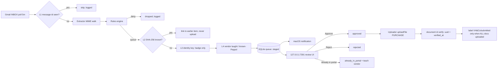
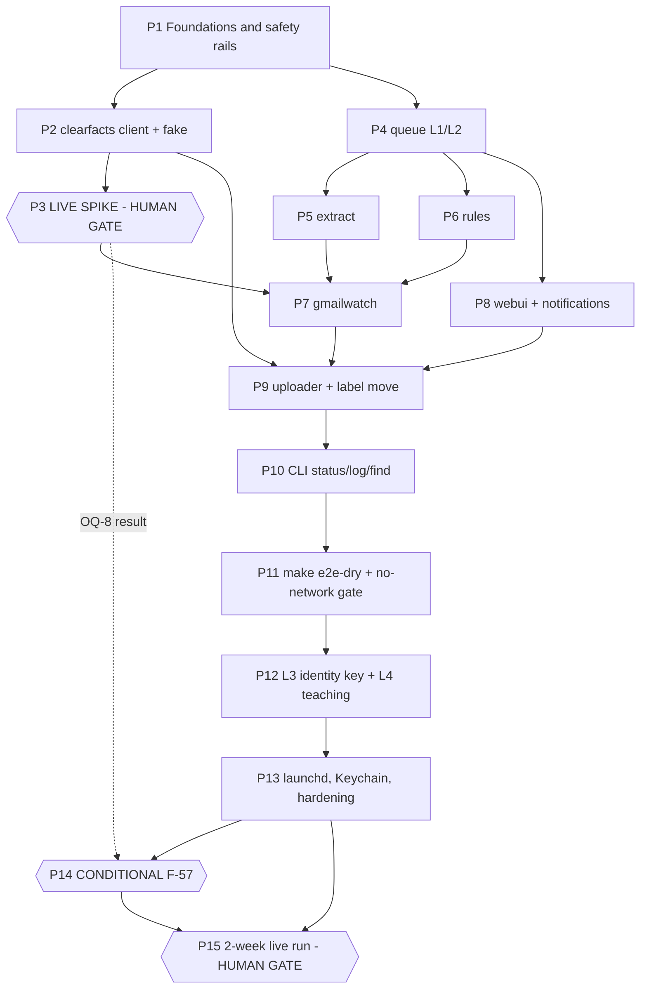

# Plan: Postbode — Gmail to ClearFacts/QPS Invoice Agent

This plan sequences PRD phases **P0 (spike)** and **P1 (MVP)** of Postbode into 15 phases, mapping every phase to the 28 acceptance criteria already defined in spec v1.2 §7 (`AC-1`…`AC-26` plus `AC-5b`/`AC-5c`). No new AC ids are invented; requirements the spec left without an AC are covered by a supplementary `F-nn`-keyed verification table (§Test Plan, part B) and flagged in §Open Questions.

---

## Table of Contents

1. [Context](#context)
2. [Dependencies](#dependencies)
3. [Scope](#scope)
4. [Design](#design)
5. [Acceptance Criteria](#acceptance-criteria)
6. [Implementation Phases](#implementation-phases)
7. [Test Plan](#test-plan)
8. [Implementation Order](#implementation-order)
9. [File Reference Summary](#file-reference-summary)
10. [Open Questions](#open-questions)

---

## Context

**Source spec:** `docs/specs/postbode-gmail-invoice-agent.spec.md` (v1.2, 2026-08-03, status *ready for /plan*).
**Background:** `prd-postbode.md` (repo root, Draft v1.2). Where the two disagree, **the spec wins** — it corrects the PRD on the module path (`github.com/vhco-pro/postbode`, not `michielvh`), the upload argument (`companyNumber`, not the deprecated `vatnumber`), the image-attachment phase (P2, not MVP), and the dedup layer count (four, not three).

**No constitution.** This repo intentionally has no `vega.yaml` and no Engie platform bindings. There is no Kubernetes, no Argo CD, no GitOps repo, no container image, no registry, no cloud secret manager, no CI/CD platform and no cross-repo PR choreography anywhere in this plan. Deployment is a `launchd` LaunchAgent on one MacBook; secrets are the macOS Keychain; the git repo is local-only on `main` with no remote. Everything below derives from the spec, which was written to stand alone.

**Why this work exists.** The developer's recurring pain is not "did it get sent" but **"was it already sent"** (spec §1). ClearFacts publishes no bulk document-list query — `document(id:)` is the only read path and the only source of an id is your own upload response (spec §6.1, OQ-4 closed). Postbode therefore cannot ask the portal what it already holds, and the entire duplicate guarantee has to be built locally in four layers (F-30…F-36). That constraint, not the Gmail plumbing, is the architectural centre of this build. See `decisions/ADR-001-four-layer-local-duplicate-prevention.md`.

**Deviations from the spec's own suggested order (§11).** The spec's 12-step handoff is a strong input and this plan follows roughly 80% of it. Four deliberate changes, each justified in the phase that makes it:

| Spec §11 step | This plan | Why |
|---|---|---|
| Step 7 (`gmailwatch`) owns AC-19 (label move only when all docs uploaded) | **Phase 9** (uploader) owns AC-19; Phase 7 owns only label *resolution* (F-15) | F-14's precondition is "all documents of the message reached terminal `uploaded`". That state does not exist until the uploader does. Testing AC-19 in Phase 7 would require faking the very state Phase 9 produces. |
| Step 2 (`clearfacts`) owns AC-17 (retry_count == 3, 400 → failed) | **Phase 9** owns AC-17; Phase 2 owns error *classification* only | AC-17 asserts on persisted `retry_count` and item status, which are queue+uploader concerns. Phase 2 can only unit-test the retry/backoff decision function. |
| Step 11 (ops polish) owns `postbode status --find` | **Phase 10**, immediately after the uploader | AC-16 textually couples F-39 (`status --find`) into the upload acceptance criterion. Deferring `--find` to the end leaves AC-16 unverifiable for five phases. |
| Step 10 (L3/L4) precedes the e2e harness | **Phase 11** (`make e2e-dry`) precedes **Phase 12** (L3/L4) | L3 is the single highest-risk area in the whole build (heuristic parsing that must never auto-suppress). Landing it on a pipeline that already has an executable full-path regression test is materially safer than the reverse. |

Two structural additions: **Phase 1** hard-gates `.gitignore` before the first commit (F-63 is a one-way door on a repo with no remote to force-push over), and **Phase 14** isolates the conditional F-57 so it cannot be built speculatively.

---

## Dependencies

### Human prerequisites (cannot be agent-created — blocks Phase 3)

| # | Item | Detail | Blocks |
|---|---|---|---|
| D-1 | **ClearFacts PAT** | `app.myqps.be` → profile → *Persoonlijke toegangstokens* → *Nieuwe token aanmaken*. Scopes: `upload_document`, `read_administrations`, **and `statistics`**. Exported as `CF_TOKEN` in the dev shell. | Phase 3 |
| D-2 | **Google OAuth desktop client** | `console.cloud.google.com` → project → enable Gmail API → consent screen (External) → *Desktop app* credentials → save as `credentials.json` in repo root (**gitignored — Phase 1 must land first**). Human clicks consent once. | Phase 3 |
| D-3 | **`VH&Co/submitted` label exists in Gmail** | Nested label, exact full name. Postbode resolves it by name and must never create it (F-15). | Phase 3, Phase 7 |
| D-4 | **Portal cleanup authorization** | Developer deletes `TEST-postbode-ignore.pdf` from "In verwerking" after Phase 3 (A-5). | Phase 3 exit |

> **D-1 is a one-way door.** ClearFacts scopes are fixed at token-creation time; adding `statistics` later means minting a new token. Mint it now even though F-57 is conditional — the cost of including it is zero, the cost of omitting it is a token rotation mid-build (spec §11).

### Toolchain

Go 1.22+ (stdlib `for range` over integers not required; module + `embed.FS` + `net/http` are). macOS with `osascript` and `launchctl` on PATH. No JS toolchain, no Docker, no container runtime.

### Go dependencies

NF-13 restricts the dependency set to `google.golang.org/api/gmail/v1`, `golang.org/x/oauth2`, `modernc.org/sqlite`, `github.com/zalando/go-keyring`, plus stdlib, and states **"any addition requires a note in the plan"**. Two additions are unavoidable and are noted here:

| Dependency | Required by | Note |
|---|---|---|
| `gopkg.in/yaml.v3` | F-26, F-29, §6.5 — config is `~/.config/postbode/config.yaml` | **NF-13 omits any YAML parser while F-26 mandates a YAML config.** This is a gap in the spec, not a discretionary addition. `yaml.v3` is the stdlib-adjacent default, pure Go, no cgo. Needed from Phase 6 (Phase 1 may stub config loading). |
| PDF text extraction (undecided) | F-32 — "the PDF text layer where one exists" | **No pure-stdlib path exists.** Deferred to a decision point inside Phase 12; see OQ-P4. Phase 12 explicitly ships filename+subject parsing first so that the dependency question does not block L3 entirely. `F-22` (password-protected detection) does **not** need this — the `/Encrypt` trailer key is detectable with stdlib byte scanning. |

No other dependency may be added without amending this table.

---

## Scope

### In Scope

- **PRD P0** — `cmd/spike`: live ClearFacts administrations query, one authorized live `TEST-postbode-ignore.pdf` upload, `document(id:)` verification, provenance readback, Gmail label resolution, and the `companyStatistics` `type`-argument probe that settles OQ-8. (F-01…F-08)
- **PRD P1** — the MVP daemon: Gmail INBOX polling with history sync and windowed fallback (F-10…F-19); MIME-tree PDF extraction and spooling (F-20…F-25); config-driven rules engine (F-26…F-29); the four dedup layers L1–L4 plus proof of delivery and provenance stamping (F-30…F-39, F-56); SQLite review queue, localhost review UI, notifications (F-40…F-47); uploader with durable approval and backoff (F-50…F-55); packaging, launchd, Keychain, CLI, repo hygiene (F-60…F-67).
- **Conditional** — F-57 aggregate reconciliation, built **only if** the Phase 3 probe finds a working `companyStatistics(type:)` string.
- All 13 non-functional requirements NF-01…NF-13, with NF-09 (no test touches live APIs) and NF-12 (`make test && go vet ./...`) enforced as standing gates from Phase 1 onward.

### Out of Scope

Everything in spec §9, restated so no phase drifts into it:

- **PRD P2 — image attachments.** No `sips` conversion, no HEIC/PNG/TIFF handling, no tiny-image filtering. The extractor stages non-PDF accepted MIME types as `unsupported_type` (F-25) so P2 is additive, not a rewrite. *(The PRD §6.2-vs-§10 contradiction is resolved in favour of §10 per A-8.)*
- **PRD P3 — link-based invoices.** No HTTP link-following of any kind, no per-vendor recipes, no headless browser — ever.
- **PRD P4 — comfort.** No `--yolo` auto-upload, no weekly digest, no `postbode doctor`. Every upload in P1 requires human approval (G-3); there is no auto-approve code path at all.
- **`invoicetype: SALE` / `VARIOUS`**, and the `uploadArchiveFile` archive mutation. PURCHASE only.
- **IMAP + app-password fallback** (F-18) — documented in `docs/` as an escape hatch, zero code.
- **Multi-user / multi-administration / hosted operation.** One user, one mailbox, one administration, one Mac.
- **Any Engie platform artifact** — no `vega.yaml`, no Kubernetes manifests, no Argo CD Application, no GitOps repo, no `Dockerfile`, no registry, no CI pipeline definition, no cloud secret manager.
- **A git remote or any push.** The repo stays local-only for the duration of this plan.
- **Bookkeeping logic**, VAT treatment, payment approval, Peppol interaction. Postbode only *avoids* Peppol.

---

## Design

### Runtime shape

One static Go binary, no cgo, four entry points (F-60): `postboded` (the launchd-managed daemon), `postbode review`, `postbode status`, `postbode log`. State is one SQLite file plus a spool directory under `~/Library/Application Support/Postbode/`. Config is `~/.config/postbode/config.yaml`. Secrets are macOS Keychain in production, `CF_TOKEN` / `credentials.json` in dev.

### Pipeline (from spec §5.1, unchanged)



### Phase dependency graph



<details>
<summary>Legend</summary>

- Rounded-hex nodes (`{{ }}`) are **gates**: they terminate on human confirmation or a conditional decision, not on an automated assertion.
- The dotted edge from P3 to P14 carries the **OQ-8 probe result**, which decides whether Phase 14 exists at all.
- Phases 4, 5 and 6 are pure/local and do **not** depend on the Phase 3 live gate; they may proceed in parallel while the developer performs the portal spot-check (D-4).
</details>

### Data model

Entities and fields are normative in spec §5.2 (`message`, `item`, `vendor_teaching`, `sync_state`, `decision_log`) and are implemented verbatim in Phase 4, with one correction the spec's own constraints force:

> **Design correction (Phase 4).** Spec §5.2 declares a unique index on `item.sha256` where `status IN ('staged','approved','uploaded','already_in_portal')`, while F-31/AC-11 require the byte-identical second item to be **stored and linked**, not discarded. Those two statements are incompatible if the linked duplicate is stored as `staged`. Phase 4 resolves this by adding a terminal status **`duplicate_linked`** to the F-41 lifecycle (outside the partial-unique index), used exclusively for L2 links. Raised as OQ-P1 for spec ratification.

### Dedup layer semantics (spec §5.3, authoritative)

| Layer | Catches | Action | Silent? |
|---|---|---|---|
| **L1** message-id | Reprocessing the same email | Skip extraction entirely | Yes (logged) |
| **L2** SHA-256 | Byte-identical file already known | Link to earlier item, never upload | Yes (logged + shown in UI) |
| **L3** identity key | Same invoice, different bytes | Stage with `possible duplicate of <ref>` badge | **No — human decides** |
| **L4** vendor teaching | Arrived via a channel Postbode cannot see | Stage pre-flagged, or `suppressed_peppol` | **No — human decides** |

**L3 and L4 must never auto-suppress.** This is the single most important invariant in the codebase and is recorded formally in ADR-001. A false negative costs a flagged duplicate someone deletes; a false positive silently loses a real invoice and violates G-1. Any future change that turns an L3/L4 match into an automatic drop requires a spec revision, not a code review.

### API surface (contracts, from spec §6)

- **ClearFacts** `https://api.clearfacts.be/graphql`, `Authorization: Bearer <PAT>`, `multipart/form-data` with parts `query`, `variables`, `file`. Upload signature is `uploadFile(companyNumber, filename!, comment, tags, invoicetype, journal): File` — **never `vatnumber`** (A-12, the single most likely thing to be copied wrong from the PRD). `File = {uuid, name, amountOfPages, comment, tags}`. Read path is `document(id:)` only.
- **Gmail** `users.labels.list`, `users.history.list`, `users.messages.list`, `users.messages.get`, `users.messages.modify`. Scopes `gmail.readonly` + `gmail.modify`.
- **Review UI** `http://127.0.0.1:7391` — `GET /`, `GET /preview/{id}`, `POST /items/{id}/{approve,reject,already-in-portal}`, `POST /approve-all`, `GET /healthz`. Session token required on all mutating requests.

### Security posture

Localhost-only listener with a per-daemon-start random session token (F-46, NF-04). PAT redacted to `cf_***` in every log line and every error path (F-55). No message bodies in logs, subjects only (F-65). `.gitignore` before the first commit (F-63). No telemetry, no cloud component (NF-05).

---

## Acceptance Criteria

All criteria are **taken verbatim from spec §7** — no parallel ids are introduced. The "Phase" column names the phase that *owns* verification; "Support" names phases that build the mechanism but cannot fully verify it alone.

**PRD P0 — spike**

- [ ] AC-1: `go run ./cmd/spike` prints at least one administration with a non-empty `companyNumber`, and writes that value into `~/.config/postbode/config.yaml` under `administration.company_number`. *(F-01, A-12)* — **Phase 3**
- [ ] AC-2: The spike uploads `TEST-postbode-ignore.pdf` with `invoicetype: PURCHASE` and prints a non-empty `uuid` plus `amountOfPages`; the same line names the file and administration. *(F-02, F-04)* — **Phase 3** (support: Phase 2)
- [ ] AC-3: Immediately after AC-2 the spike calls `document(id: <uuid>)` and prints `verified: true` on a resolving response. *(F-05, F-37)* — **Phase 3** (support: Phase 2)
- [ ] AC-4: The spike prints the 5 newest Gmail message ids and the resolved label ID for `VH&Co/submitted`. With that label renamed/absent, the spike exits non-zero with an explicit "label not found, refusing to create" message and creates no label. *(F-03, F-15)* — **Phase 3** (regression-tested against a Gmail fake in Phase 7)
- [ ] AC-5: The developer confirms in the portal that exactly one `TEST-postbode-ignore.pdf` appeared in "In verwerking" and deletes it. Human-confirmed, not assumed. *(NF-11)* — **Phase 3 — HUMAN GATE, no automated assertion**
- [ ] AC-5b: The spike calls `companyStatistics` for the current month with `invoicetype: PURCHASE`, trying each candidate `type` string, and prints either the returned `{period, value}` items with the `type` that worked, or an explicit "no working `type` found". Either outcome is a pass. *(F-08)* — **Phase 3** (decides Phase 14)
- [ ] AC-5c: The spike's upload passes `companyNumber` (never the deprecated `vatnumber`) and sets `tags: ["postbode"]` plus a provenance `comment`; the follow-up `document(id: <uuid>)` reads both back unchanged. *(F-06, F-56)* — **Phase 3** (support: Phase 2)

**PRD P1 — pipeline**

- [ ] AC-6: Given a `testdata/*.eml` fixture with two PDFs nested in `multipart/mixed` plus one `application/octet-stream` named `*.pdf`, the extractor produces exactly 3 queue items linked to one `gmail_message_id`. *(F-20, F-21)* — **Phase 5**
- [ ] AC-7: Given a password-protected PDF fixture, the item is staged with `needs_manual_handling=true`, is not uploadable from the UI, and is never sent to the fake upload server. *(F-22)* — **Phase 5** (UI half re-verified in Phase 8)
- [ ] AC-8: Rules table test: for the exact `config.yaml` in PRD §6.3, an email from `news@newsletter.example.com` with a PDF yields decision `denied` (rule index 2), and an email from `billing@ovh.com` with a PDF yields `queued` (rule index 0). Both appear in `decision_log`. *(F-26, F-28)* — **Phase 6**
- [ ] AC-9: With no rule matching, an email carrying a PDF and the subject "Uw factuur juli" is queued with `low_confidence=true`. *(F-27, F-47)* — **Phase 6**
- [x] AC-10: Replaying the same Gmail history response twice produces exactly one set of items; the second pass writes a `skip (L1)` log line and creates zero rows. *(F-30)* — **Phase 7** (mechanism: Phase 4)
- [ ] AC-11: Two different emails carrying byte-identical PDFs produce one uploadable item; the second is `linked_item_id`-bound with `dedup_layer='L2'` and is never POSTed to the fake upload server. *(F-31)* — **Phase 4** (re-verified end-to-end in Phase 11)
- [ ] AC-12: Two emails carrying different bytes but the same `(vendor_domain, invoice_number, invoice_date, total_amount)` both stage, and the second shows a `possible duplicate of #<id>` badge with the first item's status and uuid. Neither is auto-suppressed. *(F-32, F-33)* — **Phase 12**
- [ ] AC-13: `POST /items/{id}/already-in-portal` sets status `already_in_portal`, writes a `vendor_teaching` row, and performs zero upload calls. A subsequent item from the same `vendor_domain` stages with `probably_already_handled=true` and the UI shows the reason and the teaching date. *(F-34, F-35)* — **Phase 12** (endpoint delivered in Phase 8)
- [ ] AC-14: With `vendors.known_peppol: ["*@acerta.be"]`, a PDF from `facturatie@acerta.be` stages as `suppressed_peppol` and the Approve button is disabled without an explicit override action. *(F-36)* — **Phase 12**
- [ ] AC-15: Approving one item POSTs exactly one multipart request to the fake server containing parts `query`, `variables` and `file`, with `variables.invoicetype == "PURCHASE"`, `variables.companyNumber` equal to the configured company number, no `vatnumber` key present, and `variables.tags == ["postbode"]`. *(F-50, F-56)* — **Phase 2** (re-verified through the UI approve path in Phase 9)
- [ ] AC-16: After a successful fake upload, the item has non-null `uuid` and `verified_at`, and `postbode status --find <vendor>` prints `uploaded (uuid=<uuid>, verified <ts>)`. *(F-37, F-38, F-39)* — **Phase 10** (upload half: Phase 9)
- [ ] AC-17: A fake server returning 503 three times then 200 results in exactly one stored `uuid`, `retry_count == 3`, and no duplicate upload. A fake server returning 400 marks the item `failed` immediately with `retry_count == 0`. *(F-51)* — **Phase 9** (classifier unit-tested in Phase 2)
- [ ] AC-18: Killing the process between `approved` and upload, then restarting, results in the item uploading exactly once with no second approval required. *(F-52, F-53)* — **Phase 9**
- [ ] AC-19: A message with 2 PDFs where only 1 uploads successfully results in no `messages.modify` call; once the second succeeds, exactly one `modify` call is issued adding the submitted label and removing `INBOX`. *(F-14)* — **Phase 9**
- [ ] AC-20: With the fake OAuth server returning `invalid_grant`, the daemon stays alive, emits a notification containing a re-auth URL, leaves all queue rows untouched, and `postbode status` reports `re-auth needed` with token age. Polling resumes without restart once auth succeeds. *(F-16, F-17)* — **Phase 7** (`status` field surfaced in Phase 10; Phase 7 asserts the state, Phase 10 asserts the print)
- [ ] AC-21: `GET /` and every `POST` without a valid session token returns 401; the listener is bound to `127.0.0.1` (verified by asserting a connection to the host's LAN IP is refused). *(F-42, F-46, NF-04)* — **Phase 8**
- [ ] AC-22: `make test && go vet ./...` passes, and a test-suite run with outbound network to `api.clearfacts.be` and `gmail.googleapis.com` blocked still passes 100%. *(NF-09, NF-12)* — **Phase 11** (standing gate from Phase 1)
- [ ] AC-23: `make e2e-dry` runs the full pipeline against the fixture mailbox and fake upload server, ending with items in `uploaded` state and zero real network calls. *(NF-10)* — **Phase 11**
- [ ] AC-24: `git status` shows no `credentials.json`, token cache, `spool/` content or `*.db` as tracked or untracked-unignored; grep of the log output for the PAT value returns zero matches. *(F-55, F-63, NF-03)* — **Phase 13** (`.gitignore` half enforced and asserted in Phase 1 — see OQ-P2)
- [ ] AC-25: After `make install-launchagent`, `launchctl list` shows the agent, and `kill -9` of the daemon results in an automatic restart with the queue intact. *(F-61, NF-07)* — **Phase 13 — partly manual, darwin-only**
- [ ] AC-26: Two consecutive weeks of real invoices flow review → portal with zero manual file handling and zero duplicates in "In verwerking". *(PRD §10 P1 definition of done; G-1, G-2, G-4)* — **Phase 15 — HUMAN GATE, 14-day observation window**

**Coverage statement:** all 28 spec acceptance criteria are owned by exactly one phase. **No AC is uncovered.** Conversely, several P0-priority requirements carry **no AC in the spec at all** — see §Test Plan part B and OQ-P3.

---

## Implementation Phases

### Phase 1: Foundations — repo safety rails and skeleton

**Priority: CRITICAL** — F-63 is a one-way door. A `credentials.json`, token cache, spool file or `*.db` committed to a repo with no remote cannot be force-pushed away; it can only be rewritten by history surgery on the developer's only copy. Nothing else may be committed first.

**Goal**: A committable, buildable, testable empty skeleton in which no secret can be accidentally tracked, with the quality gate wired before any code exists.

**Tasks**:
- [x] Write `.gitignore` covering `credentials.json`, `token.json` / any token cache, `spool/`, `*.db`, `*.db-wal`, `*.db-shm`, `.env`, `session.token`, and build output — **and commit it as the first commit on `main`** (F-63) — commit `9ad33c6`, the only file in it
- [x] `go mod init github.com/vhco-pro/postbode`; add the NF-13 dependency set plus `gopkg.in/yaml.v3` (see §Dependencies note) (A-6, NF-13) — all 5 direct deps resolved
- [x] Create the F-66 layout: `cmd/postbode/`, `cmd/spike/`, `internal/{gmailwatch,extract,rules,queue,clearfacts,webui,keychain,config}/`, `testdata/`, `tests/e2e/`, `launchd/`, `docs/`
- [x] `Makefile` with `build`, `test`, `vet`, `spike`, `e2e-dry`, `test-nonet`, `install-launchagent` targets; `test` and `vet` must pass on the empty tree (NF-12) — **deviation:** a literally empty tree makes `go test ./...` exit non-zero ("matched no packages"), so a minimal `cmd/postbode` dispatch skeleton + test landed in this phase to make the gate meaningful rather than tautological
- [x] `CLAUDE.md` from the PRD §13.3 starter, amended per F-67 with: the `vhco-pro` module path, the four-layer dedup rule and the never-auto-suppress invariant, and the "no test touches live APIs" rule (F-67)
- [x] `docs/imap-escape-hatch.md` documenting the IMAP + app-password fallback as a non-implemented escape hatch (F-18)
- [x] Add a `make check-gitignore` guard that fails if any of the F-63 patterns appear in `git status --porcelain` output as untracked-unignored, and wire it into `make test` — **negative-tested**: removing the `credentials.json` rule makes it exit 2 and name the file

**Depends on**: None

---

### Phase 2: `internal/clearfacts` — GraphQL client and httptest fake

**Priority: HIGH** — the riskiest external contract, and the one the PRD documents wrongly (deprecated `vatnumber`). Building it testable before the live spike means the spike is a thin `main` over already-tested code, so deleting `cmd/spike` in Phase 15 removes **zero** production code.

**Goal**: A fully unit-tested ClearFacts client covering every call the product will ever make, plus a reusable `httptest` fake that every later phase drives its upload assertions against.

**Tasks**:
- [x] `uploadFile` as `multipart/form-data` with parts `query`, `variables`, `file`; always `companyNumber`, never `vatnumber`; `invoicetype: PURCHASE` sent explicitly even though the schema marks it nullable (F-50, A-12) — `internal/clearfacts/upload.go`
- [x] Provenance arguments on every upload: `tags: ["postbode"]`, `comment: "postbode <item-id> · <gmail-message-id> · <sha256-prefix>"` (F-56) — computed internally by `UploadFile`, never caller-suppliable, so it cannot be forgotten
- [x] `administrations(offset, first) { companyNumber }` query (F-01) — `internal/clearfacts/administrations.go`
- [x] `document(id:)` read returning `{date, comment, type, paymentState, file{uuid,name,amountOfPages,comment,tags}}` (F-05, F-37) — `internal/clearfacts/document.go`, inline fragment on `InvoiceDocument`
- [x] `companyStatistics(type, startPeriod, endPeriod, companyNumber, invoicetype)` call with a caller-supplied `type` string, for the Phase 3 probe (F-08) — `internal/clearfacts/statistics.go`
- [x] Error classification function: 401/403 → terminal `failed` + notify-worthy; 4xx except 429 → terminal `failed`; 429/5xx/network → retryable with backoff schedule 1m→2h, give up at 24h (F-51). **Classification only — persistence and scheduling belong to Phase 9.** — `internal/clearfacts/classify.go` (`Classify`, `Backoff`, `ShouldGiveUp`)
- [x] Rate discipline: `max_concurrent` (default 1) and `min_interval` (default 2s) enforced inside the client (F-54) — `internal/clearfacts/ratelimit.go`
- [x] PAT sourced through an interface (env in dev, Keychain in prod — Keychain impl lands Phase 13) and redacted to `cf_***` in every log line, error string and `%v` formatting path (F-55) — `internal/clearfacts/token.go`
- [x] `internal/clearfacts/fake/` — an `httptest` server mimicking the multipart contract, scriptable to return 200 / 400 / 503 sequences / malformed GraphQL errors (NF-09) — `internal/clearfacts/fake/fake.go`

**Depends on**: Phase 1

---

### Phase 3: PRD-P0 live spike — HUMAN GATE

**Priority: CRITICAL** — this is PRD milestone P0 in full. It is the only phase in the plan that touches production systems, and its exit is a human confirmation, not an assertion.

**Goal**: Prove both live integrations end-to-end before any architecture is committed to, and settle OQ-8 so Phase 14's existence is decided by evidence rather than guesswork.

**Tasks**:
- [ ] `cmd/spike/main.go` with a `// DELETE AFTER P1` header and a matching Makefile note (F-07)
- [ ] Round-trip (a): query `administrations`, print each with its `companyNumber`, require **explicit confirmation** if more than one is returned (never guess), write the chosen value to `~/.config/postbode/config.yaml` under `administration.company_number` (F-01, AC-1)
- [ ] Round-trip (b): upload exactly one `TEST-postbode-ignore.pdf` as `invoicetype: PURCHASE`; print a single announcement line containing `uuid`, `filename` and destination administration (F-02, F-04, NF-11, AC-2)
- [ ] Round-trip (c): `document(id: <uuid>)` immediately after, print `verified: true` on a resolving response (F-05, AC-3)
- [ ] Signature + provenance confirmation: assert `companyNumber` was sent and no `vatnumber` key exists; print the returned `File` payload; read `tags` and `comment` back unchanged (F-06, F-56, AC-5c)
- [ ] Round-trip (d): Gmail OAuth desktop flow, list the 5 newest message ids, resolve `VH&Co/submitted` by **exact full name**; on absence exit non-zero with "label not found, refusing to create" and create nothing (F-03, F-15, AC-4)
- [ ] Round-trip (e): `companyStatistics` probe for the current month with `invoicetype: PURCHASE`, iterating candidate `type` strings; print the working `type` with its `{period, value}` items, or an explicit "no working `type` found" (F-08, AC-5b)
- [ ] Place the OAuth token acquisition/refresh code in `internal/gmailwatch/auth.go` and the label resolver in `internal/gmailwatch/labels.go` from the start — the spike calls them. Phase 15's deletion of `cmd/spike` must remove no production logic.
- [ ] **Record the OQ-8 outcome in this plan's §Open Questions** and mark Phase 14 as either scheduled or dropped.

**Executed live 2026-08-03. Results:**

| Leg | Result | Evidence |
|---|---|---|
| (a) `administrations` | **PASS** | `companyNumber=0XXXXXXXXX` — bare, **not** `BE`-prefixed as the schema example implies (A-15). Written to config. |
| (b) upload | **PASS** *(after a fix)* | `uuid=<uuid-redacted>`, `amountOfPages=1` |
| (c) `document(id:)` verify | **PASS** | `verified: true`; `type=PURCHASE`, `paymentState=UNPAID` |
| (c2) provenance readback | **PASS** | `comment` round-trips on both `Document` and `File`; `tags=[]` |
| (e) `companyStatistics` probe | **PASS (negative)** | All 8 candidate `type` strings rejected → **OQ-8 closed, Phase 14 dropped** |
| (d) Gmail auth + label | **PASS** *(2026-08-04, after a fix)* | OAuth desktop flow completed, 5 newest message ids listed, token cached at `0600`, label resolved `VH&Co/submitted` id=`Label_2`. A second run refreshed with no re-consent. |

> **Leg (d) first failed correctly.** `vh&co/submitted` — the name in the PRD and in the spec through v1.5 — **does not exist**; the mailbox has `VH&Co/submitted`. F-15 refused to create a lookalike and exited non-zero, which is precisely the failure this requirement exists to force: auto-creating a near-identical label would have silently orphaned every processed message under it. Name corrected repo-wide, with a case-insensitive fallback added (safe: Gmail forbids two user labels differing only in case, and matching never creates).
>
> **D-2 also resolved OQ-1 favourably.** The app is registered **Internal** on Google Workspace with the watched mailbox inside the org, so the 7-day refresh-token expiry — scoped by Google to *External + Testing* — does not apply. Re-auth is no longer a weekly event (spec v1.6); F-16 remains P0 for genuine revocation.

> **The upload initially failed** with `Internal server error` and was root-caused by single-variable isolation against the live API: **`tags` is broken server-side.** `comment`-only succeeds, `tags`-only fails, `comment`+`tags` fails; file content is irrelevant (a 345-byte generated PDF and a 15 KB real PDF behave identically). The published schema documents `tags` as writable — it is not. F-56 now stamps `comment` alone (spec v1.4), and the client carries an inverted regression test asserting the `tags` key is **absent**.
>
> **Diagnosis cost 4 live documents**, not the 1 this phase anticipated, because isolating the variable required successful uploads as controls: `<uuid>`, `<uuid>`, `<uuid>`, `<uuid>` — all named `TEST-postbode-ignore.pdf`. All four need deleting from "In verwerking".

**Exit gate (human, not automated)**:
- [ ] Developer opens the portal, confirms the `TEST-postbode-ignore.pdf` uploads appeared in "In verwerking", and **deletes all four** (AC-5, D-4). Nothing in this phase may assert "it appeared in the portal" on its own.
- [ ] Re-run leg (d) once `credentials.json` exists (D-2), to close AC-4.

**Depends on**: Phase 2, D-1, D-2, D-3

---

### Phase 4: `internal/queue` — SQLite store, item lifecycle, L1 + L2

**Priority: HIGH** — everything downstream writes here. May proceed in parallel with the Phase 3 human gate.

**Goal**: A durable, crash-safe queue implementing the spec §5.2 schema, the F-41 lifecycle, and the two silent dedup layers.

**Tasks**:
- [ ] Schema for `message`, `item`, `vendor_teaching`, `sync_state`, `decision_log` exactly as spec §5.2, on `modernc.org/sqlite` with WAL, no cgo (F-40, NF-01)
- [ ] Constraints: unique index on `message.gmail_message_id`; unique `item.uuid` when non-null; partial unique index on `item.sha256` for the active status set
- [ ] Lifecycle `staged → approved → uploaded` with terminals `rejected`, `already_in_portal`, `failed`, `suppressed_peppol`, **plus `duplicate_linked`** (see Design correction / OQ-P1); every transition logged with timestamp and actor `human`/`daemon` (F-41)
- [ ] **L1** — record every processed `gmail_message_id` before staging; a known id is never re-extracted regardless of history replay, restart or full resync (F-30)
- [ ] **L2** — store SHA-256 of every extracted file; a hash matching an item in `staged`/`approved`/`uploaded`/`already_in_portal` produces a `duplicate_linked` row bound via `linked_item_id` with `dedup_layer='L2'`, never uploadable (F-31, AC-11)
- [ ] `ClaimApproved(ctx)` — select-and-mark inside one transaction so a concurrent or restarted uploader sees zero claimable rows (F-53 foundation, proven in Phase 9)
- [ ] Rejection memory: a `(gmail_message_id, sha256)` pair once rejected never re-stages (F-44)
- [ ] Migration runner so the schema can evolve across phases 12 and 14 without a wipe

**Depends on**: Phase 1

---

### Phase 5: `internal/extract` — MIME walk, spool, proposed filename

**Priority: HIGH** — pure and highly testable; also where the `testdata/` fixture corpus starts growing, which every later phase depends on.

**Goal**: Turn one Gmail message into N queue items, dropping nothing and never crashing on malformed input.

**Tasks**:
- [ ] Full MIME-tree walk collecting `application/pdf` parts including nesting inside `multipart/mixed` and `multipart/related`, plus `application/octet-stream` parts whose filename ends `.pdf` (F-20)
- [ ] One extracted document → exactly one queue item; N PDFs → N items all linked to the one `gmail_message_id` (F-21, AC-6)
- [ ] Password-protected / undecryptable PDF detection via the `/Encrypt` trailer key (stdlib byte scan, no new dependency): stage with `needs_manual_handling=true`, never drop, never upload (F-22, AC-7)
- [ ] MIME sniff against the ClearFacts accepted list (`application/pdf`, `image/jpeg`, `application/xml`); anything else stages `unsupported_type` with the sniffed type shown, not uploaded. In P1 only `application/pdf` reaches upload (F-25)
- [ ] Proposed filename `{vendor}-{date}-{orig}.pdf`, vendor from sender domain, date ISO `YYYY-MM-DD` from the message date, sanitized to `[A-Za-z0-9._-]`, truncated to 120 chars (F-23)
- [ ] Spool write to `~/Library/Application Support/Postbode/spool/` at mode `0600`, referenced by the item (F-24)
- [ ] Spool pruning `retention_days` (default 30) after successful upload, run on a daemon tick (F-24 — cadence is unspecified in the spec, see OQ-P5)
- [ ] Fail-safe on disk-full: no queue row committed, message-id **not** marked seen, error logged, retried next poll (spec §8)
- [ ] Build the `testdata/*.eml` corpus: nested-multipart with 2 PDFs + 1 octet-stream `.pdf`; password-protected PDF; zero-byte and corrupt PDF; non-PDF with `.pdf` extension; 20-attachment bundle; sanitized real invoices as they become available

**Depends on**: Phase 4

---

### Phase 6: `internal/rules` — config-driven matching engine

**Priority: HIGH** — recall-favouring classification is what keeps G-1 (nothing missed) true.

**Goal**: A table-driven, first-match-wins rules engine that fails loudly rather than silently dropping a rule.

**Tasks**:
- [ ] Config loader for `~/.config/postbode/config.yaml`, normative shape from PRD §6.3 plus the §6.5 P1 additions (`gmail.watch: inbox`, `vendors.known_peppol`, `retention_days`, `upload.max_concurrent`, `upload.min_interval`, `ui.port`, `administration.company_number`)
- [ ] Per-document, first-match-wins evaluation with `allow` (→ queue) and `deny` (→ never queue) forms, matching on `from` (glob), `subject` (substring, case-insensitive), `has`/`has_no` (`pdf`, `image`), `list_unsubscribe` (bool) (F-26, AC-8)
- [ ] Default when nothing matches: `queue_if(pdf_attachment || image_attachment || invoice_keywords)` with keywords at least `factuur, invoice, receipt, creditnota, rekening` over subject and body; recall over precision (F-27, AC-9)
- [ ] Keyword-only or no-rule matches set `low_confidence=true` on the item (F-47, AC-9)
- [ ] Every decision (`queued`, `denied`, `no-match-dropped`) written to `decision_log` with message id, matched rule index and reason (F-28, AC-8)
- [ ] Startup validation: unknown key or bad glob fails loudly with the offending **line number** and the daemon refuses to start; the previous run's queue is untouched (F-29)

**Depends on**: Phase 4

---

### Phase 7: `internal/gmailwatch` — OAuth, polling, history sync, re-auth

**Priority: HIGH** — the largest and second-riskiest contract. `historyId` expiry and pagination are easy to get subtly wrong.

**Goal**: An unattended poller that recovers from a 14-day offline period, treats re-auth as routine, and never writes Gmail state beyond the one label.

**Tasks**:
- [x] OAuth desktop client, scopes `gmail.readonly` + `gmail.modify`; refresh token cached locally; access token never written to config (F-10) — extends the Phase 3 `auth.go` (unchanged; `Watcher.RecordTokenIssued` added to persist `token_issued_at` after a successful interactive auth)
- [x] Watch scope is the whole `INBOX`, configurable via `gmail.watch: inbox` (F-11) — `history.go`'s `effectiveLabelID`, tested in `scope_test.go`
- [x] Poll every `gmail.poll_interval` (default 5m) using incremental `history.list` from the stored `historyId`, with correct pagination (F-12) — `history.go` (`historySync`, using `Pages`); the daemon's own ticker driving `gmail.poll_interval` is `cmd/postboded`'s job (out of this phase's scope, per the plan's file map)
- [x] Fallback on first run or any history gap / `404 historyId not found`: `messages.list` with `has:attachment OR (invoice OR factuur)` bounded by `gmail.query_window_days` (default 30). **Add `in:inbox` and `newer_than:{N}d` to the query** — the spec's literal query is neither inbox-scoped nor date-bounded, contradicting F-11 (see OQ-P6) (F-13) — `fallback.go` (`FallbackQuery`, `fallbackList`), proven by `fallback_query_test.go`
- [x] Label resolution by exact full name at startup; if absent → fail loudly, notify, refuse to start the uploader while the watcher keeps polling and staging (F-15). **Distinguish "label absent" from "cannot check because re-auth is pending"** — the second must not trip the refusal (OQ-P7) — `label.go`'s `ResolveAndPersistSubmittedLabel` wraps the existing `ResolveLabel` (Phase 3) verbatim, no reimplementation
- [x] Re-auth as a routine event: on `invalid_grant` / refresh expiry, emit a macOS notification with a one-click re-auth URL, keep the queue and all state intact, keep the process alive, retry the auth check every poll tick, never silently stop polling (F-16, AC-20) — `reauth.go` + `poll.go`, proven by `reauth_test.go`
- [x] Persist `token_issued_at` and expose token age + `re-auth needed` flag through the queue's `sync_state` for Phase 10 to print (F-17) — `queue.SyncState.LastAuthError` (schema migration v2, additive) + `Watcher.RecordTokenIssued`/`handleReauth`. **Deviation from the literal task text:** "computed expiry (issue time + 7 days in Testing mode)" is deliberately NOT implemented — spec v1.6 struck that expectation once the app was confirmed registered Internal on Workspace, for which no fixed refresh-token lifetime exists to compute (see spec F-17's v1.6 amendment note). `postbode status` (Phase 10) reports observed token age, not a predicted expiry.
- [x] No Gmail state written other than the `VH&Co/submitted` label (F-19) — proven by `no_side_effects_test.go` (zero `messages.modify` calls during `Poll`); `ApplyLabel` exists only as a callable primitive, never invoked by `Poll` itself
- [x] Gmail `httptest` fake with pagination, history-gap 404, replayable history responses, and a scriptable OAuth endpoint returning `invalid_grant` (NF-09) — `internal/gmailwatch/fake/fake.go`
- [x] History replay test: the same history response twice yields exactly one set of items, a `skip (L1)` log line and zero new rows (F-30, AC-10) — `history_replay_test.go`

**Depends on**: Phase 3 (auth foundation), Phase 5, Phase 6

---

### Phase 8: `internal/webui` — review UI, session token, notifications

**Priority: HIGH** — the review queue is the product's whole reason to exist over "just add more Gmail filters" (G-7), and G-3 depends on it structurally.

**Goal**: A single embedded localhost page through which the human, and only the human, makes every terminal decision.

**Tasks**:
- [ ] `html/template` + `embed.FS`, **no JS build step, no framework**, bound to `127.0.0.1:7391` exclusively (F-42, NF-01, NF-04)
- [ ] `GET /` list view with badges, `GET /preview/{id}` streaming PDF bytes from spool, `POST /items/{id}/approve`, `/reject`, `/already-in-portal`, `POST /approve-all`, `GET /healthz` — per the spec §6.3 contract including 401/404/409 semantics (F-43)
- [ ] Random per-daemon-start session token required on every mutating request; 401 without it (F-46, AC-21)
- [ ] **Token handoff to `postbode review`**: the daemon writes the token to `~/Library/Application Support/Postbode/session.token` at mode `0600` on start; `postbode review` reads it and opens the tokenized URL. The spec does not say how the separate CLI process learns the token (OQ-P8)
- [ ] `Approve all` applies to the **visible filtered set only**, so a 20-attachment bundle cannot be approved by accident (spec §8)
- [ ] Items flagged `needs_manual_handling` or `unsupported_type` are not approvable from the UI (F-22, F-25, AC-7)
- [ ] `already-in-portal` endpoint sets status `already_in_portal`, writes the `vendor_teaching` row `(vendor_domain, identity_key, reason, marked_at, note)`, and performs zero upload calls (F-34 — the *pre-flagging* half, F-35, lands in Phase 12)
- [ ] macOS notification via `osascript` when new items are staged ("Postbode: N invoices waiting for review.") and when an upload batch completes (F-45)
- [ ] `low_confidence`, `possible_duplicate`, `probably_already_handled`, `needs_manual_handling`, `unsupported_type` badges rendered with their reason (F-47)
- [ ] First paint < 500 ms for a 100-item queue (NF-08)

**Depends on**: Phase 4

---

### Phase 9: Uploader — durable approval, backoff, proof of delivery, label move

**Priority: HIGH** — where G-2 (nothing uploaded twice) and G-3 (nothing without approval) are structurally enforced.

**Goal**: An at-least-once uploader that dedup makes effectively exactly-once, with delivery proven rather than assumed.

**Tasks**:
- [ ] Item selector is literally `WHERE status='approved'` — there is no auto-approve path anywhere in P1 (G-3)
- [ ] Claim-in-transaction before every upload, re-checking layers L1–L3 inside the same transaction so a concurrent or restarted uploader cannot double-send (F-53, AC-18)
- [ ] Retry persistence: exponential backoff 1m→2h, give up after 24h into `failed` with the last error stored; 4xx except 429 is terminal-`failed` immediately with `retry_count == 0` (F-51, AC-17)
- [ ] Durable approval: a partial-batch failure leaves remaining items `approved`, retrying automatically without re-approval (F-52, AC-18)
- [ ] Honour `max_concurrent_uploads` (default 1) and `min_interval` (default 2s) (F-54)
- [ ] Proof of delivery: store the returned `uuid`, then call `document(id:)` and store `verified_at`; an item with a `uuid` but no `verified_at` displays as `uploaded (unverified)` and is **never retried** — a retry risks a real portal duplicate, which violates G-2 harder than an unverified row does (F-37). See ADR-003.
- [ ] Provenance stamping asserted end-to-end through the UI approve path (F-56, AC-15)
- [ ] Label application (F-14, AC-19): after **all** documents extracted from a message reach terminal `uploaded`, issue exactly one `messages.modify` adding `VH&Co/submitted` and removing `INBOX`. Never modify a message with a non-terminal document. **This task is moved here from the spec's step 7 — see §Context deviations.**
- [ ] 401/403 → terminal `failed` + notification "PAT invalid or scope missing", no retry storm (F-51, NF-02)

**Depends on**: Phase 7, Phase 8, Phase 2

---

### Phase 10: CLI surface — `postbode status`, `log`, `--find`

**Priority: HIGH** — this is goal G-5, the answer to "is this already uploaded?", and AC-16 cannot be verified without it.

**Goal**: Any invoice's fate answerable from the local record in under 10 seconds with no portal login.

**Tasks**:
- [ ] Subcommand wiring for `postboded`, `postbode review`, `postbode status`, `postbode log [--since 24h]` on a single static binary (F-60)
- [ ] `postbode status`: last poll time, queue counts by status, last upload uuid, Gmail token age/expiry, `re-auth needed` flag, and items stuck > 48h (F-64, F-17, AC-20 print half)
- [ ] Per-item exposure of status, `uuid`, `verified_at`, the dedup layer that fired (L1–L4) and the linked sibling item, in both the CLI and the UI (F-38)
- [ ] `postbode status --find <term>` searching by vendor, filename, subject, invoice number and amount, printing exactly one of: `uploaded (uuid, verified-at)` / `staged` / `rejected` / `already-in-portal (marked <date>)` / `unknown` (F-39, G-5, AC-16)
- [ ] `postbode log`: decision log + upload log, local, rotated, **never containing message bodies or attachment contents**; subjects are logged, bodies are not (F-65, NF-05)
- [ ] PAT redaction verified across every CLI output path (F-55)

**Depends on**: Phase 9

---

### Phase 11: `make e2e-dry` and the no-network gate

**Priority: HIGH** — placed **before** L3/L4 deliberately. The riskiest heuristic code in the build should land on a pipeline that already has an executable full-path regression test.

**Goal**: One command that drives Gmail-fake → extract → rules → queue → UI approve → upload-fake → verify → label, plus proof that the entire suite is airtight against live APIs.

**Tasks**:
- [ ] `tests/e2e/pipeline_test.go` behind `//go:build e2e`: boots the real daemon wiring with the Gmail fake and the ClearFacts fake, drives the **real HTTP review UI** on `127.0.0.1` (approve via `POST` with the session token), and asserts items end in `uploaded` with `uuid` + `verified_at` and exactly one `messages.modify` (NF-10, AC-23)
- [ ] `make e2e-dry` target wiring, with the fixture mailbox pointed at `testdata/` (NF-10)
- [ ] Network-isolation harness: a `TestMain` guard installing a dialer that **panics on any dial to a non-loopback address**, plus a `make test-nonet` target. The spec asserts "outbound network blocked" without specifying a mechanism (OQ-P9) (NF-09, AC-22)
- [ ] Full-suite green under `make test && go vet ./...` and under `make test-nonet` (NF-12, AC-22)
- [ ] Re-verify AC-11 (L2 link) end-to-end rather than at unit level only

**Depends on**: Phase 10

---

### Phase 12: L3 identity key and L4 vendor teaching

**Priority: HIGH — HIGHEST RISK IN THE BUILD** — heterogeneous invoice parsing is inherently unreliable. The mitigation is architectural, not algorithmic: **L3 and L4 never auto-suppress** (F-33). Do not let any implementation "improve" this into silent suppression; that is a spec revision, not a refactor.

**Goal**: Catch the duplicates hashing cannot see, and teach the tool about channels it cannot observe — always by badging, never by dropping.

**Tasks**:
- [ ] **L3** identity key from `(vendor_domain, invoice_number, invoice_date, total_amount)` parsed from filename, email subject and — where present — the PDF text layer; lower-confidence fallback key `(vendor_domain, year_month, total_amount)`; store `identity_key`, `identity_confidence` (`high`/`low`) and `identity_source` per item (F-32)
- [ ] **Ship filename + subject parsing first**, then decide the PDF-text dependency (OQ-P4) as a separate task. This keeps L3 delivering value without blocking on a dependency choice NF-13 does not cover.
- [ ] An identity-key match **never auto-suppresses**: the item stages with a `possible duplicate of <item ref>` badge showing the matched item's status, uuid (if uploaded) and date (F-33, AC-12)
- [ ] **L4** pre-flagging: future items whose `vendor_domain` matches a vendor previously marked `already_in_portal` stage pre-flagged `probably_already_handled` **with the reason and the teaching date shown**, still staged, still human-decidable, never auto-rejected (F-35, AC-13)
- [ ] `vendors.known_peppol` glob list: matching documents stage `suppressed_peppol` and are not uploadable without an explicit UI override action (F-36, AC-14)
- [ ] UI rendering for the new badges and the override control (extends Phase 8)
- [ ] Record measured `high`-confidence parse rate against the real corpus for OQ-6; if it lands below 50%, re-open whether the `(vendor, month, amount)` fallback carries too many false positives

**Depends on**: Phase 11

---

### Phase 13: Packaging, ops and hardening

**Priority: HIGH** — G-6 (runs unattended, recovers cleanly) and the secret-hygiene gate.

**Goal**: The daemon survives sleep, restart and `kill -9`; no secret is reachable from the repo, the logs or the config.

**Tasks**:
- [ ] `launchd/be.vhco.postbode.plist` with `KeepAlive`, installed by `make install-launchagent` (F-61, AC-25)
- [ ] `internal/keychain` — `github.com/zalando/go-keyring` wrapper storing the Gmail refresh token and the ClearFacts PAT in the macOS Keychain, with env-var fallback **for dev only**; migrate the Phase 2 PAT interface onto it (F-62, NF-03)
- [ ] Log rotation, local only, no telemetry (F-65, NF-05)
- [ ] Crash-resilience pass: no panic on token expiry, API down, malformed MIME, corrupt PDF or offline — every such condition degrades to a queued/flagged state plus a notification (NF-06)
- [ ] Sleep/restart survival: all state in SQLite, durable across process death; 14-day offline fully recovered via the 30-day window (NF-07)
- [ ] Secret-hygiene verification: `git status` shows no `credentials.json`, token cache, `spool/` content or `*.db` tracked or untracked-unignored; grep the full log corpus for the PAT value returns zero matches (F-55, F-63, NF-03, AC-24)
- [ ] `launchctl list` shows the agent; `kill -9` results in automatic restart with the queue intact (AC-25 — manual, darwin-only)

**Depends on**: Phase 12

---

### Phase 14: ~~CONDITIONAL — F-57 aggregate reconciliation~~ — **DROPPED 2026-08-03**

> **The condition failed.** The Phase 3 F-08 probe tried all eight candidate `type` strings against the live `companyStatistics` query — `DOCUMENTS`, `INVOICES`, `PURCHASE`, `documents`, `invoices`, `UPLOADS`, `INBOX`, `COUNT` — and every one returned the identical error *"Invalid type for getCompanyStatistics query."* OQ-8 is closed negative, F-57 and AC-30 are struck in spec v1.4, and **nothing in this phase is built**. The conditional framing worked exactly as intended: zero speculative implementation, and the negative result is on the record instead of being quietly dropped.
>
> Standing consequence for every later phase: **Postbode has no portal-side duplicate check at any granularity.** Per-document is impossible (OQ-4, no list query) and aggregate is impossible (OQ-8). L1–L4 plus the F-56 `comment` stamp are the entire duplicate story. Do not weaken them on the assumption that something server-side will catch a miss.

<details><summary>Original phase definition (retained for audit)</summary>

**Priority: LOW — CONDITIONAL. Do not implement speculatively.**

**Gate**: This phase exists **if and only if** the Phase 3 `companyStatistics` probe (F-08, AC-5b) found a working `type` argument string, and the PAT carries the `statistics` scope (D-1). If the probe found none, **F-57 is dropped**, this phase is deleted, and no other requirement changes (A-14). The gate result must be written into §Open Questions OQ-8 before Phase 14 is started or dropped.

**Goal**: The only portal-side visibility that exists — prove the totals agree.

**Tasks** *(only if gated in)*:
- [ ] `postbode status --reconcile [month]` calling `companyStatistics(type: <the working string>, invoicetype: PURCHASE, startPeriod, endPeriod)` (F-57)
- [ ] Print portal count vs Postbode-uploaded count for the period and flag any divergence
- [ ] Document plainly in `--help` and `docs/` that this can prove totals disagree but **can never identify which document diverged** — it is not a substitute for L1–L4 (A-14)
- [ ] **The spec defines no acceptance criterion for F-57.** If this phase is gated in, a spec revision must add one before it can be marked complete (OQ-P10)

**Depends on**: Phase 3 (gate result), Phase 13

</details>

---

### Phase 16: Release engineering — house conventions from `template-go-app`

**Priority: MEDIUM** — added 2026-08-04 at the developer's request: *"add my default packaging pipelines and conventions around versioning from template-go-app, I use the same flow for all my go apps."* Source of truth is `~/code/personal/template-go-app`. Runnable any time after Phase 13; ordered last because it is orthogonal to the product pipeline.

**Goal**: Postbode releases the same way every other `michielvha` Go app does — GitVersion-driven semver from conventional commits, GoReleaser-built signed artifacts, golangci-lint in the same shape.

**Tasks**:
- [ ] `gitversion.yml` — copied from the template: `GitHubFlow/v1`, **unprefixed tags** (`0.0.1`, not `v0.0.1`), `Loose` semver, `commit-message-incrementing: Enabled`, and the house bump regexes (`feat:` → minor, `fix|perf|refactor|revert:` → patch, `BREAKING CHANGE`/`!:` → major, `chore|docs|style|test|ci:` → no bump)
- [ ] `.goreleaser.yml` — `version: 2`, `CGO_ENABLED=0` (already true here: `modernc.org/sqlite` is pure Go, NF-01), `-trimpath`, ldflags `-s -w -X main.version={{.Version}} -X main.commit={{.Commit}}`, zip archives, `SHA256SUMS`, GPG detached signing of the checksum file, and the template's conventional-commit changelog groups
- [ ] **`main.version` / `main.commit` vars in `cmd/postbode/main.go` plus a `postbode version` subcommand.** The ldflags above inject into variables that do not exist yet — without this the release builds but reports nothing. Extends F-60's subcommand set.
- [ ] `.golangci.yml` — the template's v2 config: `govet, errcheck, staticcheck, unused, gocritic` + formatters `gofumpt, goimports, gci, gofmt`. **Then fix what it reports** — this is a stricter bar than `go vet`, especially `errcheck` and `gofumpt`
- [ ] `make lint` target wired to `golangci-lint run`, and added to the `make test` gate chain
- [ ] `.github/workflows/build-and-release.yaml` — the template's three-step flow (`michielvha/gitversion-tag-action` → `michielvha/goreleaser-action` → docker step, see deviation below), **plus the lint/test steps the template leaves as a `TODO`**, since this repo has a real suite
- [ ] Document the conventional-commit contract in `CLAUDE.md` so future sessions write commit messages that drive versioning correctly

**Deliberate deviations from the template, each needing a decision (see OQ-P14):**

| Template does | Postbode should | Why |
|---|---|---|
| Builds `windows`, `linux`, `darwin` × `amd64`, `arm64` | **`darwin` only** (both arches) | Postbode shells out to `osascript` and `launchctl`, stores secrets in the macOS Keychain and is installed as a launchd LaunchAgent. A Linux or Windows binary would build and then fail at runtime — shipping one is a promise the product cannot keep. |
| Builds and pushes a `ghcr.io` container image (alpine, non-root) | **Omit the Docker step** | Same reason, plus spec §9 explicitly excludes container images. There is no meaningful container for a macOS desktop daemon that talks to the Keychain and the user's notification centre. |
| `permissions: packages: write` for the registry | Drop `packages: write` | Unused once the Docker step goes; least privilege. |

**Blocked on**: **the repo has no git remote.** GitHub Actions cannot run until it exists under `vhco-pro`. Everything except the workflow actually executing can be built and verified locally.

**Depends on**: Phase 13

---

### Phase 15: Live-run gate and spike removal — HUMAN GATE

**Priority: CRITICAL** — this is the PRD P1 definition of done.

**Goal**: Two consecutive weeks of real invoices flowing review → portal, then remove the throwaway.

**Tasks**:
- [ ] Run the daemon under launchd for 14 consecutive days against the real mailbox and the real administration
- [ ] Audit `postbode log` against the mailbox for G-1 (zero missed matched invoices) and G-2 (zero duplicates in "In verwerking"), recording every suppressed/flagged duplicate with its reason and layer
- [ ] Confirm G-4 (zero "save attachment then drag into portal" events) and G-6 (`KeepAlive` restart count ≤ 2)
- [ ] Record the OQ-6 measurement (L3 `high`-confidence parse rate) and the OQ-1 answer (does Production-unverified escape the 7-day refresh expiry?)
- [ ] Delete `cmd/spike` and its Makefile target; confirm the build and full suite still pass, proving no production logic lived there (F-07)

**Exit gate (human)**:
- [ ] Developer confirms AC-26 over the full 14-day window. This is an observation window, not an assertion — it cannot be shortened or simulated.

**Depends on**: Phase 13, Phase 14 (if gated in)

---

## Test Plan

**Traceability contract.** Every test written for this plan must carry, immediately above the test function, a comment naming this plan and quoting the criterion **verbatim** so `grep` can prove coverage:

```go
// Verifies: Postbode — Gmail to ClearFacts/QPS Invoice Agent, Criterion: "AC-11: Two different emails carrying byte-identical PDFs produce one uploadable item; the second is `linked_item_id`-bound with `dedup_layer='L2'` and is never POSTed to the fake upload server."
func TestL2LinksByteIdenticalPDFs(t *testing.T) { ... }
```

**NF-09 is absolute.** No test may contact `api.clearfacts.be` or `gmail.googleapis.com`. All external contracts are exercised against `httptest` fakes; all email input comes from the `testdata/*.eml` corpus. The only commands permitted to touch live systems are `cmd/spike` and a future `postbode doctor`. Phase 11 installs a dialer guard that panics on any non-loopback dial, so a violation fails the suite rather than leaking.

### Part A — spec acceptance criteria (all 28)

| Criterion | Test Type | Test Location |
|---|---|---|
| AC-1: administrations printed with non-empty `companyNumber`, written to config | **Live (spike only)** | `cmd/spike/main.go` — manual run, output recorded in the phase log |
| AC-2: `TEST-postbode-ignore.pdf` uploaded PURCHASE, uuid + amountOfPages announced | **Live (spike only)** | `cmd/spike/main.go` |
| AC-3: `document(id:)` prints `verified: true` | **Live (spike only)** | `cmd/spike/main.go` |
| AC-4: 5 newest message ids + resolved label id; absent label → non-zero exit, no label created | **Live (spike)** + Integration vs fake | `cmd/spike/main.go`; `internal/gmailwatch/labels_test.go` |
| AC-5: developer confirms one doc in "In verwerking" and deletes it | **Manual / human gate** | Phase 3 exit checklist — **no automated assertion permitted** |
| AC-5b: `companyStatistics` probe prints the working `type` or "no working `type` found" | **Live (spike only)** | `cmd/spike/main.go` |
| AC-5c: `companyNumber` sent, no `vatnumber`, tags + comment read back unchanged | **Live (spike)** + Unit vs fake | `cmd/spike/main.go`; `internal/clearfacts/upload_test.go` |
| AC-6: nested multipart with 2 PDFs + 1 octet-stream `.pdf` → exactly 3 items, one message id | Unit (fixture) | `internal/extract/mime_test.go` + `testdata/nested-three-pdfs.eml` |
| AC-7: password-protected PDF → `needs_manual_handling`, not uploadable, never POSTed | Unit + Integration | `internal/extract/pdf_test.go`; `internal/webui/approve_test.go` |
| AC-8: `newsletter.example.com` → denied (rule 2), `billing@ovh.com` → queued (rule 0), both in `decision_log` | Unit (table test) | `internal/rules/engine_test.go` + `testdata/config-prd-6.3.yaml` |
| AC-9: no rule match + PDF + "Uw factuur juli" → queued with `low_confidence=true` | Unit (table test) | `internal/rules/default_test.go` |
| AC-10: replaying the same history response twice → one item set, `skip (L1)` line, zero rows | Integration (Gmail fake) | `internal/gmailwatch/history_replay_test.go` |
| AC-11: byte-identical PDFs → one uploadable item, second `linked_item_id` + `dedup_layer='L2'`, never POSTed | Unit + **E2E** | `internal/queue/dedup_l2_test.go`; re-verified in `tests/e2e/pipeline_test.go` |
| AC-12: same identity key, different bytes → both stage, second badged `possible duplicate of #<id>`, neither suppressed | Unit + Integration | `internal/queue/dedup_l3_test.go`; `internal/webui/badges_test.go` |
| AC-13: `already-in-portal` sets status + writes teaching row + zero uploads; next item from vendor pre-flagged with reason and date | Integration (HTTP) | `internal/webui/already_in_portal_test.go`; `internal/queue/dedup_l4_test.go` |
| AC-14: `known_peppol` glob → `suppressed_peppol`, Approve disabled without override | Integration (HTTP) | `internal/webui/peppol_test.go` |
| AC-15: one multipart POST with `query`/`variables`/`file`, `invoicetype=PURCHASE`, correct `companyNumber`, **no `vatnumber`**, `tags==["postbode"]` | Integration (ClearFacts fake) | `internal/clearfacts/upload_test.go`; re-verified via UI approve in `internal/uploader/upload_test.go` |
| AC-16: after fake upload, `uuid` + `verified_at` non-null; `status --find <vendor>` prints `uploaded (uuid=…, verified …)` | Integration + CLI golden | `internal/uploader/verify_test.go`; `cmd/postbode/status_find_test.go` |
| AC-17: 503×3 then 200 → one uuid, `retry_count==3`; 400 → `failed`, `retry_count==0` | Integration (scripted fake) | `internal/uploader/retry_test.go` (schedule unit-tested in `internal/clearfacts/classify_test.go`) |
| AC-18: kill between `approved` and upload → uploads exactly once, no re-approval | Integration (process restart) | `internal/uploader/durability_test.go` |
| AC-19: 2 PDFs, 1 uploaded → zero `messages.modify`; both uploaded → exactly one modify (add label, remove INBOX) | Integration (Gmail fake) | `internal/uploader/label_move_test.go` |
| AC-20: `invalid_grant` → daemon alive, re-auth notification, queue untouched, `status` reports `re-auth needed`, polling resumes | Integration (OAuth fake) | `internal/gmailwatch/reauth_test.go`; print asserted in `cmd/postbode/status_test.go` |
| AC-21: `GET /` and every `POST` without a token → 401; listener bound to 127.0.0.1 (LAN IP connection refused) | **E2E (real HTTP listener)** | `tests/e2e/webui_bind_test.go` — see the E2E note below |
| AC-22: `make test && go vet ./...` passes; full suite passes with outbound network to both hosts blocked | Suite gate | `make test`, `make test-nonet`; dialer guard in `internal/testsupport/nonet.go` |
| AC-23: `make e2e-dry` drives the full pipeline against fakes, items end `uploaded`, zero real network calls | **E2E (full pipeline)** | `tests/e2e/pipeline_test.go` (`//go:build e2e`), driven by `make e2e-dry` |
| AC-24: no secret-bearing path tracked or untracked-unignored; PAT grep of logs returns zero matches | Repo/security gate | `make check-gitignore`; `internal/logging/redaction_test.go`; Phase 13 manual `git status` check |
| AC-25: `launchctl list` shows the agent; `kill -9` → automatic restart, queue intact | **Manual (darwin-only)** | Phase 13 checklist + `launchd/be.vhco.postbode.plist` |
| AC-26: two weeks of real invoices, zero manual handling, zero portal duplicates | **Manual (14-day observation)** | Phase 15 exit checklist — cannot be simulated |

### Part B — supplementary coverage for requirements the spec left without an AC

The spec defines 28 acceptance criteria but several **P0-priority** requirements are not covered by any of them. Rather than invent parallel `AC-` ids (which would break spec traceability), these are verified by tests keyed directly to their `F-nn`. See OQ-P3.

| Requirement | Test Type | Test Location |
|---|---|---|
| F-11: watch scope is the whole INBOX, configurable via `gmail.watch` | Unit | `internal/gmailwatch/scope_test.go` |
| F-13: fallback query is inbox-scoped and window-bounded | Unit (query string golden) | `internal/gmailwatch/fallback_query_test.go` |
| F-19: no Gmail state written beyond the submitted label | Integration (fake call recorder) | `internal/gmailwatch/no_side_effects_test.go` |
| F-23: proposed filename `{vendor}-{date}-{orig}.pdf`, sanitized, ≤120 chars | Unit (table test) | `internal/extract/filename_test.go` |
| F-24: spool written `0600`, pruned after `retention_days` | Unit | `internal/extract/spool_test.go` |
| F-25: non-accepted MIME → `unsupported_type`, not uploaded | Unit | `internal/extract/mimetype_test.go` |
| F-29: invalid rule → loud failure with line number, daemon refuses to start | Unit | `internal/rules/validate_test.go` |
| F-41: full lifecycle incl. `duplicate_linked`; transitions logged with actor | Unit | `internal/queue/lifecycle_test.go` |
| F-43: 409 on non-`staged` item, 404 on unknown id, `Approve all` scoped to the visible set | Integration (HTTP) | `internal/webui/handlers_test.go` |
| F-44: rejected `(message_id, sha256)` never resurfaces | Unit | `internal/queue/rejection_memory_test.go` |
| F-45: `osascript` notification on stage and on batch completion | Unit (exec behind an interface + fake) | `internal/notify/notify_test.go` |
| F-54: `max_concurrent=1` and `min_interval=2s` honoured | Integration (timing) | `internal/clearfacts/ratelimit_test.go` |
| F-60: all four subcommands wired on one binary | CLI smoke | `cmd/postbode/main_test.go` |
| F-62: Keychain wrapper with dev env fallback | Unit (fake keyring) | `internal/keychain/keychain_test.go` |
| F-64: `status` prints last poll, counts, last uuid, token age, stuck>48h | CLI golden | `cmd/postbode/status_test.go` |
| F-65: logs contain subjects, never bodies or attachment content | Unit | `internal/logging/no_bodies_test.go` |
| F-66/F-67: layout and CLAUDE.md content | Repo gate | `make check-layout` (Phase 1) |
| NF-06: no panic on token expiry, API down, malformed MIME, corrupt PDF, offline | Fuzz + table | `internal/extract/fuzz_test.go`, `internal/uploader/degrade_test.go` |
| NF-08: 5-min cycle over ≤200 messages < 30s; UI first paint < 500ms at 100 items | Benchmark | `internal/gmailwatch/poll_bench_test.go`, `internal/webui/render_bench_test.go` |

### E2E note — why not Playwright

The archetype default for a user-facing surface is Playwright, but **NF-01 forbids a JS build step and NF-13 restricts the dependency set to four Go modules plus stdlib**. Adding a Node toolchain and a browser binary to a single-user static Go binary would violate both, for a UI that is one server-rendered `html/template` page with form POSTs and no client-side JavaScript. The E2E layer is therefore **Go-native black-box HTTP**: `tests/e2e/pipeline_test.go` boots the real daemon wiring, drives the real listener on `127.0.0.1:7391` over `net/http` (form POSTs with the session token, exactly as a browser would), and asserts on both HTTP responses and terminal database state. This is a genuine end-to-end row — Gmail fake in, portal fake out, real HTTP through the real UI in between — not a unit test in disguise. Recorded formally in `decisions/ADR-002-go-native-e2e-without-a-browser-runner.md`.

---

## Implementation Order

Effort legend: **S** ≤ half a day · **M** 1–2 days · **L** 3+ days · **GATE** bounded by a human, not by effort.

| Phase | Description | Effort | Depends on |
|---|---|---|---|
| 1 | Foundations — `.gitignore` first commit, module init, layout, Makefile, CLAUDE.md | S | — |
| 2 | `internal/clearfacts` client + httptest fake | M | 1 |
| 3 | **PRD-P0 live spike — HUMAN GATE** (AC-1…AC-5c, settles OQ-8) | S + GATE | 2, D-1, D-2, D-3 |
| 4 | `internal/queue` — schema, lifecycle, L1 + L2 | M | 1 |
| 5 | `internal/extract` — MIME walk, spool, filename, fixture corpus | M | 4 |
| 6 | `internal/rules` — matching, defaults, validation | S | 4 |
| 7 | `internal/gmailwatch` — OAuth, poll, history, fallback, re-auth | **L** | 3, 5, 6 |
| 8 | `internal/webui` — UI, session token, notifications | M | 4 |
| 9 | Uploader — durable approval, backoff, verify, label move | M | 7, 8, 2 |
| 10 | CLI — `status`, `log`, `--find`, proof-of-delivery surfacing | M | 9 |
| 11 | `make e2e-dry` + no-network gate | **L** | 10 |
| 12 | L3 identity key + L4 teaching + known-Peppol | **L** | 11 |
| 13 | launchd, Keychain, log rotation, secret-hygiene gate | M | 12 |
| 14 | **CONDITIONAL** F-57 aggregate reconciliation | S | 3 (gate), 13 |
| 15 | **2-week live run — HUMAN GATE**, delete `cmd/spike` | GATE (14 days) | 13, 14 |

**Parallelism note:** phases 4, 5 and 6 are pure and local; they do not depend on the Phase 3 live gate and may proceed while the developer performs the portal spot-check. Phase 8 depends only on Phase 4 and can run alongside Phase 7.

---

## File Reference Summary

| Path | Phase | Purpose |
|---|---|---|
| `.gitignore` | 1 | F-63 — first commit, one-way door |
| `go.mod`, `go.sum` | 1 | Module `github.com/vhco-pro/postbode`, NF-13 dep set + `yaml.v3` |
| `Makefile` | 1, 11, 13 | `build test vet spike e2e-dry test-nonet install-launchagent check-gitignore` |
| `CLAUDE.md` | 1 | F-67 — agent rules incl. never-auto-suppress and no-live-API-in-tests |
| `docs/imap-escape-hatch.md` | 1 | F-18 — documented, not implemented |
| `internal/clearfacts/{client,upload,document,statistics,classify,ratelimit}.go` | 2 | F-50, F-51, F-54, F-55, F-56, F-05, F-08 |
| `internal/clearfacts/fake/` | 2 | Scriptable GraphQL multipart fake (NF-09) |
| `cmd/spike/main.go` | 3, deleted 15 | F-01…F-08, `// DELETE AFTER P1` |
| `internal/gmailwatch/{auth,labels}.go` | 3, 7 | OAuth + label resolve — production code the spike merely calls |
| `internal/queue/{schema,lifecycle,dedup,claim}.go` | 4 | F-30, F-31, F-40, F-41, F-44, F-53 |
| `internal/extract/{mime,pdf,spool,filename}.go` | 5 | F-20…F-25 |
| `testdata/*.eml`, `testdata/*.pdf`, `testdata/config-prd-6.3.yaml` | 5, 6 | Fixture corpus (NF-09) |
| `internal/rules/{engine,default,validate}.go`, `internal/config/` | 6 | F-26…F-29 |
| `internal/gmailwatch/{poll,history,fallback,reauth}.go` | 7 | F-10…F-19 |
| `internal/gmailwatch/fake/` | 7 | Gmail pagination/history/OAuth fake (NF-09) |
| `internal/webui/{server,handlers,templates/}` | 8, 12 | F-42…F-47, F-34 endpoint, L3/L4 badges |
| `internal/notify/notify.go` | 8 | F-45 `osascript` behind an interface |
| `internal/uploader/{loop,retry,verify,label}.go` | 9 | F-14, F-37, F-51…F-54, F-56 |
| `cmd/postbode/{main,status,log,review}.go` | 10 | F-38, F-39, F-60, F-64, F-65 |
| `tests/e2e/{pipeline,webui_bind}_test.go` | 11 | AC-21, AC-23, NF-10 |
| `internal/testsupport/nonet.go` | 11 | AC-22 dialer guard |
| `internal/queue/identity.go` | 12 | F-32, F-33 — **never auto-suppresses** |
| `internal/queue/teaching.go` | 12 | F-34, F-35, F-36 |
| `launchd/be.vhco.postbode.plist` | 13 | F-61 |
| `internal/keychain/keychain.go` | 13 | F-62 |
| `internal/logging/` | 13 | F-55 redaction, F-65 rotation |
| `cmd/postbode/reconcile.go` | 14 (conditional) | F-57 — only if OQ-8 resolved positively |
| `decisions/ADR-001…003` | 1 | Architecture decisions accompanying this plan |

---

## Open Questions

### Inherited from spec §10 (status carried forward)

| ID | Question | Impact on this plan |
|---|---|---|
| **OQ-1** | Does an app in Google OAuth "In production but unverified" status escape the 7-day refresh-token expiry? `[unverified]` | None on correctness — F-16 makes weekly re-auth routine either way. Measured in Phase 15. |
| **OQ-2** | ClearFacts rate limits and max file size — unpublished, no longer answerable by research. | None. Handled empirically: `413` is the size ceiling, `429`/`Retry-After` the throttle signal, both covered by F-51/F-54 defaults (Phase 2, Phase 9). |
| **OQ-6** | What accuracy does the L3 parser achieve on the real corpus? | Measured in Phase 12 and re-measured in Phase 15. If `high`-confidence parse rate < 50%, re-open the fallback key. Does not block. |
| **OQ-8** | **Which `type` string does `companyStatistics` accept?** | **Blocks Phase 14 only.** Answered by the Phase 3 probe (AC-5b). Record the answer here before starting or dropping Phase 14. **Status at plan authoring: UNANSWERED.** |
| **OQ-5** | Where do the portal's "Auto-forward" rows originate? | Non-blocking curiosity. L4 (F-34/F-35) covers the behaviour regardless. |

### Raised by this plan (need developer or spec resolution)

| ID | Question | Recommendation | Blocks |
|---|---|---|---|
| **OQ-P1** | **Spec §5.2's partial unique index on `item.sha256` contradicts F-31/AC-11.** If the byte-identical second item must be *stored and linked*, it cannot also be stored with a status inside the unique-index set. | Add terminal status **`duplicate_linked`** to the F-41 lifecycle, outside the index, used only for L2 links. Ratify in a spec revision. | Phase 4 design |
| **OQ-P2** | **AC-24 bundles two unrelated gates**: the `.gitignore` state (must hold from commit #1, Phase 1) and PAT redaction in logs (only testable once logging exists, Phase 13). | Verify the `.gitignore` half continuously via `make check-gitignore` from Phase 1; own the composite criterion in Phase 13. | No |
| **OQ-P3** | **Several P0 requirements have no acceptance criterion at all**: F-44 (rejected never resurface), F-45 (notifications), F-29 (config validation fails loud), F-23 (proposed filename), F-25 (`unsupported_type`), F-11 (watch scope), F-19 (no Gmail side effects), F-60 (subcommands), F-64 (status contents), F-65 (no bodies in logs), F-62 (Keychain), F-66/F-67 (layout, CLAUDE.md). | Covered by Test Plan **part B** keyed to `F-nn` rather than by invented `AC-` ids. If the spec is revised, promote at least F-44, F-45 and F-29 to real acceptance criteria — all three are P0 and all three fail silently when broken. | No |
| **OQ-P4** | **F-32 requires PDF text-layer parsing, which no NF-13-permitted dependency provides.** | Phase 12 ships filename+subject parsing first. Then choose: (a) a pure-Go PDF text library (small, needs an NF-13 amendment), or (b) shell out to a macOS-native tool (no dep, darwin-only, needs an interface + fake for CI). Developer's call; (a) is the recommendation. Note F-22 needs **no** such dependency. | Phase 12 (partially) |
| **OQ-P5** | **F-24 does not say when spool pruning runs.** "Pruned `retention_days` after successful upload" describes the condition, not the cadence. | Run the prune on a daemon tick (once per poll cycle is ample at single-digit daily volume). | No |
| **OQ-P6** | **F-13's fallback query contradicts F-11's INBOX watch scope.** `has:attachment OR (invoice OR factuur)` is neither inbox-scoped nor date-bounded, so the resync would pull the archived mailbox. | Emit `in:inbox (has:attachment OR invoice OR factuur) newer_than:{query_window_days}d`. L1 makes an over-broad query harmless but not free. | Phase 7 |
| **OQ-P7** | **F-15 and F-16 interact badly.** Label resolution needs a valid Gmail token; if re-auth is pending at startup, "label not found" and "cannot check" are indistinguishable, and F-15's refusal would fire spuriously on what F-16 calls a routine event. | Treat only an authenticated `labels.list` that returns without the exact name as "absent". An auth failure is the F-16 path, not the F-15 path. | Phase 7 |
| **OQ-P8** | **F-46 does not say how `postbode review` (a separate process) learns the daemon's session token.** | Daemon writes it to `~/Library/Application Support/Postbode/session.token` at mode `0600` on start and removes it on clean shutdown; `postbode review` reads it. Add `session.token` to `.gitignore` in Phase 1. | Phase 8 |
| **OQ-P9** | **AC-22 requires a run "with outbound network blocked" but specifies no mechanism.** Go has no built-in network sandbox and `go test` cannot be trusted to be run under an external one. | In-process dialer guard installed in `TestMain` that panics on any dial to a non-loopback address, plus a `make test-nonet` target. This makes NF-09 self-enforcing rather than aspirational. | Phase 11 |
| **OQ-P10** | **F-57 has no acceptance criterion.** If OQ-8 resolves positively, Phase 14 has nothing to verify against. | Add an AC in a spec revision at the moment Phase 14 is gated in. If OQ-8 resolves negatively this is moot. | Phase 14 |
| **OQ-P11** | **NF-02 lists PAT scopes `upload_document` + `read_administrations`, but F-57 needs `statistics`**, and ClearFacts fixes scopes at token-creation time. | Mint the PAT with all three now (D-1). Cost of including it is zero; cost of omitting it is a mid-build token rotation. Reconcile NF-02 in a spec revision. | Phase 3 (D-1) |
| **OQ-P12** | **F-56 stamps the `gmail_message_id` into a portal-visible `comment`**, exporting a Gmail identifier into a third-party system, which sits slightly uneasily beside NF-05's privacy posture. | Accept — it is an opaque id, not content, and it is the mechanism that makes channel attribution possible at all. Flagged for the record, not for change. | No |
| **OQ-P13** | **AC-21's "connection to the host's LAN IP is refused" is environment-dependent** — a machine with no LAN IP, or one behind a personal firewall, makes the assertion either impossible or vacuously true. | Assert the bind address on the listener directly **and** attempt the LAN-IP dial when a non-loopback interface exists, skipping with a logged reason when it does not. | Phase 8 |
