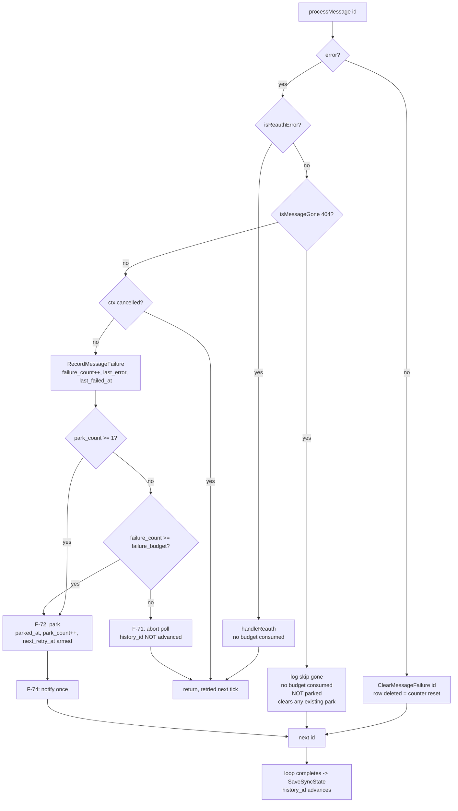
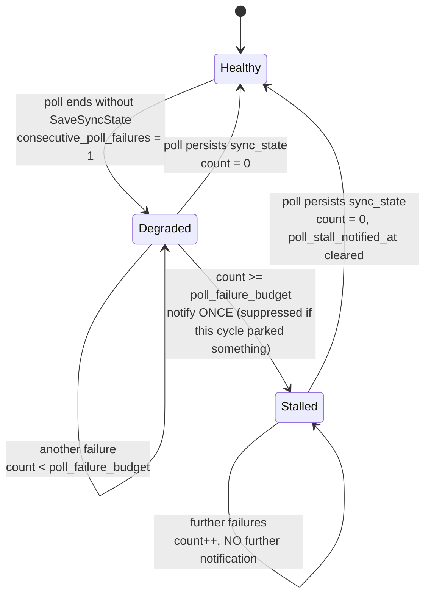
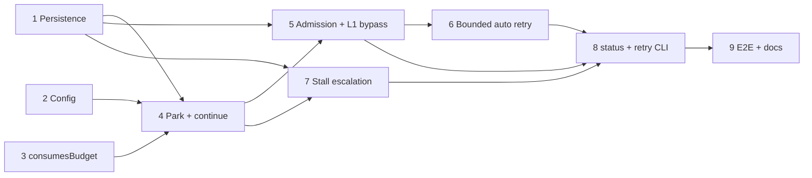

# Plan: Resilient poll — per-message failure budget and stall escalation

This plan sequences `docs/specs/resilient-poll-failure-budget.spec.md` (F-70…F-87, NF-14…NF-19, AC-34…AC-47) into nine independently shippable phases that fix GitHub issues [#1](https://github.com/vhco-pro/postbode/issues/1) (poll wedges indefinitely on any non-404 per-message error) and [#2](https://github.com/vhco-pro/postbode/issues/2) (a stalled poll is silent). It is **additive to** `plans/postbode-gmail-invoice-agent.md`, which is not modified by this document.

---

## Table of Contents

1. [Context](#context)
2. [Dependencies](#dependencies)
3. [Scope](#scope)
4. [Design](#design)
5. [Acceptance Criteria](#acceptance-criteria)
6. [Implementation Phases](#implementation-phases)
7. [Test Plan](#test-plan)
8. [Implementation Order](#implementation-order)
9. [File Reference Summary](#file-reference-summary)
10. [Release Engineering](#release-engineering)
11. [Open Questions](#open-questions)

---

## Context

Between **2026-08-22 and 2026-08-25** a single deleted Gmail message wedged the production daemon for three days. `Watcher.Poll` returns out of its message loop on the first per-message error that is neither a re-auth condition nor a `404`, and that `return` is at `internal/gmailwatch/poll.go:88` — **before** `SaveSyncState` at line 113. `history_id` therefore never advances, the next tick re-lists the same message, and it fails identically, forever. Commit `c92fdb8` closed exactly one error shape (the 404) because for a 404 the reasoning is airtight. A 500, a 429, a spool write failure, a malformed MIME part and a `decision_log` write failure all still have the original failure mode.

The same incident exposed a second, independent gap: **nothing escalates**. `Daemon.RunIteration` (`internal/daemon/daemon.go:232-242`) logs the poll error and waits for the next tick. `brew services list` said `started` — true and useless. The only human-visible signal was `sync_state.last_poll_at` going stale, reachable only by someone who already suspected a problem.

This plan implements the spec's bounded-loud-recoverable treatment for both. It rests on two decisions recorded as ADRs:

- **[ADR-004](../decisions/ADR-004-park-and-continue-with-bounded-auto-retry.md)** — park-and-continue in a dedicated `message_failure` table, with a bounded auto-retry that goes quiet but never goes away, and never ages out.
- **[ADR-005](../decisions/ADR-005-retry-scoped-l1-bypass.md)** — a retry bypasses L1 for exactly one attempt, because of a real, verified window in `extract.ExtractMessage`.

### Verification performed while planning (do not re-derive, but do re-confirm before editing)

| Claim | Verified at | Consequence for this plan |
|---|---|---|
| The pre-`SaveSyncState` return is the bug | `internal/gmailwatch/poll.go:88` vs `:113` | Phase 4 must move the failure handling *inside* the loop with a `continue`, not wrap the return. |
| `isMessageGone` is a narrow 404-only predicate with an explicit doc comment | `internal/gmailwatch/gone.go:19-25` | Phase 3 adds `consumesBudget` as a **sibling** predicate in its own file. Neither may absorb the other. |
| `deleted_message_test.go` has **two** guards, not one | `internal/gmailwatch/deleted_message_test.go:25` and `:113` | `TestPollStillFailsOnNonNotFoundMessageError` asserts that a single 500 fails the poll — this stays **true** under F-71 (first failure is under budget and still aborts). Both tests must pass **unmodified** (AC-36, NF-19). |
| `handleReauth` is the notify-once precedent | `internal/gmailwatch/reauth.go:38-47` | Phase 4 and Phase 7 mirror its shape: persist the marker, notify once, return non-fatally. |
| The record-before-stage window is real | `internal/extract/extract.go:141` (L1 skip), `:182` (`RecordMessageIfNew`), staging after `:211` | ADR-005 / Phase 5. A failure between 182 and staging leaves a message permanently L1-skipped with zero queue rows. |
| `migrations` is a forward-only slice, versions 1–3 shipped | `internal/queue/schema.go:15-159` | Phase 1 appends **version 4** (and 5). Editing 1–3 is forbidden (NF-07, NF-15) and this repo ships through a Homebrew tap, so older binaries exist in the wild. |
| The config loader walks `yaml.Node` against a per-level allow-list | `internal/config/config.go:342-348` (`decodeGmail`) | Phase 2 must extend that map or a config with the new keys fails to load with an F-29 "unknown key" error that reads like a user mistake. |
| `queue.Open` sets `journal_mode=WAL` and `busy_timeout=5000` | `internal/queue/db.go:42` (`applyPragmas`) | `postbode retry` can be a pure SQLite write from a second process. No lock file, no daemon IPC (AC-41 asserts it rather than assuming it). |
| `uploader.Clock` is the established injected-clock pattern | `internal/uploader/uploader.go:19-22, 60-72` | Phase 6 adds `Watcher.Clock` in the same shape, so cooldown tests never sleep on wall-clock time. |
| `notify.Fake` with `.All()` is the standard test notifier | `internal/daemon/daemon_test.go:133` | Every notification assertion uses it. `osascript` is never executed in a test. |
| `fake.Server.MessagesGetFunc` takes `(id, format)`; `HistoryFunc` takes `(startHistoryID, pageToken)`; `fake.APIError` carries `{Code, Message}` | `internal/gmailwatch/fake/fake.go:20-66` | **No fake extension is needed.** Per-id, per-poll failure scripting is a test-side counter closed over by `MessagesGetFunc`. Recorded here so Phase 4 does not spend time re-deciding this. If a §7 shape ever proves inexpressible, extend the fake — never weaken the criterion (spec §11 dep 3). |
| `tests/e2e` has **no** build tag and runs under `go test ./...` | `tests/e2e/pipeline_test.go:1`, `tests/e2e/testmain_test.go` | Phase 9's E2E file is picked up by the standing `make test` gate automatically, and by `make e2e-dry` when named `TestE2EDry_*`. |

---

## Dependencies

**Must already exist (all confirmed present):**

| Dependency | Where | Why this plan needs it |
|---|---|---|
| `internal/queue` migration framework | `schema.go`, `db.go:64-130` | Phase 1's version-4/5 entries |
| `internal/gmailwatch/fake` + `fake.APIError` | `internal/gmailwatch/fake/fake.go` | Every failure shape in AC-34…AC-47 (NF-16) |
| `internal/testsupport/nonet` dialer guard | driven by `make test-nonet` | AC-46's enforcement mechanism |
| `notify.Fake` | `internal/notify` | AC-39, AC-43 notification counting |
| `testdata/*.eml` corpus | `testdata/` (8 fixtures) | Message bodies for every scenario; `rfc2047-filename.eml` is the standard "one good PDF" fixture used by `deleted_message_test.go` |
| `cli.BuildStatusReport` / `cli.FormatStatus` with injected `now` | `internal/cli/status.go:68, 139` | AC-40, AC-43's status half |
| WAL + `busy_timeout` pragmas | `internal/queue/db.go:42` | AC-41's concurrent-writer assertion |
| `tests/e2e` harness (`newPipeline`) | `tests/e2e/harness_test.go:89` | Phase 9 extends it rather than building a second harness (ADR-002) |

**Blocked on nothing.** No external service, no credential, no human gate. Both open questions are non-blocking (see [Open Questions](#open-questions)).

**Must NOT be introduced:** no Kubernetes, no Argo CD, no Dockerfile, no container image, no cloud secret manager, no telemetry endpoint. `vega.yaml` declares `artifact.kind: binary`, `deploy_unit: launchd-launchagent`; the inherited `gitops-layout.spec.md` and `runtime-containers.spec.md` do not apply (spec §9, §Constitution).

---

## Scope

### In Scope

- A persisted per-`gmail_message_id` consecutive-failure count, with park state, in a new `message_failure` table (F-70, F-72, NF-15).
- Unchanged under-budget behaviour: the poll still aborts and retries next tick (F-71).
- Park-and-continue at budget, so `SaveSyncState` is reached and `history_id` advances (F-72, NF-14).
- A `consumesBudget` classifier excluding re-auth, 404-gone and context cancellation (F-73).
- Exactly one notification per newly parked message (F-74) and per stall episode (F-82), with F-83 suppression.
- Retry admission by id at the start of every poll, for both automatic and manual retry (§5.3).
- A retry-scoped L1 bypass so a retried message is genuinely re-extracted (F-78, ADR-005).
- Bounded automatic retry: cooldown, doubling, 24h cap, `park_retry_attempts` limit, then quiet-but-reported (F-75, F-79).
- Effective budget of 1 for any message with `park_count ≥ 1`, so a retry can never re-wedge the poll (F-76).
- Consecutive whole-poll failure count in `sync_state`, with escalation (F-81, F-82).
- `postbode status` poll-health and parked-messages sections (F-84, F-85).
- `postbode retry <id>` / `postbode retry --all` (F-77).
- Four new `gmail:` config keys with defaults and validation, including the allow-list extension (F-87).
- Log vocabulary for every park, re-park, retry and un-park (F-80).

### Out of Scope

Carried verbatim from spec §9, plus plan-level exclusions:

- **A review-UI surface for parked messages.** F-86: parked messages are never rendered as rows in `internal/webui` and never enter the F-41 queue lifecycle in any status. Notification + `postbode status` is the entire visibility surface.
- **Any auto-approve or auto-upload path.** G-3 and CLAUDE.md: every upload requires human approval. This plan adds no code path that approves anything.
- **Changing the 404 handling from `c92fdb8`.** Preserved bit-for-bit; this plan only forbids conflating it with parking.
- **Re-classifying ClearFacts-side retryability.** F-51's outbound policy is untouched; this is inbound-only.
- **A digest/summary notification** when many messages park at once.
- **Automatic root-cause classification of park reasons.** Recorded verbatim, interpreted by humans.
- **Aging out, archiving or GC of parked state.** Forbidden by F-79, not deferred.
- **Health-check endpoints, telemetry, remote alerting.** Local `osascript` only (NF-05).
- **Every Engie platform artifact.** No k8s, no Argo CD, no Dockerfile, no container registry.
- **Extending `internal/gmailwatch/fake`** — verified unnecessary (see Context table). If that proves wrong mid-build, extend the fake; do not weaken a criterion.
- **Changing `postbode status`'s exit code.** Stays 0 in all cases this plan ships (OQ-71).
- **Making `RecordMessageIfNew` + `StageItem` atomic.** Rejected in ADR-005 as high blast radius and incomplete coverage.

---

## Design

### Per-message decision flow (Phase 3 + Phase 4 + Phase 6)



<details>
<summary>Legend</summary>

- **Rounded/plain boxes** are actions taken by `Watcher.Poll` / `processMessage`.
- **Diamonds** are predicates. `isReauthError` and `isMessageGone` already exist; `consumesBudget` (Phase 3) is the classifier that answers all three exclusion diamonds in one place.
- **"no budget consumed"** means no `message_failure` row is created or incremented — the message's history is untouched.
- **`return`** means the poll cycle ends without `SaveSyncState`, which is what Phase 7's whole-poll counter counts.
- The 404 branch **clears** an existing park (spec §8: a parked message later deleted from Gmail provably cannot be a silent miss).
</details>

### Retry admission (Phase 5)

Parking advances `history_id` past the parked message by design, so it will never be re-listed. At the start of every cycle, before the ordinary listing, `Poll` reads `DueRetries(ctx, now)` and **prepends** those ids to `msgIDs`, de-duplicated against the listing result. This is the single mechanism behind both automatic (F-75) and manual (F-77) retry, and it is why `postbode retry` can be a pure SQLite write from a separate process.

Ids admitted this way — and **only** those ids — carry the ADR-005 re-extraction flag into `extract.ExtractMessage` for that one attempt.

### Whole-poll stall state machine (Phase 7)



<details>
<summary>Legend</summary>

- The transition trigger is **"persisted `sync_state`"**, not "returned nil" — that is what makes it cover `history.list` failing, the F-13 fallback failing, `SaveSyncState` itself failing and F-71's under-budget abort in one predicate.
- `poll_stall_notified_at` is the notify-once marker, persisted so a restart does not re-notify (F-16's `last_auth_error` is the precedent).
- **Suppression (F-83)** applies per cycle, not per episode: a cycle that emitted a park notification emits no stall notification. The next cycle resets the counter to zero anyway, because parking unwedges the poll.
</details>

### Data model

`message_failure` — **new table**, migration version 4:

| Column | Type | Meaning |
|---|---|---|
| `gmail_message_id` | TEXT PRIMARY KEY | **No foreign key to `message`.** Hard constraint (spec §5.2, ADR-004): the most likely park cause is a `messages.get` failure, before `extract` records anything. |
| `failure_count` | INTEGER NOT NULL | Consecutive failures in the current episode; reset by row deletion on success |
| `first_failed_at` | TEXT NOT NULL | Anchors the episode; set once, never overwritten (mirrors F-51) |
| `last_failed_at` | TEXT NOT NULL | Last attempt time, printed by `postbode status` |
| `last_error` | TEXT | Truncated ≤ 500 chars, redacted per F-55, no body/attachment content per F-65 |
| `parked_at` | TEXT | NULL = not parked |
| `park_count` | INTEGER NOT NULL DEFAULT 0 | ≥ 1 means F-76's effective budget of 1 applies. Never reset. |
| `retry_count` | INTEGER NOT NULL DEFAULT 0 | Automatic attempts spent against `park_retry_attempts`. Never reset. |
| `next_retry_at` | TEXT | When the next automatic attempt becomes due; NULL = exhausted |
| `notified_at` | TEXT | F-74 notify-once marker |

Plus `CREATE INDEX idx_message_failure_next_retry_at ON message_failure(next_retry_at)` — NF-18's "one indexed read of due retries".

`sync_state` — **amended additively**, migration version 5: `consecutive_poll_failures INTEGER NOT NULL DEFAULT 0`, `first_poll_failure_at TEXT`, `last_poll_error TEXT`, `poll_stall_notified_at TEXT`.

<details>
<summary>Why two migration entries rather than one</summary>

Version 4 creates a table; version 5 runs four `ALTER TABLE ... ADD COLUMN` statements. They are split so a failure applying one does not leave the other half-applied under a single version number, and because `applyMigration` records versions individually (`internal/queue/db.go:102`). Both land in **Phase 1** — the spec is explicit that the schema work must not be spread across the build (§11 dep 1).
</details>

### New Go surfaces

| Package | Surface | Phase |
|---|---|---|
| `internal/queue` | `MessageFailure` struct; `RecordMessageFailure(ctx, id, errText, budget) (MessageFailure, parked bool, err error)`; `ClearMessageFailure(ctx, id) error`; `ListParkedMessages(ctx) ([]MessageFailure, error)`; `DueRetries(ctx, now) ([]string, error)`; `Unpark(ctx, id) (bool, error)`; `UnparkAll(ctx) (int, error)`; `GetMessageFailure(ctx, id) (*MessageFailure, error)` | 1 |
| `internal/queue` | `RecordPollFailure(ctx, errText, budget) (SyncState, escalate bool, err error)`; `ClearPollFailure(ctx) error`; four `SyncState` fields | 1 |
| `internal/config` | `Gmail.FailureBudget`, `Gmail.ParkRetryCooldown`, `Gmail.ParkRetryAttempts`, `Gmail.PollFailureBudget` + allow-list entries + `> 0` validation | 2 |
| `internal/gmailwatch` | `consumesBudget(err error) bool` in `budget.go`, sibling of `isReauthError` / `isMessageGone` | 3 |
| `internal/gmailwatch` | `Config.FailureBudget`, `Config.ParkRetryCooldown`, `Config.ParkRetryAttempts`, `Config.PollFailureBudget`; `Watcher.Clock` (mirrors `uploader.Clock`); `PollResult.Parked []string`, `PollResult.Retried []string` | 3–6 |
| `internal/extract` | `Message.ForceReextract bool` — ADR-005, documented at its declaration with a pointer to that ADR | 5 |
| `internal/notify` | `ParkedMessage(id string, failures int, reason string) string`; `PollStalled(count int, since time.Time, lastErr string) string` — both append the command to run, per the v1.8 F-45 convention | 4, 7 |
| `internal/cli` | `StatusReport.Parked []queue.MessageFailure`; poll-health and parked sections in `FormatStatus`; `Retry(ctx, db, args) (int, error)` | 8 |
| `cmd/postbode` | `retry` verb in the `run` switch + usage text | 8 |

---

## Acceptance Criteria

Ids are the spec's §7 ids, unchanged. Every one is mapped to at least one row in the [Test Plan](#test-plan).

- [x] **AC-34:** Given a poll listing `[A, B, C]` where `B`'s `messages.get` returns `500` on every call: polls 1 and 2 return an error and leave `sync_state.history_id` unchanged; poll 3 parks `B`, processes `C`, and persists `sync_state` with an advanced `history_id`. After poll 3, `A` and `C` have staged items and `B` is listed by `ListParkedMessages` with `failure_count == 3`. A fourth poll stages nothing new, parks nothing new and does not error. *(F-70, F-71, F-72, NF-14)*
- [x] **AC-35:** A message whose `messages.get` fails twice then succeeds is never parked: after poll 3 it has staged items, `ListParkedMessages` is empty, no park notification was sent, and its `message_failure` row no longer exists. *(F-70, G-72)*
- [x] **AC-36 — regression guard on `c92fdb8`:** A message whose `messages.get` returns `404` is skipped on the **first** poll with the existing `skip (gone)` log line, consumes no budget (no `message_failure` row is created), is not parked, raises no notification, and the same poll persists `sync_state`. Both tests in `internal/gmailwatch/deleted_message_test.go` continue to pass **unmodified**. *(F-73b, G-75, NF-19)*
- [x] **AC-37:** A poll cancelled mid-loop (context cancelled while `messages.get` is in flight) creates no `message_failure` row and increments no counter for the in-flight message; the next poll with a live context processes that message normally. *(F-73c)*
- [x] **AC-38:** With the fake OAuth server returning `invalid_grant` mid-loop, behaviour is byte-for-byte AC-20's: `handleReauth` runs, exactly one re-auth notification is sent, no queue row changes, no `message_failure` row is created for the in-flight message, and no message is parked. *(F-73a, NF-19)*
- [x] **AC-39:** Parking a message invokes `notify.Fake` **exactly once**, with a message containing the `gmail_message_id`, the failure count and the truncated reason. Second and third polls that re-encounter the same parked message before its cooldown invoke it **zero** further times. `osascript` is never executed. *(F-74)*
- [x] **AC-40:** With one parked message, `postbode status` output contains a `parked messages:` section listing that id, its failure count, its last error and its last attempt time, plus either an auto-retry timestamp or `auto-retry exhausted` with the exact `postbode retry <id>` command. With none parked it prints `parked messages:  0` rather than being omitted. Asserted against `cli.FormatStatus` with an injected `now`. *(F-85, F-84, G-74)*
- [x] **AC-41:** `postbode retry <id>` on a parked message exits 0, clears `parked_at`, and the **next poll reprocesses that message and stages its documents even though `history_id` has advanced past it and no listing returns it**. `postbode retry --all` unparks every parked message and reports the count. `postbode retry` with no argument exits **2** and changes nothing; `postbode retry <unknown-id>` exits non-zero naming the id. The write succeeds while a second connection holds the same database open. *(F-77, §5.3, §6.1)*
- [x] **AC-42:** With a tiny `park_retry_cooldown` and `park_retry_attempts: 2` (injected clock), a parked message whose failure persists is retried automatically twice and no more; each retry **re-parks on the first failure without aborting the poll** — every one of those cycles still persists `sync_state` and still processes the messages behind it — and after the second retry the message reports `auto-retry exhausted` while remaining in `ListParkedMessages`. A parked message whose failure has healed is processed successfully on its first automatic retry, stages its documents, and its `message_failure` row disappears. *(F-75, F-76, F-79)*
- [x] **AC-43:** With `history.list` scripted to `503` on every call and `poll_failure_budget: 3`: polls 1–2 notify nothing; poll 3 invokes the notifier **exactly once** naming the consecutive failure count and the last error; polls 4–10 invoke it **zero** further times; `postbode status` prints `poll health: NOT MAKING PROGRESS` naming the count and the episode start. Once `history.list` succeeds, the counter resets, status prints `poll health: ok`, and a subsequent new stall episode notifies again exactly once. Separately: a purely per-message stall that ends in a park emits the **park** notification only — never both — for that cycle. *(F-81, F-82, F-83, F-84, G-73)*
- [x] **AC-44:** Parked state, failure counts, retry schedules and the notify-once markers survive closing and reopening the database: reopening does not re-notify, does not reset any counter, and does not restart the cooldown from zero. A prune/retention pass with `retention_days` set to prune-everything leaves every parked message present and reported. *(NF-15, F-79, G-71)*
- [x] **AC-45 — the silent-miss guard:** A message that reaches `RecordMessageIfNew` and then fails during staging is parked; on retry it is **re-extracted rather than L1-skipped**, and its documents reach the queue. The retry produces **no** second uploadable item for a byte-identical document — the duplicate links as `duplicate_linked` via L2 exactly as AC-11 requires — and a document previously rejected stays rejected via F-44. *(F-78, G-1, G-2)*
- [x] **AC-46:** `make test && go vet ./...` passes, and the whole suite passes under `make test-nonet` with the AC-22 in-process non-loopback dialer guard active: every failure shape in AC-34…AC-45 is produced by `fake.Server` / `fake.APIError` / `httptest`, and zero tests reference `gmail.googleapis.com` or `api.clearfacts.be`. *(NF-16, NF-09, NF-12)*
- [x] **AC-47:** A `config.yaml` containing all four new `gmail:` keys loads with those values; one containing `failure_budget: 0` (and, separately, `park_retry_attempts: -1`) is rejected at startup with the offending **line number**, and the daemon does not start. Omitting all four yields the documented defaults 3 / 6h / 3 / 3. *(F-87, F-29)*

---

## Implementation Phases

Every phase ends with the repo **green** under `make test && go vet ./...` and, for any phase touching test code, `make test-nonet`. No phase may be declared done without running both (CLAUDE.md hard rule).

### Phase 1: Persistence — `message_failure` table, `sync_state` columns, queue CRUD

**Priority: HIGH** — every later phase writes to this. Getting reset/park/unpark semantics right here is the cheapest it will ever be.

**Goal**: The full failure/park/poll-stall state model exists and is directly unit-tested, with nothing yet reading it.

**Tasks**:
- [x] Append migration **version 4** to `internal/queue/schema.go`'s `migrations` slice: `CREATE TABLE message_failure (...)` per [Design](#data-model), **with no foreign key to `message`**, plus `idx_message_failure_next_retry_at`. Comment the entry the way versions 2 and 3 are commented, naming F-70/NF-15 and the no-FK constraint.
- [x] Append migration **version 5**: four additive `ALTER TABLE sync_state ADD COLUMN` statements.
- [x] Do **not** edit versions 1–3 (NF-07, NF-15). Add a test that asserts the shipped versions 1–3 statement lists are byte-identical to what they are today, so a future edit fails loudly.
- [x] Add `MessageFailure` to `internal/queue/model.go`, with a doc comment carrying the §5.2 F-51 vocabulary mapping and a pointer to ADR-004.
- [x] Extend `queue.SyncState` with `ConsecutivePollFailures`, `FirstPollFailureAt`, `LastPollError`, `PollStallNotifiedAt`; update `GetSyncState`/`SaveSyncState` in `internal/queue/sync_state.go` to round-trip them.
- [x] Implement `internal/queue/message_failure.go`: `RecordMessageFailure`, `ClearMessageFailure`, `GetMessageFailure`, `ListParkedMessages` (oldest `parked_at` first), `DueRetries`, `Unpark`, `UnparkAll`.
- [x] `RecordMessageFailure` truncates `errText` to ≤ 500 chars before persisting (NF-17) and returns `parked == true` **exactly once per park**, so the caller can notify once.
- [x] Implement `RecordPollFailure` / `ClearPollFailure` in `internal/queue/poll_failure.go`, with `escalate == true` exactly once per episode, gated on `poll_stall_notified_at`.
- [x] Confirm no prune/retention path touches `message_failure` (grep `internal/uploader/prune.go`, `internal/extract/prune.go`); add a test proving it (F-79).

**Depends on**: None

**Exit criteria**: `make test && go vet ./...` green. A fresh database and a database created at schema version 3 both migrate to 5. AC-44's persistence half passes.

**Commit prefix**: `feat(queue):` — minor bump.

---

### Phase 2: Configuration — four `gmail:` keys, allow-list, validation

**Priority: HIGH** — small, standalone, and every later phase should read real config rather than a constant that gets replaced later.

**Goal**: `failure_budget`, `park_retry_cooldown`, `park_retry_attempts` and `poll_failure_budget` load, default and validate.

> **Deviation from spec §11's suggested order**, which puts config last. Config is a leaf change that ships green on its own, and threading real values through `gmailwatch.Config` from Phase 3 onward avoids a placeholder-constant refactor in the middle of the risky phases. The spec's rationale for going last ("so the defaults are already proven by the tests") is preserved by AC-47 asserting the defaults directly.

**Tasks**:
- [x] Add the four fields to `config.Gmail` (`internal/config/config.go:68-78`) with doc comments naming F-70/F-72/F-75/F-81.
- [x] Add all four keys to `decodeGmail`'s allow-list map (`internal/config/config.go:343-348`) — **the easy-to-miss coupling**; without it a valid config fails to load with an F-29 "unknown key" error that reads like a user mistake.
- [x] Decode them with the existing `decodeInt` / `decodeDuration` helpers.
- [x] Reject `≤ 0` for all four with `errAt(line, ...)` so the message carries the offending line number (F-29). A `failure_budget: 0` would park every message on its first hiccup — a G-1 hazard dressed as a config typo.
- [x] Add the defaults 3 / 6h / 3 / 3 to `config.Default()` (`internal/config/config.go:118-123`).
- [x] Thread the four values into `gmailwatch.Config` in `cmd/postbode/daemon.go:183-187`.
- [x] Add the four keys to `internal/gmailwatch.Config` with the same `<= 0 means default` fallback convention `QueryWindowDays` already uses.

**Depends on**: None (can run in parallel with Phase 1)

**Exit criteria**: AC-47 passes. `make test && go vet ./...` green.

**Commit prefix**: `feat(config):` — minor bump.

---

### Phase 3: Classification — `consumesBudget`

**Priority: HIGH** — pure, highly testable, and the requirement most likely to be got subtly wrong.

**Goal**: One documented predicate answers "does this error consume budget?" for all four classes.

**Tasks**:
- [x] Create `internal/gmailwatch/budget.go` containing **only** `consumesBudget(err error) bool`, as a sibling of `isReauthError` (`reauth.go:19`) and `isMessageGone` (`gone.go:19`).
- [x] Doc comment explains **each exclusion separately**: (a) re-auth → `handleReauth`, no budget; (b) 404-gone → `skip (gone)`, no budget, **never parked** — parking a dead id would pollute the parked list forever and noise is how G-71 dies; (c) `context.Canceled` / `context.DeadlineExceeded` → burning budget because the user quit the daemon would park healthy messages.
- [x] **Do not** absorb `isMessageGone` or `isReauthError` into `consumesBudget`. They stay separate, separately documented predicates (spec §11 risk 2). `consumesBudget` calls them.
- [x] Handle wrapped errors via `errors.Is` / `errors.As` — every call site wraps with `fmt.Errorf("...: %w", err)`.
- [x] Table test in `internal/gmailwatch/budget_test.go`: 404, 403, 429, 500, 503, `oauth2.RetrieveError{invalid_grant}`, `context.Canceled`, `context.DeadlineExceeded`, a plain `errors.New`, a wrapped 404, a wrapped cancellation, and `nil`.

**Depends on**: None

**Exit criteria**: `make test && go vet ./...` green. Classifier-level halves of AC-36/AC-37/AC-38 pass.

**Commit prefix**: `feat(gmailwatch):` — minor bump.

---

### Phase 4: Poll loop — budget, park, continue, notify once

**Priority: HIGH** — this is the fix for issue #1 and for the production outage.

**Goal**: A message that exhausts its budget is parked with one notification, the loop continues, and `SaveSyncState` is reached.

**Tasks**:
- [x] In `internal/gmailwatch/poll.go`, replace the `return` at line 88 with the [decision flow](#per-message-decision-flow-phase-3--phase-4--phase-6): classify via `consumesBudget`, `RecordMessageFailure`, then either abort (under budget, F-71 — **behaviour unchanged**) or park and `continue` (at budget, F-72).
- [x] On successful processing of a message that has a `message_failure` row, call `ClearMessageFailure` (F-70's reset). Cheap: only call it when a row could exist — track ids that failed this session or accept one indexed delete per success; measure against NF-18 if in doubt.
- [x] On the 404-gone branch, **also** clear any existing park (spec §8: a parked message later deleted from Gmail provably cannot be a silent miss) and keep the existing `skip (gone)` log line byte-identical.
- [x] Arm `next_retry_at = parked_at + park_retry_cooldown` at park time. Backoff doubling, the 24h cap and attempt exhaustion are **Phase 6**; this phase arms the first attempt only.
- [x] Add `notify.ParkedMessage(id, failures, reason)` to `internal/notify/messages.go`, beside `StagedMessage`. Wording must name the id, the failure count, the truncated reason, state that the message is **not** in the review queue, and append the command that resolves it (`postbode status` / `postbode retry <id>`) per the v1.8 F-45 convention — an `osascript` notification is not clickable, so a notification without a command is a dead end.
- [x] Fire the notification **only** when `RecordMessageFailure` returns `parked == true` (F-74 notify-once).
- [x] Add `PollResult.Parked []string` so `RunIteration` and tests can observe outcomes without reading the database.
- [x] Add F-80 log lines for park and re-park, in the existing `skip (gone)` / `skip (L1)` / `dropped:` vocabulary, carrying id, failure count and reason, with no body/attachment content (F-65) and redacted error text (F-55).
- [x] Verify both `deleted_message_test.go` tests still pass **unmodified** — including `TestPollStillFailsOnNonNotFoundMessageError`, which stays valid because a first 500 is under budget and still aborts the poll.

**Depends on**: Phase 1, Phase 2, Phase 3

**Exit criteria**: AC-34, AC-35, AC-36, AC-37, AC-38, AC-39 pass. `make test && go vet ./... && make test-nonet` green.

> **State at this boundary**: a parked message is notified, logged and reported in the database, but is not yet retried (admission lands in Phase 5). That is strictly better than today's unbounded outage, and F-79 already holds — nothing ages out. Do not ship a "clean up parked rows" convenience anywhere.

**Commit prefix**: `feat(gmailwatch):` — minor bump. (New mechanism and new notification surface, not a bare `fix:`.)

---

### Phase 5: Retry admission and the L1 bypass — **HIGHEST RISK**

**Priority: HIGH** — this is the phase that makes parking *recoverable* instead of a fancy skip, and it contains the one defect in this feature that is completely invisible from the outside.

**Goal**: A due or unparked message is re-injected into the poll by id and genuinely re-extracted.

> **Read [ADR-005](../decisions/ADR-005-retry-scoped-l1-bypass.md) before writing a line of this phase.** The hazard: a message can be parked *after* `RecordMessageIfNew` (`internal/extract/extract.go:182`) and before staging. Without the bypass, every future retry hits the L1 check at line 141, returns `Skipped: true`, logs `skip (L1)`, reports **success**, and clears the park — no error, no park churn, nothing in the log, and the invoice is gone forever. It passes casual inspection completely. AC-45 is the only thing that catches it.

**Tasks — sequenced, do not reorder**:
- [x] **5a.** In `Poll`, before the ordinary listing, call `DueRetries(ctx, now)` and prepend the returned ids to `msgIDs`, de-duplicated against the listing result so a message that is both due and listed is processed once. Record them in `PollResult.Retried`.
- [x] **5b.** Add `Message.ForceReextract bool` to `internal/extract/extract.go:19-26`, with a doc comment that (i) names F-78, (ii) links `decisions/ADR-005-retry-scoped-l1-bypass.md`, and (iii) states explicitly that it bypasses **L1 only** and that L2/L3/L4/F-44 remain in force.
- [x] **5c.** In `ExtractMessage`, skip the `MessageSeen` early return (line 141-147) **and** the `alreadySeen` concurrent-race return (line 195-203) when `ForceReextract` is set. The spool-before-record fail-safe (lines 151-176) is untouched.
- [x] **5d.** In `processMessage`, set `ForceReextract` **only** for ids that came from this cycle's admission set. Never for a listed id. Never globally. Never sticky.
- [x] **5e.** Add the F-80 log line for an admitted retry, so the sequence is reconstructible without reading SQLite.
- [x] **5f.** Write `internal/extract/force_reextract_test.go` **first**, asserting the three halves of AC-45 separately: (i) a message recorded-then-failed is re-extracted and its documents reach the queue; (ii) a byte-identical document links as `duplicate_linked` via L2 and produces **no second uploadable item**; (iii) a previously rejected `(gmail_message_id, sha256)` stays unstageable via F-44.
- [x] **5g.** Add a test asserting the bypass does **not** leak: an ordinary listed message that is already recorded still L1-skips with the `skip (L1)` line (F-30 replay protection intact) — including on an F-13 fallback resync, which re-lists old ids.

**Depends on**: Phase 1, Phase 4

**Exit criteria**: AC-45 passes in all three halves; the admission half of AC-41 passes (a message not returned by any listing is still processed). `make test && go vet ./... && make test-nonet` green.

**Commit prefix**: `feat(extract):` for 5b–5c, `feat(gmailwatch):` for 5a/5d — minor bump.

---

### Phase 6: Bounded automatic retry — cooldown, backoff, effective budget 1

**Priority: HIGH** — without F-76 every scheduled retry of a permanently broken message costs another `failure_budget × poll_interval` stall, on a timer. That is the exact behaviour the design forbids.

**Goal**: Automatic retry is bounded and can never re-wedge the poll.

**Tasks**:
- [x] Add `Watcher.Clock` in the shape of `uploader.Clock` (`internal/uploader/uploader.go:19-22, 60-72`): a `func() time.Time` with a nil-safe `now()` helper, so cooldown tests never sleep on wall-clock time.
- [x] Implement F-75's schedule in `queue`/`gmailwatch`: first automatic attempt due `park_retry_cooldown` after `parked_at`; each subsequent attempt doubles the previous interval, **capped at 24h**; at most `park_retry_attempts` automatic attempts (`retry_count` bounds it). When exhausted, set `next_retry_at` to NULL — the message stays parked, stays reported, generates no further automatic work.
- [x] Implement F-76: any message with `park_count ≥ 1` is processed with an **effective budget of 1**. A single failure re-parks it immediately, re-arms the cooldown, and the poll **continues** — a re-park never aborts the cycle and never blocks `SaveSyncState`.
- [x] `retry_count` and `park_count` are **never reset by a retry**. They are the history that makes F-75's and F-76's bounds work. Only a successful processing (row deletion) clears them.
- [x] Clock-jump handling: a `next_retry_at` in the future simply delays; one in the past fires on the next tick. At most **one** automatic attempt per message per cycle — no catch-up loop.
- [x] F-80 log lines for automatic retry and re-park.

**Depends on**: Phase 1, Phase 5

**Exit criteria**: AC-42 passes in both halves (persisting failure → exactly two auto retries then exhausted-but-listed; healed failure → success on the first auto retry and the row disappears), **and every retry cycle in that test asserts `sync_state` was persisted**. That assertion, not the cooldown value, is what makes the design safe. `make test && go vet ./...` green.

**Commit prefix**: `feat(gmailwatch):` — minor bump.

---

### Phase 7: Whole-poll stall counter and escalation

**Priority: HIGH** — issue #2. Small once Phase 1 exists.

**Goal**: A daemon that is alive but not making progress announces itself once per episode.

**Tasks**:
- [x] In `Poll`, wire every exit path that ends **without persisting `sync_state`** to `RecordPollFailure` — `history.list` failing, the F-13 fallback failing, `SaveSyncState` itself failing, and F-71's under-budget per-message abort. A cycle that persists calls `ClearPollFailure`.
- [x] Re-use Phase 1's counting/notify-once logic; do **not** write a second implementation (A-80). The state is genuinely different (singleton row vs per-message row) and must not be force-fitted into one table.
- [x] Add `notify.PollStalled(count, since, lastErr)` to `internal/notify/messages.go`: the daemon is alive but not making progress, how many consecutive polls failed, since when, the last error, and the command to run.
- [x] Fire it only when `RecordPollFailure` returns `escalate == true`.
- [x] Implement **F-83 suppression**: a cycle that already emitted a park notification emits no stall notification. Both budgets default to 3, so a purely per-message stall crosses both thresholds on the same tick; the park notification is strictly more informative, and parking unwedges the poll so the next cycle resets the counter anyway.
- [x] A successful poll clears the episode (counter, `first_poll_failure_at`, `poll_stall_notified_at`), so a later stall is a **new** episode and may notify again.
- [x] Leave `Daemon.RunIteration` (`internal/daemon/daemon.go:232-242`) structurally as-is — it still logs and swallows (NF-06). Escalation is `Poll`'s job, not the ticker's.

**Depends on**: Phase 1, Phase 4

**Exit criteria**: AC-43's notification halves pass (0/0/1/0×7, reset, new episode notifies again, park-only on a dual-threshold cycle). `make test && go vet ./...` green.

**Commit prefix**: `feat(gmailwatch):` — minor bump.

---

### Phase 8: Ops surfaces — `postbode status` sections and `postbode retry`

**Priority: HIGH** — G-74: "is it working?" must be answerable in words, not arithmetic.

**Goal**: Both new states are visible and one of them is actionable from the CLI.

**Tasks**:
- [x] Extend `cli.StatusReport` with `Parked []queue.MessageFailure`; populate it in `BuildStatusReport` (`internal/cli/status.go:68`) from `ListParkedMessages`. Keep `now` injected.
- [x] **F-84** in `FormatStatus`: add a `poll health:` line between the existing `re-auth needed:` and `queue:` blocks. Either `ok (last successful poll <age> ago)` or `NOT MAKING PROGRESS — N consecutive poll failures since <t>` plus an indented `last error:` line. The existing `last poll:` line **stays** — this is added, not substituted.
- [x] **F-85**: add a `parked messages:` section after the `stuck > 48h:` block. Count, then per message: id, failure count, truncated last error, last attempt time, and either the next auto-retry time or `auto-retry exhausted` plus the exact `postbode retry <id>` command. An empty set prints `parked messages:  0` — a section that disappears when empty trains the reader not to look for it.
- [x] Match the existing column alignment (`%-19s`-style padding) and `formatTime`/`formatAge` helpers.
- [x] Implement `internal/cli/retry.go` and wire a `retry` case into `cmd/postbode/main.go`'s switch (`main.go:64-78`) plus the `usage` const.
- [x] Exact §6.1 contract: `retry <id>` on a parked id → exit 0, `parked_at` cleared, `next_retry_at` set to now, one line naming the id, failure count and last error, stating it will be reprocessed on the next poll (within `<poll_interval>`); `retry <id>` on an unknown or non-parked id → non-zero, message on stderr naming the id; `retry --all` with N ≥ 1 → one line per message then `retry: unparked N message(s)`; `retry --all` with none → `retry: no parked messages`, exit 0; `retry` with neither → usage on stderr, **exit 2**, changes nothing; `retry <id> --all` → usage, exit 2.
- [x] `postbode retry` opens the database via the existing `cli.OpenDB` path. It is the **first CLI verb that writes to the queue while the daemon may be running** — WAL and `busy_timeout=5000` (`internal/queue/db.go:42`) are what make that safe. **Do not add a lock file or a daemon IPC channel.**
- [x] The command's output says the change takes effect on the next poll rather than implying instant action.
- [x] F-86 check: confirm nothing in `internal/webui` renders parked messages and that no `message_failure` row ever becomes an `item` in any status. Add an assertion.

**Depends on**: Phase 1, Phase 5 (the admission half of AC-41), Phase 6, Phase 7

**Exit criteria**: AC-40, AC-41, and AC-43's status half pass. `make test && go vet ./...` green.

**Commit prefix**: `feat(cli):` — minor bump.

---

### Phase 9: End-to-end coverage, gate and documentation

**Priority: MEDIUM** — nothing new ships behind it, but AC-46 and the E2E requirement are only satisfied here.

**Goal**: The whole mechanism is proven through the real pipeline, and the standing gate stays honest.

**Tasks**:
- [x] Add `tests/e2e/resilience_test.go` extending the existing `newPipeline` harness (`tests/e2e/harness_test.go:89`) — do **not** build a second harness (ADR-002).
- [x] `TestE2EDry_PoisonMessageParksAndMailboxDrains`: deliver A, B (500 forever), C; run four polls through the real watcher/extractor/rules/queue wiring; assert A and C reach the review UI as reviewable items, B is parked, `sync_state.history_id` advanced, exactly one park notification landed in `notify.Fake`, and `cli.FormatStatus` output contains the `parked messages:` section naming B.
- [x] `TestE2EDry_ParkedMessageRetriedManuallyReachesQueue`: park a message whose failure lands **after** `RecordMessageIfNew`, run `cli.Retry`, poll again, assert its document reaches the queue and can be approved and uploaded through the real form-POST path against the ClearFacts fake. This is AC-45 and AC-41 proven together on the real path.
- [x] Name both `TestE2EDry_*` so `make e2e-dry` picks them up alongside the existing seven scenarios.
- [x] Add a `Verifies:` traceability comment to **every** test written in phases 1–9 (see [Test Plan](#test-plan)).
- [x] Run `make test && go vet ./... && make test-nonet` and confirm the non-loopback dialer guard is active for the new tests (AC-46).
- [x] `grep -rn "gmail.googleapis.com\|api.clearfacts.be" --include='*_test.go' .` returns nothing outside `cmd/spike` (AC-46, NF-09, CLAUDE.md).
- [x] Document the four config keys in `README.md`'s config section with their defaults and what each bounds.
- [x] Add a short CLAUDE.md note: parked messages are never aged out, never auto-approved, and never rendered in the review UI; `postbode retry` is the only manual recovery path.

**Depends on**: Phases 1–8

**Exit criteria**: AC-46 passes; `make e2e-dry` green; both new E2E scenarios pass; every AC-34…AC-47 checkbox in this plan is checked with a named passing test.

**Commit prefix**: `test:` for the E2E file, `docs:` for README/CLAUDE.md — **no version bump**.

---

## Test Plan

Every row cites an AC id from spec §7. Every test **must** carry a traceability comment as its first line, using the exact criterion text so `grep` finds it:

```go
// Verifies: Resilient poll — per-message failure budget and stall escalation, Criterion: "AC-34: Given a poll listing message ids [A, B, C] where B's messages.get is scripted to return 500 on every call..."
```

### Part A — acceptance criteria

| Criterion | Test Type | Test Location | Fake / fixture |
|-----------|-----------|---------------|----------------|
| AC-34: three-poll park, `history_id` advances, `C` still staged | Unit (integration-in-package) | `internal/gmailwatch/park_test.go` | `fake.Server.HistoryFunc` lists `[A,B,C]`; `MessagesGetFunc` returns `&fake.APIError{Code:500}` for `B` via a test-side per-id counter; `testdata/rfc2047-filename.eml` for A and C |
| AC-34 (full-path) | **E2E** | `tests/e2e/resilience_test.go` → `TestE2EDry_PoisonMessageParksAndMailboxDrains` | `newPipeline` harness: `gwfake` + `cffake` + real SQLite + real spool + real `webui` listener (ADR-002) |
| AC-35: fail twice then succeed, never parked, row gone | Unit | `internal/gmailwatch/park_test.go` | `MessagesGetFunc` counter returning 500, 500, then `testdata/rfc2047-filename.eml`; `notify.Fake` asserted empty |
| AC-36: 404 skipped on poll 1, no budget, no park, no notify, `sync_state` persisted | Regression + Unit | `internal/gmailwatch/deleted_message_test.go` (**unmodified**, both tests) + a new case in `internal/gmailwatch/park_test.go` asserting `GetMessageFailure` returns nil | `&fake.APIError{Code:404}`, as the existing test already does |
| AC-36 (classifier level) | Unit (table) | `internal/gmailwatch/budget_test.go` | `googleapi.Error` 404 direct and wrapped |
| AC-37: cancelled mid-loop, no row, next poll normal | Unit | `internal/gmailwatch/park_test.go` | `MessagesGetFunc` closes over a `context.CancelFunc` and cancels while in flight |
| AC-37 (classifier level) | Unit (table) | `internal/gmailwatch/budget_test.go` | `context.Canceled`, `context.DeadlineExceeded`, wrapped |
| AC-38: `invalid_grant` mid-loop is byte-for-byte AC-20, no `message_failure` row | Unit | `internal/gmailwatch/reauth_test.go` (extended) | Fake OAuth token endpoint returning `invalid_grant`; `notify.Fake` asserted at exactly one re-auth message |
| AC-39: exactly one park notification, zero on re-encounter | Unit | `internal/gmailwatch/park_test.go` | `notify.Fake.All()` counted across three polls; `osascript` never invoked (notifier is behind the interface) |
| AC-40: `parked messages:` section, and `parked messages:  0` when empty | Unit | `internal/cli/status_parked_test.go` | `cli.FormatStatus` with injected `now` over a seeded `message_failure` row; golden-ish substring assertions |
| AC-41: `retry <id>` → next poll reprocesses despite advanced `history_id`; `--all`; exit 2; unknown id; concurrent writer | Unit + Integration | `internal/cli/retry_test.go` (contract, exit codes, concurrent second `*sql.DB` connection) + `cmd/postbode/retry_test.go` (argv/exit-code wiring) + `internal/gmailwatch/retry_admission_test.go` (re-injection with an empty listing) | `fake.Server` whose `HistoryFunc`/`MessagesListFunc` return **nothing**, proving admission is by id and not by listing |
| AC-41 (full-path) | **E2E** | `tests/e2e/resilience_test.go` → `TestE2EDry_ParkedMessageRetriedManuallyReachesQueue` | `newPipeline` harness + real form-POST approval + `cffake` upload |
| AC-42: two auto retries then exhausted; re-park never aborts; healed message succeeds on first retry | Unit | `internal/gmailwatch/park_retry_test.go` | Injected `Watcher.Clock` (`uploader.Clock` pattern) advanced past each cooldown; **every cycle asserts `sync_state` was persisted** |
| AC-43: 0/0/1/0×7 stall notifications, status wording, reset, new episode, park-only suppression | Unit | `internal/gmailwatch/poll_stall_test.go` + `internal/cli/status_parked_test.go` (the `poll health:` half) | `HistoryFunc` returning `&fake.APIError{Code:503}`; `notify.Fake.All()` counted per poll |
| AC-44: state survives close/reopen; no re-notify; no counter reset; prune leaves parks intact | Unit | `internal/queue/message_failure_test.go` + `internal/queue/poll_failure_test.go` | Real temp SQLite closed and reopened via `queue.Open`; `PruneSpool` with `retention_days` set to prune-everything |
| **AC-45**: recorded-then-failed message is re-extracted, not L1-skipped; no second uploadable item; rejection stays rejected | Unit (three separate assertions) | `internal/extract/force_reextract_test.go` | `extract.NewWithSpooler` with an injected failing writer / a `StageItem` failure after `RecordMessageIfNew`; `testdata/rfc2047-filename.eml` and a byte-identical copy for the L2 half |
| **AC-45** (no-leak guard) | Unit | `internal/extract/force_reextract_test.go` | Ordinary listed, already-recorded message still L1-skips with the `skip (L1)` line, including on an F-13 fallback resync |
| **AC-45** (full-path) | **E2E** | `tests/e2e/resilience_test.go` → `TestE2EDry_ParkedMessageRetriedManuallyReachesQueue` | As above |
| AC-46: `make test && go vet ./...` green; suite green under the non-loopback dialer guard; no live endpoint referenced | Gate (command) | `make test && go vet ./...`, `make test-nonet`, plus a `grep` assertion documented in Phase 9 | `internal/testsupport/nonet` in-process dialer guard (AC-22) |
| AC-47: four keys load; `failure_budget: 0` and `park_retry_attempts: -1` rejected with a line number; defaults 3/6h/3/3 | Unit | `internal/config/config_test.go` (extended) | In-memory YAML strings; assertion on `ValidationError.Line` |

### Part B — requirements without a dedicated AC

| Requirement | Test Type | Test Location | Assertion |
|---|---|---|---|
| F-79 — parked state never ages out | Unit | `internal/queue/message_failure_test.go` | No prune/retention path deletes a `message_failure` row; grep-backed assertion that `message_failure` appears in no prune query |
| F-80 — log vocabulary | Unit | `internal/gmailwatch/park_test.go`, `park_retry_test.go` | A captured `Logf` sink contains `park`, `re-park`, `retry` and `unpark` lines with id and count, and **no** message body or attachment content |
| F-86 — parked messages never enter the review UI | Unit | `internal/cli/status_parked_test.go` (or `internal/webui`) | `ListReviewable` returns nothing for a parked-only message; no `item` row exists for it |
| NF-17 — truncation ≤ 500 chars, redaction | Unit | `internal/queue/message_failure_test.go` | A 10 KB error string persists truncated; a PAT-shaped string is redacted per F-55 |
| NF-18 — no measurable regression on a healthy poll | Unit | `internal/gmailwatch/park_test.go` | A healthy poll over a multi-message listing issues one `DueRetries` read and **zero** `message_failure` writes |
| NF-15 — forward-only migrations | Unit | `internal/queue/schema_test.go` (extended) | Versions 1–3 statement lists are byte-identical to their shipped form; a v3 database migrates cleanly to v5 |
| Migration idempotence | Unit | `internal/queue/migration_test.go` (extended) | Migrating twice is a no-op |

---

## Implementation Order

| Phase | Description | Effort | Depends on |
|---|---|---|---|
| 1 | Persistence: `message_failure` table, `sync_state` columns, queue CRUD | M | — |
| 2 | Config: four `gmail:` keys, allow-list, validation | S | — |
| 3 | Classification: `consumesBudget` | S | — |
| 4 | Poll loop: budget, park, continue, notify once | M | 1, 2, 3 |
| 5 | **Retry admission + L1 bypass (highest risk)** | **L** | 1, 4 |
| 6 | Bounded auto retry: cooldown, backoff, effective budget 1 | M | 1, 5 |
| 7 | Whole-poll stall counter and escalation | S | 1, 4 |
| 8 | Ops surfaces: `postbode status` sections, `postbode retry` | M | 1, 5, 6, 7 |
| 9 | E2E, gate, documentation | M | 1–8 |



Phases 1, 2 and 3 have no dependencies and may be built in any order or in parallel. Phase 7 is independent of Phases 5 and 6 and can be pulled forward if the stall escalation is wanted sooner than the retry path.

---

## File Reference Summary

| File | Change | Phase |
|---|---|---|
| `internal/queue/schema.go` | **Append** migration versions 4 and 5. Never edit 1–3. | 1 |
| `internal/queue/model.go` | `MessageFailure` struct; four `SyncState` fields | 1 |
| `internal/queue/message_failure.go` | **New** — per-message CRUD, park/unpark, due retries | 1 |
| `internal/queue/poll_failure.go` | **New** — `RecordPollFailure`, `ClearPollFailure` | 1 |
| `internal/queue/sync_state.go` | Round-trip the four new columns | 1 |
| `internal/queue/message_failure_test.go`, `poll_failure_test.go` | **New** | 1 |
| `internal/queue/schema_test.go`, `migration_test.go` | Extended: v1–3 immutability, v3→v5 upgrade | 1 |
| `internal/config/config.go` | Four `Gmail` fields, **allow-list entries in `decodeGmail`**, `> 0` validation, defaults | 2 |
| `internal/config/config_test.go` | Extended: AC-47 | 2 |
| `cmd/postbode/daemon.go` | Thread the four values into `gmailwatch.Config` (lines 183-187) | 2 |
| `internal/gmailwatch/budget.go` | **New** — `consumesBudget`, sibling of `gone.go` / `reauth.go` | 3 |
| `internal/gmailwatch/budget_test.go` | **New** — table test over all four classes | 3 |
| `internal/gmailwatch/watcher.go` | `Config` budget fields; `Watcher.Clock`; `PollResult.Parked` / `.Retried` | 3, 6 |
| `internal/gmailwatch/poll.go` | **The core change** — replace the line-88 return with classify/record/park/continue; admission prepend; `ClearMessageFailure` on success; poll-failure accounting | 4, 5, 6, 7 |
| `internal/notify/messages.go` | `ParkedMessage`, `PollStalled` | 4, 7 |
| `internal/gmailwatch/park_test.go` | **New** — AC-34…AC-39, F-80, NF-18 | 4 |
| `internal/extract/extract.go` | `Message.ForceReextract`; conditional L1 skip at lines 141 and 195 | 5 |
| `internal/extract/force_reextract_test.go` | **New** — AC-45, all three halves + the no-leak guard | 5 |
| `internal/gmailwatch/retry_admission_test.go` | **New** — re-injection with an empty listing | 5 |
| `internal/gmailwatch/park_retry_test.go` | **New** — AC-42 with an injected clock | 6 |
| `internal/gmailwatch/poll_stall_test.go` | **New** — AC-43 notification halves | 7 |
| `internal/cli/status.go` | `StatusReport.Parked`; `poll health:` and `parked messages:` sections | 8 |
| `internal/cli/retry.go` | **New** — F-77 | 8 |
| `internal/cli/status_parked_test.go`, `internal/cli/retry_test.go` | **New** — AC-40, AC-41, AC-43 status half | 8 |
| `cmd/postbode/main.go` | `retry` case in the switch + `usage` text | 8 |
| `cmd/postbode/retry_test.go` | **New** — argv and exit-code wiring | 8 |
| `tests/e2e/resilience_test.go` | **New** — two `TestE2EDry_*` scenarios (ADR-002 harness) | 9 |
| `README.md`, `CLAUDE.md` | Config keys; parked-message policy note | 9 |
| `decisions/ADR-004-...md`, `decisions/ADR-005-...md` | **New** (written with this plan) | — |
| `plans/_index.md` | Row for this plan + the two ADRs | — |

**Files deliberately NOT changed**: `internal/gmailwatch/gone.go` (behaviour frozen by AC-36), `internal/gmailwatch/deleted_message_test.go` (must pass unmodified), `internal/daemon/daemon.go` (`RunIteration` keeps logging-and-swallowing per NF-06), `internal/webui/*` (F-86), `plans/postbode-gmail-invoice-agent.md`, `docs/specs/postbode-gmail-invoice-agent.spec.md`.

---

## Release Engineering

Versioning is driven by conventional-commit prefixes on `main`, evaluated by GitVersion against **every** commit message (`commit-message-incrementing: Enabled`), not just merges. Tags are unprefixed.

| Phase | Prefix | Bump |
|---|---|---|
| 1 | `feat(queue):` | minor |
| 2 | `feat(config):` | minor |
| 3 | `feat(gmailwatch):` | minor |
| 4 | `feat(gmailwatch):` | minor |
| 5 | `feat(extract):` / `feat(gmailwatch):` | minor |
| 6 | `feat(gmailwatch):` | minor |
| 7 | `feat(gmailwatch):` | minor |
| 8 | `feat(cli):` | minor |
| 9 | `test:` / `docs:` | none |

Rule of thumb for this plan: `feat:` when the phase adds a surface (table, config key, CLI verb, notification, exported function); `fix:` only for a pure behaviour correction with no new surface. **No phase uses `!` or `BREAKING CHANGE`** — every change here is additive: new table, new columns, new keys with defaults, new verb, new `PollResult` fields. A database created by an older binary migrates forward, and an existing `config.yaml` keeps loading unchanged.

Before pushing any phase: `make test && go vet ./...` (CLAUDE.md hard rule), plus `make test-nonet` for phases 4, 5, 6, 7, 9. `make test` already chains `check-gitignore` → `go test ./...` → `make lint` (golangci-lint).

---

## Open Questions

Both inherited from spec §10. **Neither blocks implementation** — each has a value the plan proceeds on.

| ID | Question | Plan proceeds on | Blocking? |
|---|---|---|---|
| **OQ-70** | Are the default cooldown numbers right in practice — first automatic retry at 6h, then 12h/24h, 3 attempts total (F-75)? A judgement call, not a measurement: the only production data point is a single deleted message, whose class no longer reaches this path at all (it is a 404). | **The spec's defaults: `park_retry_cooldown: 6h`, doubling, capped 24h, `park_retry_attempts: 3`.** All four are config keys (F-87), so this is wrong-but-tunable rather than wrong-and-stuck. AC-42 uses an injected clock and tiny durations, so no test outcome depends on the default values. Revisit after the first real park. | No |
| **OQ-71** | Should `postbode status` exit non-zero when anything is parked or the poll is stalled, so scripted checks can act on it? | **No — `postbode status` keeps exiting 0 in every case**, matching today's contract. Nothing in this plan depends on it, and adding it later is purely additive. Listed under Out of Scope so it is not implemented by accident. | No |

### Plan-level questions raised during planning

| ID | Question | Plan proceeds on |
|---|---|---|
| **OQ-P70** | On every successful message, `Poll` must clear a possibly-nonexistent `message_failure` row. Unconditional delete-per-success is one indexed write per healthy message, which may register against NF-18's "no measurable regression" on a 200-message poll. | Track ids that failed during the current process and clear only those, **plus** any id that came from the admission set. If measurement shows the unconditional delete is free, simplify to it. Phase 4 task; NF-18's Part B test is the measurement. |
| **OQ-P71** | Should `consumesBudget` treat a `403 rateLimitExceeded` differently from a `403 forbidden`? Both are 403; only one is transient. | **No special case.** Both consume budget and both park after 3 cycles — which is the correct outcome for a genuine permission failure and an acceptable one for sustained rate limiting, since the park is loud and recoverable. Revisit only if a real incident produces it. |
| **OQ-P72** | ADR-004 and ADR-005 are `status: proposed`, matching ADR-001…003 which are all still `proposed` in this repo. | Leave them `proposed`. The repo has no established promotion ritual; the reviewer may promote them at the merge gate. |

---

## Implementation Notes (added by /implement, 2026-08-25)

Two deviations from the plan as written, both discovered by a failing test
rather than by review, and both recorded here for the reviewer:

**1. The automatic retry schedule has exactly one owner.** The plan (Phase 4)
had `RecordMessageFailure` re-arm `next_retry_at` on a re-park, and (Phase 6)
had `RecordRetryAttempt` advance-or-exhaust it. Both wrote the same column,
in that order, so the re-park silently undid the exhaustion and a
permanently broken message got an unbounded supply of retries — precisely
the "re-wedge the poll on a schedule forever" behaviour F-75 exists to
prevent. Caught by `TestAutomaticRetryIsBoundedAndNeverRewedgesThePoll`
failing with a third automatic retry. Fixed by making the re-park branch
leave `next_retry_at` alone: `RecordRetryAttempt` owns the schedule,
`RecordMessageFailure` owns the counting.

**2. OQ-P70 resolved differently from the plan's suggestion.** The plan
proposed tracking failed ids in process memory to avoid a write per healthy
message. That is wrong across a restart: the map would be empty while the
rows persisted, so a stale count could park an innocent message later.
Implemented instead as `queue.DB.FailedIDs`, one small indexed read per
poll cycle, which is correct across restarts and still costs healthy
messages no write at all.

**Not deviations, but worth the reviewer's eye:**

- The F-83 suppression path rolls back `poll_stall_notified_at` rather than
  leaving it set, so the marker keeps meaning "the human was actually told".
  Without this, a cycle that parked one message and then aborted under
  budget on another would consume the episode's one notification without
  ever sending it.
- `TestShippedMigrationsAreFrozen` pins the SHA-256 of migrations 1–3. If it
  fails, add a new migration; do not update the hash.
- `TestForceReextractRecoversAMessageStuckBehindL1` asserts that a *plain*
  retry is still L1-skipped before asserting the forced one is not. That
  half is deliberate: it proves the F-78 hazard is real and still reachable,
  so the test cannot quietly become vacuous if the record/stage ordering
  changes.
